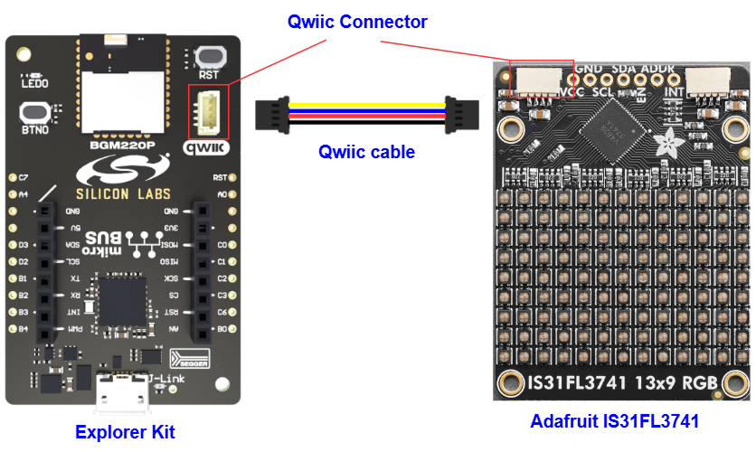

# IS31FL3741 - 13x9 PWM RGB LED Matrix (Adafruit) #

[](https://siliconlabs-massmarket.github.io/repository-catalog/#applications-list?filter=Entertainment%20Devices)
[](https://siliconlabs-massmarket.github.io/repository-catalog/#applications-list?filter=Human%20Machine%20Interface)
[](https://siliconlabs-massmarket.github.io/repository-catalog/#applications-list?filter=LED%20Lighting)

## Summary ##

This project aims to implement a hardware driver interacting with the [IS31FL3741 Adafruit 13x9 PWM RGB LED Matrix](https://learn.adafruit.com/adafruit-is31fl3741) using Silicon Labs platform.

Adafruit RGB LED Matrix is a 13x9 RGB LED matrix breakout. It features 117 RGB LEDs, each one 2x2mm in size, in a 13x9 grid with 3mm pitch spacing. The IS31FL3741 communicates over I2C and can set each LED element to have 16-bit color by using an 8-bit PWM signal. There's an adjustable current driver, so you can brighten or dim the whole display without losing color resolution. The module can be tiled side-to-side with others if desired up to 4 boards on the I2C bus.

## Quick Look Video ##

[](https://youtu.be/eNGRJq4ZlzU "Dev Lab - Adafruit 13x9 RGB LED Matrix IS31FL3741 – Silicon Labs")

## Table Of Contents ##

- [Required Hardware](#required-hardware)
- [Hardware Connection](#hardware-connection)
- [Setup](#setup)
  - [Create a project based on an example project](#create-a-project-based-on-an-example-project)
  - [Start with an empty example project](#start-with-an-empty-example-project)
- [How It Works](#how-it-works)
  - [API Overview](#api-overview)
  - [Testing](#testing)
- [Report Bugs & Get Support](#report-bugs--get-support)

## Required Hardware ##

- 1x [Silicon Labs BLE Development Kit](https://www.silabs.com/development-tools/wireless/bluetooth) based on the EFR32 SoC, such as:
  - [BGM220-EK4314A](https://www.silabs.com/development-tools/wireless/bluetooth/bgm220-explorer-kit)
  - [BG22-EK4108A](https://www.silabs.com/development-tools/wireless/bluetooth/bg22-explorer-kit?tab=overview)
  - [xG24-EK2703A](https://www.silabs.com/development-tools/wireless/efr32xg24-explorer-kit?tab=overview)
  - [xG22-EK2710A](https://www.silabs.com/development-tools/wireless/efr32xg22e-explorer-kit?tab=overview)
  - [XG24-DK2601B](https://www.silabs.com/development-tools/wireless/efr32xg24-dev-kit)
  - [SparkFun Thing Plus Matter - MGM240P](https://www.sparkfun.com/sparkfun-thing-plus-matter-mgm240p.html)

  *or*

  1x [Silicon Labs Wi-Fi Development Kit](https://www.silabs.com/development-tools/wireless/wi-fi) based on SiWG917, such as:
  - [SIWX917-DK2605A](https://www.silabs.com/development-tools/wireless/wi-fi/siwx917-dk2605a-wifi-6-bluetooth-le-soc-dev-kit)
  - [SIWX917-RB4338A](https://www.silabs.com/development-tools/wireless/wi-fi/siwx917-rb4338a-wifi-6-bluetooth-le-soc-radio-board) + [Si-MB4002A](https://www.silabs.com/development-tools/wireless/wireless-pro-kit-mainboard?tab=overview)
  - [SiW917Y-EK2708A](https://www.silabs.com/development-tools/wireless/wi-fi/siw917y-ek2708a-explorer-kit?tab=overview)

- 1x [Adafruit IS31FL3741 - 13x9 PWM RGB LED Matrix](https://learn.adafruit.com/adafruit-is31fl3741)

## Hardware Connection ##

For the Silicon Labs boards that feature a Qwiic connector, a [Qwiic Cable](https://www.sparkfun.com/flexible-qwiic-cable-100mm.html) is used to connect to the Adafruit 13x9 PWM RGB LED Matrix board, as illustrated in the figure below.



For the Silicon Labs boards that do not have a Qwiic connector, consider using the [Qwiic Breadboard Cable](https://www.sparkfun.com/products/14425).

The tables below provide an overview of the pin connections.

**Silicon Labs BLE Development Kit:**

| Description | BRD4108A | BRD4314A | BRD2601B | BRD2703A | BRD2704A | BRD2710A | ↔ | Adafruit 13x9 PWM RGB LED Matrix |
| --- | --- | --- | --- | --- | --- | --- | --- | --- |
| I2C_SDA | PD3 | PD3 | PC5 | PC5 | PB4 | PD3 | ↔ | SDA |
| I2C_SCL | PD2 | PD2 | PC4 | PC4 | PB3 | PD2 | ↔ | SCL |

**Silicon Labs Wi-Fi Development Kit:**

| Description | BRD4338A + BRD4002A | BRD2605A | BRD2708A | ↔ | Adafruit 13x9 PWM RGB LED Matrix |
| --- | --- | --- | --- | --- | --- |
| I2C_SDA | ULP_GPIO_6 [EXP_16] | ULP_GPIO_6 | GPIO_6 | ↔ | SDA |
| I2C_SCL | ULP_GPIO_7 [EXP_15] | ULP_GPIO_7 | GPIO_7 | ↔ | SCL |

## Setup ##

You can either create a project based on an example project or start with an empty example project.

> [!IMPORTANT]
>
> - Make sure that the [Third Party Hardware Drivers](https://github.com/SiliconLabsSoftware/third_party_hw_drivers_extension) extension is installed as part of the SiSDK. If not, follow [this documentation](https://github.com/SiliconLabsSoftware/third_party_hw_drivers_extension/blob/master/README.md#how-to-add-to-simplicity-studio-ide).
> - **Third Party Hardware Drivers** extension must be enabled for the project to install the required components from this extension.

> [!TIP]
> To show all components in the **Third Party Hardware Drivers** extension, the **Evaluation** quality must be enabled in the Software Component view.

### Create a project based on an example project ###

1. From the Launcher Home, add your device to My Products, click on it, and click on the **EXAMPLE PROJECTS & DEMOS** tab. Find the example project with filter "rgb led".

2. Click **Create** button on the **Third Party Hardware Drivers - IS31FL3741 - 13x9 PWM RGB LED Matrix (Adafruit)** example Example project creation dialog pops up -> click Create and Finish and Project should be generated.

   

3. Build and flash this example to the board.

### Start with an empty example project ###

1. Create an "Empty C Project" for the your board using Simplicity Studio v5. Use the default project settings.

2. Copy the file `app/example/adafruit_rgb_led_is31fl3741/app.c` into the project root folder (overwriting existing file).

3. Open the .slcp file. Select the **SOFTWARE COMPONENTS** tab and install the following components:

   - **If the BLE Explorer Kit is used:**
     - [Services] → [Timers] → [Sleep Timer]
     - [Services] → [IO Stream] → [IO Stream: USART] → default instance name: vcom
     - [Application] → [Utility] → [Log]
     - [Platform] → [Driver] → [I2C] → [I2CSPM] → default instance name: qwiic
     - [Application] → [Utility] → [Assert]
     - [Third Party Hardware Drivers] → [Display & LED] → [IS31FL3741 - 13x9 PWM RGB LED Matrix (Adafruit) - I2C]
     - [Third Party Hardware Drivers] → [Services] → [GLIB - OLED Graphics Library]

   - **If the Wi-Fi Development Kit is used:**
     - [WiSeConnect 3 SDK] → [Device] → [Si91x] → [MCU] → [Service] → [Sleep Timer for Si91x]
     - [Application] → [Utility] → [Assert]
     - [WiSeConnect 3 SDK] → [Device] → [Si91x] → [MCU] → [Peripheral] → [I2C] → [i2c2] → Select the corresponding pins according to the table provided in [Hardware Connection](#hardware-connection)
     - [Third Party Hardware Drivers] → [Display & LED] → [IS31FL3741 - 13x9 PWM RGB LED Matrix (Adafruit) - I2C]
     - [Third Party Hardware Drivers] → [Services] → [GLIB - OLED Graphics Library]

4. Build and flash the project to your device.

### Display Configuration ###

Adafruit IS31FL3741 module supports up to 4 devices on a single I2C bus. Therefore, We provided 4 following display layout configurations: **1x1**, **1x2**, **1x3**, **1x4**, **2x2**. Users can choose their desired layout and the position of each display in the layout by setting its I2C address. But the order of the display has to follow the below diagram:

- **Horizontal**

```c
 -----------------------------------------------
| Display 1 | Display 2 | Display 3 | Display 4 |
 -----------------------------------------------
```

- **2x1** and **2x2**

```c
 -----------             -----------------------
| Display 1 |           | Display 1 | Display 2 |
|-----------|           |-----------------------|
| Display 2 |           | Display 3 | Display 4 |
 -----------             -----------------------
```

All of this can be done in the configuration part of **IS31FL3741 - 13x9 PWM RGB LED Matrix (Adafruit) - I2C** component.

> [!NOTE]
> The address of the display which is not used should be set to "None". For example, if the layout configuration is set to **1x2** and users want to use Display 1 and Display 2, They should set the address of two others display to None.


## How It Works ##

### API Overview ###

```c
 ---------------------------------------------
|                  application                |
|---------------------------------------------|
|                     glib.c                  |
|---------------------------------------------|
|            adafruit_is31fl3741.c            |
|---------------------------------------------|
|          adafruit_is31fl3741_i2c.c          |
|---------------------------------------------|
|                     emlib                   |
 ---------------------------------------------
```

The Adafruit IS31FL3741 driver is implemented to be compatible with the GLIB service. Hence, the application can use the APIs of the GLIB service driver instead of calling the APIs from Adafruit IS31FL3741 driver.

- `adafruit_is31fl3741.c`: Use to handle display features of the Adafruit IS31FL3741 module.
- `adafruit_is31fl3741_i2c.c`: Use to communicate with the Microcontroller via emlib of SiSDK.

### Testing ###

- The testing program will try to display the following text "Silicon Labs - Third Party Hardware Drivers Extension".

   

## Report Bugs & Get Support ##

To report bugs in the Application Examples projects, please create a new "Issue" in the "Issues" section of [third_party_hw_drivers_extension](https://github.com/SiliconLabsSoftware/third_party_hw_drivers_extension) repo. Please reference the board, project, and source files associated with the bug, and reference line numbers. If you are proposing a fix, also include information on the proposed fix. Since these examples are provided as-is, there is no guarantee that these examples will be updated to fix these issues.

Questions and comments related to these examples should be made by creating a new "Issue" in the "Issues" section of [third_party_hw_drivers_extension](https://github.com/SiliconLabsSoftware/third_party_hw_drivers_extension) repo.
