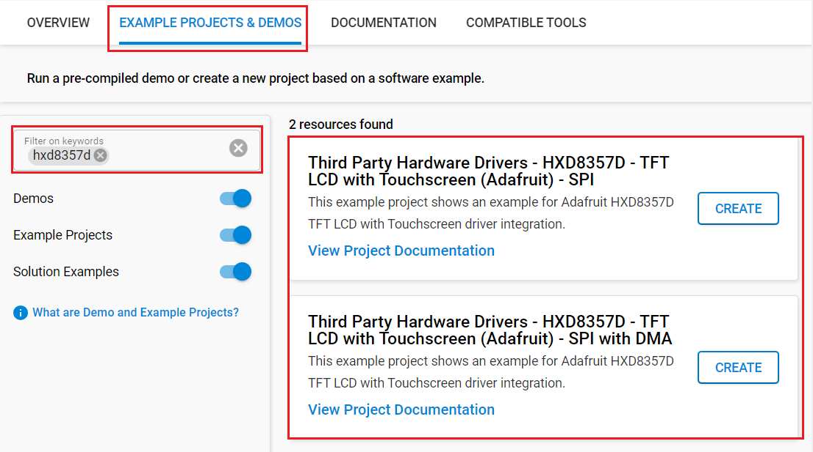

# HXD8357D - TFT LCD with Touchscreen (Adafruit) #

## Summary ##

This project aims to demonstrate how to integrate the HXD8357D TFT Display into your application using the HXD8357D TFT driver.

3.5" TFT 320x480 + Touchscreen Breakout Board w/MicroSD Socket - HXD8357D is a useful and convenient product from Adafruit. This display is an excellent choice to integrate with your project for monitoring, controlling, or gaming functionality. With a resolution of up to 320x480, along with a 3.5" diagonal screen size and bright (6 white-LED backlight), this display allows you to show images, graphics, and other content in detail and sharpness. The screen also features touchscreen functionality, allowing you to interact with applications in an intuitive way.

This display supports SPI communication mode, making it highly compatible with the most controllers.

For testing, you will need a HXD8357D display breakout, like [this large 3.5" TFT display breakout](https://www.adafruit.com/product/2050).  Make sure that the display you are using has the HXD8357D driver chip.

## Table Of Contents ##

- [Required Hardware](#required-hardware)
- [Hardware Connection](#hardware-connection)
- [Setup](#setup)
  - [Create a project based on an example project](#create-a-project-based-on-an-example-project)
  - [Start with an empty example project](#start-with-an-empty-example-project)
- [How It Works](#how-it-works)
  - [Testing](#testing)
- [Report Bugs & Get Support](#report-bugs--get-support)

## Required Hardware ##

- 1x [Silicon Labs BLE Development Kit](https://www.silabs.com/development-tools/wireless/bluetooth) based on the EFR32 SoC, such as:
  - [BGM220-EK4314A](https://www.silabs.com/development-tools/wireless/bluetooth/bgm220-explorer-kit)
  - [BG22-EK4108A](https://www.silabs.com/development-tools/wireless/bluetooth/bg22-explorer-kit?tab=overview)
  - [xG24-EK2703A](https://www.silabs.com/development-tools/wireless/efr32xg24-explorer-kit?tab=overview)
  - [xG22-EK2710A](https://www.silabs.com/development-tools/wireless/efr32xg22e-explorer-kit?tab=overview)
  - [XG24-DK2601B](https://www.silabs.com/development-tools/wireless/efr32xg24-dev-kit)
  - [SparkFun Thing Plus Matter - MGM240P](https://www.sparkfun.com/sparkfun-thing-plus-matter-mgm240p.html)

  *or*

  1x [Silicon Labs Wi-Fi Development Kit](https://www.silabs.com/development-tools/wireless/wi-fi) based on SiWG917, such as:
  - [SIWX917-DK2605A](https://www.silabs.com/development-tools/wireless/wi-fi/siwx917-dk2605a-wifi-6-bluetooth-le-soc-dev-kit)
  - [SIWX917-RB4338A](https://www.silabs.com/development-tools/wireless/wi-fi/siwx917-rb4338a-wifi-6-bluetooth-le-soc-radio-board) + [Si-MB4002A](https://www.silabs.com/development-tools/wireless/wireless-pro-kit-mainboard?tab=overview)
  - [SiW917Y-EK2708A](https://www.silabs.com/development-tools/wireless/wi-fi/siw917y-ek2708a-explorer-kit?tab=overview)

- 1x [Adafruit HXD8357D - 3.5" TFT LCD with Touchscreen](https://www.adafruit.com/product/2050)

## Hardware Connection ##

The tables below provide an overview of the pin connections.

**Silicon Labs BLE Development Kit:**

| Description | BRD4108A | BRD4314A | BRD2601B | BRD2703A | BRD2704A | BRD2710A | ↔ | Adafruit HXD8357D |
| --- | --- | --- | --- | --- | --- | --- | --- | --- |
| Data / Command Selection | PC6 | PC6 | PC5 | PC8 | PC0 | PC6 | ↔ | D/C |
| Chip select | PC3 | PC3 | PA7 | PC0 | PC1 | PC3 | ↔ | CS   |
| SPI clock   | PC2 | PC2 | PC1 | PC1 | PC2 | PC2 | ↔ | CLK  |
| SPI MISO    | PC1 | PC1 | PC2 | PC2 | PC6 | PC1 | ↔ | MISO |
| SPI MOSI    | PC0 | PC0 | PC3 | PC3 | PC3 | PC0 | ↔ | MOSI |
| GPIO         | PB2 | PB2 | PD2 | PD5 | PD2 | PB2 | ↔ | XP (X+) |
| Analog input | PD2 | PD2 | PC4 | PD4 | PA0 | PD2 | ↔ | YP (Y+) |
| GPIO         | PB3 | PB3 | PB3 | PB1 | PD1 | PB3 | ↔ | YM (Y-) |
| Analog input | PB4 | PB4 | PB2 | PA0 | PD0 | PB4 | ↔ | XM (X-) |

**Silicon Labs Wi-Fi Development Kit:**

| Description | BRD4338A + BRD4002A | BRD2605A | BRD2708A | ↔ | Adafruit HXD8357D |
| --- | --- | --- | --- | --- | --- |
| Data / Command Selection | GPIO_47 [P26] | GPIO_10 [P23] | GPIO_30 [RST] | ↔ | D/C |
| Chip select | GPIO_28 [P31] | GPIO_28 [P9] | GPIO_28 [CS]   | ↔ | CS |
| SPI clock   | GPIO_25 [P25] | GPIO_25 [P3] | GPIO_25 [SCK]  | ↔ | CLK |
| SPI MISO    | GPIO_26 [P27] | GPIO_26 [P5] | GPIO_26 [MISO] | ↔ | MISO |
| SPI MISO    | GPIO_27 [P29] | GPIO_27 [P7] | GPIO_27 [MOSI] | ↔ | MOSI |
| GPIO         | GPIO_7 [P20]     | GPIO_7 [P24]    | GPIO_7 [SCL]    | ↔ | XP (X+) |
| Analog input | ULP_GPIO_1 [P16] | ULP_GPIO_1 [P4] | ULP_GPIO_7 [TX] | ↔ | YP (Y+) |
| GPIO         | GPIO_6 [P19]     | GPIO_6 [P21]    | GPIO_6 [SDA]    | ↔ | YM (Y-) |
| Analog input | ULP_GPIO_8 [P15] | ULP_GPIO_8 [P8] | ULP_GPIO_6 [RX] | ↔ | XM (X-) |

> [!IMPORTANT]
> To be able to communicate with TFT LCD using SPI mode, you need to solder closed the IM2 jumper on the back of the PCB.*

## Setup ##

You can either create a project based on an example project or start with an empty example project.

> [!IMPORTANT]
>
> - Make sure that the [Third Party Hardware Drivers](https://github.com/SiliconLabsSoftware/third_party_hw_drivers_extension) extension is installed as part of the SiSDK. If not, follow [this documentation](https://github.com/SiliconLabsSoftware/third_party_hw_drivers_extension/blob/master/README.md#how-to-add-to-simplicity-studio-ide).
> - **Third Party Hardware Drivers** extension must be enabled for the project to install the required components from this extension.

> [!TIP]
> To show all components in the **Third Party Hardware Drivers** extension, the **Evaluation** quality must be enabled in the Software Component view.

### Create a project based on an example project ###

1. From the Launcher Home, add your board to My Products, click on it, and click on the **EXAMPLE PROJECTS & DEMOS** tab. Find the example project filtering by **hxd8357d**.

2. Click **Create** button on the example:

   - **Third Party Hardware Drivers - HXD8357D - TFT LCD with Touchscreen (Adafruit) - SPI** if using without DMA.
   - **Third Party Hardware Drivers - HXD8357D - TFT LCD with Touchscreen (Adafruit) - SPI with DMA** if using with DMA.

   Example project creation dialog pops up -> click Create and Finish and Project should be generated.
   

3. Build and flash this example to the board.

### Start with an empty example project ###

1. Create an "Empty C Project" for the "EFR32xG24 Explorer Kit Board" or "SiWx917-RB4338A Radio Board" using Simplicity Studio v5. Use the default project settings.

2. Copy source files:
   - With Gecko EFR32 SOCs:
     - Copy the file `app/example/adafruit_tft_lcd_hxd8357d/gecko/app.c` into the project root folder (overwriting the existing file).
   - With SiWx917 SoCs:
     - Copy the file `app/example/adafruit_tft_lcd_hxd8357d/si91x/app.c` into the project root folder (overwriting the existing file).

3. Open the .slcp file. Select the **SOFTWARE COMPONENTS** tab and install the following components:

   - [Application] → [Utility] → [Assert]
   - If using without DMA: [Third Party Hardware Drivers] → [Display & LED] → [HXD8357D - TFT LCD Display (Adafruit) - SPI]
   - If using with DMA: [Third Party Hardware Drivers] → [Display & LED] → [HXD8357D - TFT LCD Display (Adafruit) - SPI with DMA]
   - [Third Party Hardware Drivers] → [Services] → [GLIB - OLED Graphics Library]
   - [Third Party Hardware Drivers] → [Human Machine Interface] → [Touch Screen (Analog)]

   - **With Gecko EFR32 SOCs:**
     - [Services] → [Timers] → [Sleep Timer]
     - [Platform] → [Driver] → [LED] → [Simple LED] → [led0, led1]
     - [Platform] → [Driver] → [Button] → [Simple Button] → [btn0, btn1]
     - [Third Party Hardware Drivers] → [Human Machine Interface] → [Touch Screen Analog Interface (Gecko)] → use the default configuration

   - **With SiWx917 SoCs:**
     - [WiSeConnect 3 SDK] → [Device] → [MCU] → [Service] → [Power Manager] → [Sleep Timer for Si91x]
     - [WiSeConnect 3 SDK] → [Device] → [MCU] → [Hardware] → [LED] → [led0, led1]
     - [WiSeConnect 3 SDK] → [Device] → [MCU] → [Hardware] → [Button] → [btn0, btn1]
     - [Third Party Hardware Drivers] → [Human Machine Interface] → [Touch Screen Analog Interface (Si91x)] → use the default configuration

4. Enable DMA support for SPI module (for SiWx917 SoCs)

   To improve SPI transfer speed, enable DMA support by changing configuration of GSPI component at: **[WiSeConnect 3 SDK] → [Device] → [Si91X] → [MCU] → [Peripheral] → [GSPI]** as the picture bellow

   | | |
   | - | - |
   |  |  |

5. Build and flash the project to your device.

## Calibration for Touch function ##

Adafruit HXD8357D uses 4 resistive touch pins (Y+ X+ Y- X-) to determine touch points. We will read the analog values from these pins to detect where the touched point is on the screen. This process will surely have uncertainties so we have to calibrate it to detect touched points properly.

The calibration parameters can be configured through the settings of the component:

- [Third Party Hardware Drivers] → [Human Machine Interface] → [Touch Screen Analog Interface (Gecko)]
  - Calib X-min
  - Calib X-max
  - Calib Y-min
  - Calib Y-max
  - Invert X-axis
  - Invert Y-axis
  - XY Swap

Follow the steps below to calibrate the touch screen.

1. Open app.c, set the `CALIB_ENABLED` macro to `1` to enable calib function

   > #define CALIB_ENABLED 1

2. Measuring 2 points at 2 conners that is marked with green and yellow to determine the value of:

   - Calib X-min: minimum value of X_RAW
   - Calib X-max: maximum value of X_RAW
   - Calib Y-min: minimum value of Y_RAW
   - Calib Y-max: maximum value of Y_RAW

   

3. The origin of the screen (X = 0, Y = 0) is marked green, the maximum XY coordinate (X = 320, Y = 480) is marked yellow. We need to make the X and Y value of the touch screen is matched with these 2 points by changing 3 options in the `Touch Settings`:

- Invert X-axis
- Invert Y-axis
- XY Swap

## How It Works ##

### Testing ###

To demonstrate the display and touchscreen functionalities, this project implements a drawing application that you see on some tablets. This application will display everything that is drawn on the screen. Users can select colors to draw. To erase anything on the screen, select the 'ERA' button on the corner. To reset the screen, select 'RTS'. Now you only need to prepare a pen and start to draw things in your mind.

## Report Bugs & Get Support ##

To report bugs in the Application Examples projects, please create a new "Issue" in the "Issues" section of [third_party_hw_drivers_extension](https://github.com/SiliconLabsSoftware/third_party_hw_drivers_extension) repo. Please reference the board, project, and source files associated with the bug, and reference line numbers. If you are proposing a fix, also include information on the proposed fix. Since these examples are provided as-is, there is no guarantee that these examples will be updated to fix these issues.

Questions and comments related to these examples should be made by creating a new "Issue" in the "Issues" section of [third_party_hw_drivers_extension](https://github.com/SiliconLabsSoftware/third_party_hw_drivers_extension) repo.
