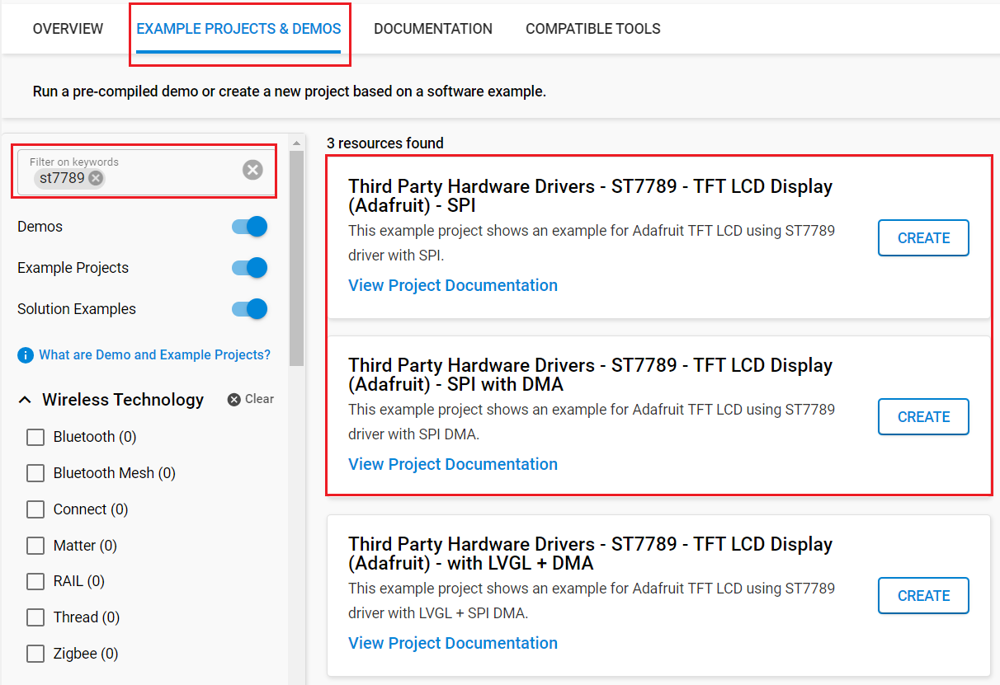

# ST7789 - Color TFT Display (Adafruit) #

## Summary ##

Small TFT displays are a great way to add graphics to your projects. They are like tiny LCD displays that you can control using a simple SPI serial interface. With a resolution of 240x135 pixels, 16-bit full color and an IPS screen, colors display great when off-axis up to 80 degrees in any direction. This TFT display can be used in smart watches and small electronic devices.

This project aims to implement a hardware driver interacting with the ST7789 TFT displays via APIs of SiSDK.

For testing, you will need a ST7789 display breakout, like [Adafruit 1.14" 240x135 Color TFT Display + MicroSD Card Breakout - ST7789](https://www.adafruit.com/product/4383). Make sure that the display you are using has the ST7789 driver chip.

## Table Of Contents ##

- [Required Hardware](#required-hardware)
- [Hardware Connection](#hardware-connection)
- [Setup](#setup)
  - [Create a project based on an example project](#create-a-project-based-on-an-example-project)
  - [Start with an empty example project](#start-with-an-empty-example-project)
- [How It Works](#how-it-works)
- [Report Bugs & Get Support](#report-bugs--get-support)

## Required Hardware ##

- 1x [Silicon Labs BLE Development Kit](https://www.silabs.com/development-tools/wireless/bluetooth) based on the EFR32 SoC, such as:
  - [BGM220-EK4314A](https://www.silabs.com/development-tools/wireless/bluetooth/bgm220-explorer-kit)
  - [BG22-EK4108A](https://www.silabs.com/development-tools/wireless/bluetooth/bg22-explorer-kit?tab=overview)
  - [xG24-EK2703A](https://www.silabs.com/development-tools/wireless/efr32xg24-explorer-kit?tab=overview)
  - [xG22-EK2710A](https://www.silabs.com/development-tools/wireless/efr32xg22e-explorer-kit?tab=overview)
  - [XG24-DK2601B](https://www.silabs.com/development-tools/wireless/efr32xg24-dev-kit)
  - [SparkFun Thing Plus Matter - MGM240P](https://www.sparkfun.com/sparkfun-thing-plus-matter-mgm240p.html)

  *or*

  1x [Silicon Labs Wi-Fi Development Kit](https://www.silabs.com/development-tools/wireless/wi-fi) based on SiWG917, such as:
  - [SIWX917-DK2605A](https://www.silabs.com/development-tools/wireless/wi-fi/siwx917-dk2605a-wifi-6-bluetooth-le-soc-dev-kit)
  - [SIWX917-RB4338A](https://www.silabs.com/development-tools/wireless/wi-fi/siwx917-rb4338a-wifi-6-bluetooth-le-soc-radio-board) + [Si-MB4002A](https://www.silabs.com/development-tools/wireless/wireless-pro-kit-mainboard?tab=overview)
  - [SiW917Y-EK2708A](https://www.silabs.com/development-tools/wireless/wi-fi/siw917y-ek2708a-explorer-kit?tab=overview)

- 1x ST7789 Color TFT display as listed below:
  - [Adafruit 1.14" 240x135 Color TFT Display + MicroSD Card Breakout - ST7789](https://www.adafruit.com/product/4383)

## Hardware Connection ##

The tables below provide an overview of the pin connections.

**Silicon Labs BLE Development Kit:**

| Description | BRD4108A | BRD4314A | BRD2601B | BRD2703A | BRD2704A | BRD2710A | ↔ | Adafruit ST7789 |
| --- | --- | --- | --- | --- | --- | --- | --- | --- |
| Data / Command Selection | PC6 | PC6 | PC5 | PC8 | PC0 | PC6 | ↔ | D/C |
| Chip select | PC3 | PC3 | PA7 | PC0 | PC1 | PC3 | ↔ | CS  |
| SPI clock   | PC2 | PC2 | PC1 | PC1 | PC2 | PC2 | ↔ | CLK |
| SPI MISO    | PC1 | PC1 | PC2 | PC2 | PC6 | PC1 | ↔ | MISO |
| SPI MOSI    | PC0 | PC0 | PC3 | PC3 | PC3 | PC0 | ↔ | MOSI |

**Silicon Labs Wi-Fi Development Kit:**

| Description | BRD4338A + BRD4002A | BRD2605A | BRD2708A | ↔ | Adafruit ST7789 |
| --- | --- | --- | --- | --- | --- |
| Data / Command Selection | GPIO_47 [P26] | GPIO_10 [P23] | GPIO_30 [RST] | ↔ | D/C |
| Chip select | GPIO_28 [P31] | GPIO_28 [P9] | GPIO_28 [CS]   | ↔ | CS |
| SPI clock   | GPIO_25 [P25] | GPIO_25 [P3] | GPIO_25 [SCK]  | ↔ | CLK |
| SPI MISO    | GPIO_26 [P27] | GPIO_26 [P5] | GPIO_26 [MISO] | ↔ | MISO |
| SPI MISO    | GPIO_27 [P29] | GPIO_27 [P7] | GPIO_27 [MOSI] | ↔ | MOSI |

## Setup ##

You can either create a project based on an example project or start with an empty example project.

> [!IMPORTANT]
>
> - Make sure that the [Third Party Hardware Drivers](https://github.com/SiliconLabsSoftware/third_party_hw_drivers_extension) extension is installed as part of the SiSDK. If not, follow [this documentation](https://github.com/SiliconLabsSoftware/third_party_hw_drivers_extension/blob/master/README.md#how-to-add-to-simplicity-studio-ide).
> - **Third Party Hardware Drivers** extension must be enabled for the project to install the required components from this extension.

> [!TIP]
> To show all components in the **Third Party Hardware Drivers** extension, the **Evaluation** quality must be enabled in the Software Component view.

### Create a project based on an example project ###

1. From the Launcher Home, add your board to My Products, click on it, and click on the **EXAMPLE PROJECTS & DEMOS** tab. Find the example project filtering by **"st7789"**.

2. Click **Create** button on the example:

   - **Third Party Hardware Drivers - ST7789 - TFT LCD Display (Adafruit) - SPI** if using without DMA.

   - **Third Party Hardware Drivers - ST7789 - TFT LCD Display (Adafruit) - SPI with DMA** if using with DMA.

   Example project creation dialog pops up -> click Create and Finish and Project should be generated.
   

3. Build and flash this example to the board.

### Start with an empty example project ###

1. Create an "Empty C Project" for the "EFR32xG24 Explorer Kit Board" or "SiWx917-RB4338A Radio Board" using Simplicity Studio v5. Use the default project settings.

2. Copy source files:
   - With Gecko EFR32 SOCs:
     - Copy the file `app/example/adafruit_tft_lcd_st7789/gecko/app.c` into the project root folder (overwriting existing file).
   - With SiWx917 SoCs:
     - Copy the file `app/example/adafruit_tft_lcd_st7789/si91x/app.c` into the project root folder (overwriting existing file).
   - Copy all the *.c files in the  `app/example/adafruit_tft_lcd_st7789` directory into the project root folder (overwriting existing file).

3. Open the .slcp file. Select the **SOFTWARE COMPONENTS** tab and install the following components:

   - **With Gecko EFR32 SOCs:**
     - [Services] → [Timers] → [Sleep Timer]
     - [Platform] → [Driver] → [LED] → [Simple LED] → [led0, led1]
     - [Platform] → [Driver] → [Button] → [Simple Button] → [btn0, btn1]
   - **With SiWx917 SoCs:**
     - [WiSeConnect 3 SDK] → [Device] → [MCU] → [Service] → [Power Manager] → [Sleep Timer for Si91x]
     - [WiSeConnect 3 SDK] → [Device] → [MCU] → [Hardware] → [LED] → [led0, led1]
     - [WiSeConnect 3 SDK] → [Device] → [MCU] → [Hardware] → [Button] → [btn0, btn1]

   - [Application] → [Utility] → [Assert]
   - If using without DMA: [Third Party Hardware Drivers] → [Display & LED] → [ST7789 - TFT LCD Display (Adafruit) - SPI]
   - If using with DMA: [Third Party Hardware Drivers] → [Display & LED] → [ST7789 - TFT LCD Display (Adafruit) - SPI with DMA]
   - [Third Party Hardware Drivers] → [Services] → [GLIB - OLED Graphics Library]

4. Enable DMA support for SPI module (for SiWx917 SoCs)

   To improve SPI transfer speed, enable DMA support by changing configuration of GSPI component at: **[WiSeConnect 3 SDK] → [Device] → [Si91X] → [MCU] → [Peripheral] → [GSPI]** as the picture bellow

   | | |
   | - | - |
   |  |  |

5. Build and flash the project to your device.

## How It Works ##

You can see, as soon as the chip is reset, the program is started. First, the display will show full screen basic colors (white, red, green, blue, cyan, purple, yellow, orange, black). Next, the screen will display the words "HELLO WORLD", "Adafruit", "1.14" TFT". Next is a demo of basic functions such as inverting colors, enable / disable display. Next, the screen The screen will display 5 different images with dimensions of 135x240 pixels. And finally, demo the functions of drawing shapes such as (circle, triangle, rectangle).The demo process will be repeated from the beginning.
There is a timer used in the program - the value is changed through specific demos, by which the users see the detailed content. If you want to do so, you can change them via the macros at the top of the "app.c" file.

## Report Bugs & Get Support ##

To report bugs in the Application Examples projects, please create a new "Issue" in the "Issues" section of [third_party_hw_drivers_extension](https://github.com/SiliconLabsSoftware/third_party_hw_drivers_extension) repo. Please reference the board, project, and source files associated with the bug, and reference line numbers. If you are proposing a fix, also include information on the proposed fix. Since these examples are provided as-is, there is no guarantee that these examples will be updated to fix these issues.

Questions and comments related to these examples should be made by creating a new "Issue" in the "Issues" section of [third_party_hw_drivers_extension](https://github.com/SiliconLabsSoftware/third_party_hw_drivers_extension) repo.
