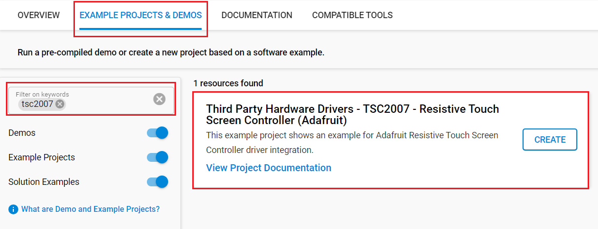

# TSC2007 - Resistive Touch Screen Controller (Adafruit) #

## Summary ##

This breakout board features the TSC2007, which has an easy-to-use I2C interface available. There is also an interrupt pin that you can use to indicate when a touch has been detected to your microcontroller or microcomputer. We wrapped up the chip with a 3V voltage regulator and level shifting; therefore, it is safe to use the device with 3V or 5V logic. This touch screen controller board can be used for any four-wire resistive touchscreen.
This project aims to implement a hardware driver for Adafruit TSC2007 Touch Screen Controller, which interacts with the resistive touch screen on ILI9341 TFT displays. It gets XY coordinates of the point that the user presses on the screen; the coordinates are matched with the screen resolution. It is useful for applications, which require a UI interface.

## Table Of Contents ##

- [Required Hardware](#required-hardware)
- [Hardware Connection](#hardware-connection)
- [Setup](#setup)
  - [Create a project based on an example project](#create-a-project-based-on-an-example-project)
  - [Start with an empty example project](#start-with-an-empty-example-project)
- [How It Works](#how-it-works)
  - [Testing](#testing)
- [Report Bugs & Get Support](#report-bugs--get-support)

## Required Hardware ##

- 1x [XG24-EK2703A](https://www.silabs.com/development-tools/wireless/efr32xg24-explorer-kit) EFR32xG24 Explorer Kit

  *or*

  1x [Silicon Labs Wi-Fi Development Kit](https://www.silabs.com/development-tools/wireless/wi-fi) based on SiWG917, such as:
  - [SIWX917-DK2605A](https://www.silabs.com/development-tools/wireless/wi-fi/siwx917-dk2605a-wifi-6-bluetooth-le-soc-dev-kit)
  - [SIWX917-RB4338A](https://www.silabs.com/development-tools/wireless/wi-fi/siwx917-rb4338a-wifi-6-bluetooth-le-soc-radio-board) + [Si-MB4002A](https://www.silabs.com/development-tools/wireless/wireless-pro-kit-mainboard?tab=overview)
  - [SiW917Y-EK2708A](https://www.silabs.com/development-tools/wireless/wi-fi/siw917y-ek2708a-explorer-kit?tab=overview)

- 1x [Adafruit ILI9341 - 2.4" TFT LCD with Touchscreen](https://www.adafruit.com/product/2478)
- 1x [Adafruit TSC2007 I2C Resistive Touch Screen Controller - STEMMA QT](https://www.adafruit.com/product/5423)

## Hardware Connection ##

To test this example, you should connect the Adafruit TSC2007 Touch Screen Controller to the Adafruit 2.4" TFT LCD (with Touchscreen) and your board as shown below.

|  Pin function | BRD2703A | BRD4338A + BRD4002A | BRD2605A | BRD2708A | ↔ | Adafruit TSC2007 | Adafruit ILI9341 |
| --- | --- | --- | --- | --- | --- | --- | --- |
| I2C SCL | PC4 | ULP_GPIO_7 | ULP_GPIO_7 (QWIIC) | GPIO_7 (QWIIC) | ↔ | QWIIC SCL | - |
| I2C SDA | PC5 | ULP_GPIO_6 | ULP_GPIO_6 (QWIIC) | GPIO_6 (QWIIC) | ↔ | QWIIC SDA | - |
| GPIO IRQ | PB0 | - | - | - | ↔ | PENIRQ | - |
| Analog | - | - | - | - | ↔ | X+ | XP(X+) |
| Analog | - | - | - | - | ↔ | Y+ | YP(Y+) |
| Analog | - | - | - | - | ↔ | Y- | YM(Y-) |
| Analog | - | - | - | - | ↔ | Y+ | XM(Y+) |
| Data/ Command | PC8 | GPIO_47 [P26] | GPIO_10 [P23] | GPIO_30 (mikroBUS RST) | ↔ | - | D/C |
| SPI CS   | PC0 | GPIO_28 [P31] | GPIO_28 [P9] | GPIO_28 (mikroBUS CS) | ↔ | - | CS |
| SPI SCK  | PC1 | GPIO_25 [P25] | GPIO_25 [P3] | GPIO_25 (mikroBUS SCK) | ↔ | - | CLK |
| SPI MISO | PC2 | GPIO_26 [P27] | GPIO_26 [P5] | GPIO_26 (mikroBUS MISO) | ↔ | - | MISO |
| SPI MOSI | PC3 | GPIO_27 [P29] | GPIO_27 [P7] | GPIO_27 (mikroBUS MOSI) | ↔ | - | MOSI |

## Setup ##

You can either create a project based on an example project or start with an empty example project.

> [!IMPORTANT]
>
> - Make sure that the [Third Party Hardware Drivers](https://github.com/SiliconLabsSoftware/third_party_hw_drivers_extension) extension is installed as part of the SiSDK. If not, follow [this documentation](https://github.com/SiliconLabsSoftware/third_party_hw_drivers_extension/blob/master/README.md#how-to-add-to-simplicity-studio-ide).
> - **Third Party Hardware Drivers** extension must be enabled for the project to install the required components from this extension.

> [!TIP]
> To show all components in the **Third Party Hardware Drivers** extension, the **Evaluation** quality must be enabled in the Software Component view.

### Create a project based on an example project ###

1. From the Launcher Home, add the BRD2703A to My Products, click on it, and click on the **EXAMPLE PROJECTS & DEMOS** tab. Find the example project filtering by **tsc2007**.

2. Click **Create** button on the **Third Party Hardware Drivers - TSC2007 - Resistive Touch Screen Controller (Adafruit)** example. Example project creation dialog pops up -> click Create and Finish and Project should be generated.

   

3. Build and flash this example to the board.

### Start with an empty example project ###

1. Create an "Empty C Project" for the "EFR32xG24 Explorer Kit Board" using Simplicity Studio v5. Use the default project settings.

2. Copy the file:

   - With Gecko EFR32 SOCs:
     - Copy the file `app/example/adafruit_touchscreen_tsc2007/gecko/app.c` into the project root folder (overwriting existing file).
   - With SiWx917 SoCs:
     - Copy the file `app/example/adafruit_touchscreen_tsc2007/si91x/app.c` into the project root folder (overwriting existing file).

3. Open the .slcp file. Select the **SOFTWARE COMPONENTS** tab and install the following components:

   - **With Gecko EFR32 SOCs:**
     - [Services] → [IO Stream] → [IO Stream: EUSART] → default instance name: vcom
     - [Application] → [Utility] → [Log]
     - [Platform] → [Driver] → [I2C] → [I2CSPM] → default instance name: qwiic
   - **With SiWx917 SoCs:**
     - [WiSeConnect 3 SDK] → [Device] → [Si91x] → [MCU] → [Peripheral] → [I2C] → [i2c2] → Select the corresponding pins according to the table provided in [Hardware Connection](#hardware-connection)

   - [Application] → [Utility] → [Assert]
   - [Third Party Hardware Drivers] → [Display & LED] → [ILI9341 - TFT LCD Display (Adafruit) - SPI]
   - [Third Party Hardware Drivers] → [Services] → [GLIB - OLED Graphics Library]
   - [Third Party Hardware Drivers] → [Human Machine Interface] → [TSC2007 - Resistive Touch Screen Controller (Adafruit)] → use default configuration

4. Build and flash the project to your device.

## Touch screen calibration ##

Below is the calibration value for Adafruit ILI9341 - 2.4" TFT LCD, that we use in this example:

To calibrate other touch screen we need to follow these steps:

1. First we need to set the screen resolution.
2. We need to get 4 values: Xmin, Ymin, Xmax Ymax by measuring 3 point at 3 conners of the screen: Upper left (X1, Y1), Upper right(X2, Y2), ower right(X3, Y3)

   - Upper left of the screen (x = 0, y = 0):
     - Normaly the raw values are X1 = Xmin, Y1 = Ymin
     - If we get X1 = Xmax, Y1 = Ymin at this position, The "Invert X-axis" option need to be enabled
       - If we get X1 = Xmin, Y1 = Ymax at this position, The "Invert Y-axis" option need to be enabled
     - If we get X1 = Xmax + Y1 = Ymax at this position, Both of the "Invert X-axis" and "Invert Y-axis" option need to be enabled

   - Upper right of the screen (x = Width, y = 0):
     - Normaly the raw values are X1 = Xmax, Y1 = Ymin
     - If we get X2 = Ymax, Y2 = Xmin at this position, The "XY swap" option need to be enabled

   - Lower right of the screen (x = Width, y = Height). Use this result to verify the options are matched with what we've set:
     - Normaly the raw values are X3 = Xmax, Y3 = Ymax
     - If we get X3 = Xmin, Y3 = Ymax at this position, The "Invert X-axis" option need to be enabled
       - If we get X3 = Xmax, Y3 = Ymin at this position, The "Invert Y-axis" option need to be enabled
     - If we get X3 = Xmin + Y3 = Ymin at this position, Both of the "Invert X-axis" and "Invert Y-axis" option need to be enabled

   

> [!TIP]
>
> - X: Pixel value of X-axis
> - Y: Pixel value of Y-axis
> - X_RAW: Raw value of X-axis
> - Y_RAW: Raw value of Y-axis
> - Z1_RAW: Raw value of Z1 (cross-panel measurements)
> - Z2_RAW: Raw value of Z2 (cross-panel measurements)
> - RT: Touch resistance
> - Xmin: The minimum raw value of X-axis
> - Ymin: The minimum raw value of Y-axis
> - Xmax: The maximum raw value of X-axis
> - Ymax: Thee maximum raw value of Y-axis

## How It Works ##

### Testing ###

This example demonstrates how the TSC2007 driver works by displaying XY-coordinates if we press the touch screen. It also shows the raw values of the sensor data to support the screen calibration.
You should expect a similar output to the one below.

## Report Bugs & Get Support ##

To report bugs in the Application Examples projects, please create a new "Issue" in the "Issues" section of [third_party_hw_drivers_extension](https://github.com/SiliconLabsSoftware/third_party_hw_drivers_extension) repo. Please reference the board, project, and source files associated with the bug, and reference line numbers. If you are proposing a fix, also include information on the proposed fix. Since these examples are provided as-is, there is no guarantee that these examples will be updated to fix these issues.

Questions and comments related to these examples should be made by creating a new "Issue" in the "Issues" section of [third_party_hw_drivers_extension](https://github.com/SiliconLabsSoftware/third_party_hw_drivers_extension) repo.
