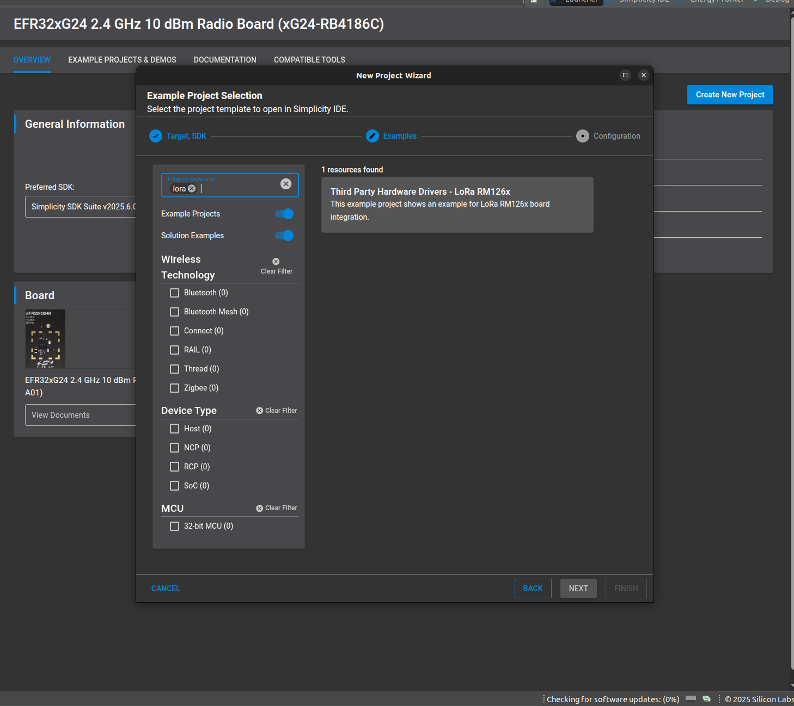

# RM126X - LoRa AT command driver #

## Summary ##

This project demonstrates the implementation of a LoRa AT command driver using the Ezurio RM126X module on the Silicon Labs platform, based on UART communication.

The Ezurio RM126x series (RM1261 and RM1262) is based on the Silicon Labs EFR32 SoC and the Semtech SX126x radio. These modules provide a low-power, long-range solution that enables easy LoRaWAN implementation. The RM126x series supports LoRaWAN classes A, B and C,  and also includes a LoRa Point to Point (LoRa P2P) capability which enables you to create your own private ultra-long range radio network between two RM126x modules.

## Table Of Contents ##

- [RM126X - LoRa AT command driver](#rm126x---lora-at-command-driver)
  - [Summary](#summary)
  - [Table Of Contents](#table-of-contents)
  - [Required Hardware](#required-hardware)
  - [Hardware Connection](#hardware-connection)
  - [Setup](#setup)
    - [Create a project based on an example project](#create-a-project-based-on-an-example-project)
    - [Start with an empty example project](#start-with-an-empty-example-project)
  - [How It Works](#how-it-works)
  - [Report Bugs \& Get Support](#report-bugs--get-support)

## Required Hardware ##

- 2x [SI-MB4002A](https://www.silabs.com/development-tools/wireless/wireless-pro-kit-mainboard?tab=overview) + [xG24-RB4186C](https://www.silabs.com/development-tools/wireless/xg24-rb4186c-efr32xg24-wireless-gecko-radio-board?tab=overview)

- 2x [RM126X Development kit](https://www.ezurio.com/part/453-00140-k1)

## Hardware Connection ##

Connect the Expander header of the SI-MB4002A to the J1 and J2 breakout pads of the RM126X development kit.

The tables below provide an overview of the pin connections.

| Description | BRD4186C | ↔ | RM126X Development kit |
| --- | --- | --- | --- |
| UART_TX  | PC1 | ↔ | UART_RX (B3) |
| UART_RTS | PC3 | ↔ | UART_RTS (B2)|
| UART_RX  | PC2 | ↔ | UART_TX (C7) |
| UART_CTS | PC0 | ↔ | UART_CTS (B4)|
| RESET    | PD2 | ↔ | RESET        |

## Setup ##

You can either create a project based on an example project or start with an empty example project.

> [!IMPORTANT]
>
> - Make sure that the [Third Party Hardware Drivers](https://github.com/SiliconLabsSoftware/third_party_hw_drivers_extension) extension is installed as part of the SiSDK. If not, follow [this documentation](https://github.com/SiliconLabsSoftware/third_party_hw_drivers_extension/blob/master/README.md#how-to-add-to-simplicity-studio-ide).
> - **Third Party Hardware Drivers** extension must be enabled for the project to install the required components from this extension.

> [!TIP]
> To show all components in the **Third Party Hardware Drivers** extension, the **Evaluation** quality must be enabled in the Software Component view.

### Create a project based on an example project ###

1. From the Launcher Home, add your device to My Products, click on it, and click on the **EXAMPLE PROJECTS & DEMOS** tab. Find the example project filtering by *lora*.

2. Click the **Create** button on the **Third Party Hardware Drivers - RM126x - LoRa Module (Ezurio)** example. When the project creation dialog appears, click **Create and Finish** to generate the project.
   
   

3. Build and flash this example to the board.

### Start with an empty example project ###

1. Create an "Empty C Project" for your board using Simplicity Studio v5. Use the default project settings.

2. Copy the following files into the project root folder (overwriting the existing file):

   - `app/example/ezurio_lora_rm126x/app.c`

3. Open the .slcp file. Select the **SOFTWARE COMPONENTS** tab and install the following components:

   - **If the BLE Development Kit is used:**
     - **[Services] → [IO Stream] → [Driver] → [IO Stream: EUSART]** → default instance name: vcom
     - **[Services] → [IO Stream] → [Driver] → [IO Stream: USART]** → instance name: ezurio
     - **[Application] → [Utility] → [Log]**
     - **[Platform] → [Driver] → [Button] → [Simple Button]** → default instance name: btn0
     - **[Platform] → [Driver] → [LED] → [Simple LED]** → default instance name: led0
     - **[Third Party Hardware Drivers] → [Wireless Connectivity] → [RM126x - LoRa (Ezurio)]** → use default configuration

4. Build and flash the project to your device.

5. Launch a terminal or console, open the communication to your device.

## How It Works ##
This example demonstrates how to initialize two devices in P2P (peer-to-peer) mode. After initialization, the devices can exchange messages directly with each other.

To start communication, power on Node 1 first, followed by Node 0 (the central device). Node 0 will broadcast a beacon message, enabling Node 1 to send and receive data.

Pressing Button 0 on either device sends a message to the other. When the receiving device gets the message, it turns on LED 0 as a visual indicator.

All communication events are logged through the Wireless Pro Kit serial port (VCOM) for monitoring and debugging purposes.

**P2P mode description**

Peer-to-peer (P2P) operation eliminates the need for LoRaWAN infrastructure. In this mode, devices communicate directly using LoRa modulation. An addressing system filters incoming messages to determine when a response is required.

## Report Bugs & Get Support ##

To report bugs in the Application Examples projects, please create a new "Issue" in the "Issues" section of [third_party_hw_drivers_extension](https://github.com/SiliconLabsSoftware/third_party_hw_drivers_extension) repo. Please include the board, project, and source files associated with the bug, along with relevant line numbers. If you are proposing a fix, also include information on the proposed fix. Since these examples are provided as-is, there is no guarantee that these examples will be updated to fix these issues.

Questions and comments related to these examples should be made by creating a new "Issue" in the "Issues" section of [third_party_hw_drivers_extension](https://github.com/SiliconLabsSoftware/third_party_hw_drivers_extension) repo.
