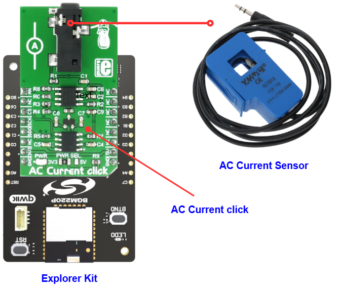
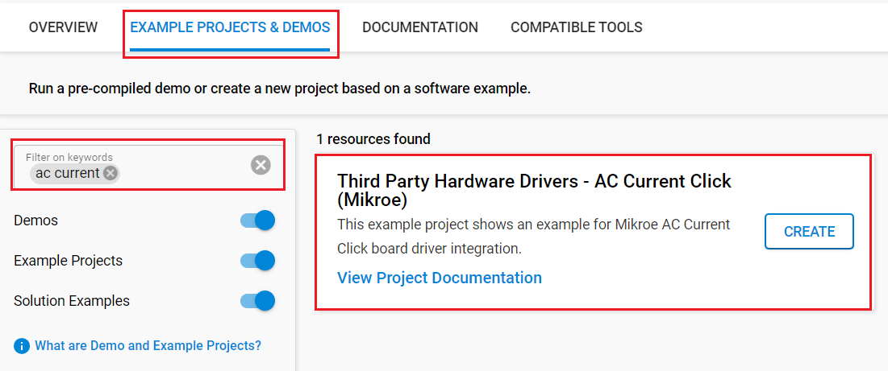

# AC Current Click (Mikroe) #

## Summary ##

This project aims to show the hardware driver that is used to interface with the AC Current driver with the Silicon Labs Platform.

AC Current click is a device that is able to measure the alternating current (AC) running through the conductor. The non-invasive sensor works by utilizing the electromagnetic induction phenomenon, similar to a transformer. The primary coil does not exist though, the electromagnetic field is generated by the AC Current running through the cable which is measured. The low-noise 12-bit SAR A/D converter (ADC) converts the sensor voltage, providing conversion data via the industry-standard SPI interface.

The Click board™ comes equipped with the 3.5mm jack connector which is used to attach the sensing probe. This board also comes as the part of the [AC Current click - bundle](https://www.mikroe.com/ac-current-click-bundle), which also contains the current measuring sensor, calibrated and well suited to work with the AC Current click (10A - 1V).

## Table Of Contents ##

- [Required Hardware](#required-hardware)
- [Hardware Connection](#hardware-connection)
- [Setup](#setup)
  - [Create a project based on an example project](#create-a-project-based-on-an-example-project)
  - [Start with an empty example project](#start-with-an-empty-example-project)
- [How It Works](#how-it-works)
- [Report Bugs & Get Support](#report-bugs--get-support)

## Required Hardware ##

- 1x [Silicon Labs BLE Explorer Kit](https://www.silabs.com/development-tools/wireless/bluetooth) based on the EFR32 SoC, such as:
  - [BGM220-EK4314A](https://www.silabs.com/development-tools/wireless/bluetooth/bgm220-explorer-kit)
  - [BG22-EK4108A](https://www.silabs.com/development-tools/wireless/bluetooth/bg22-explorer-kit?tab=overview)
  - [xG24-EK2703A](https://www.silabs.com/development-tools/wireless/efr32xg24-explorer-kit?tab=overview)
  - [xG22-EK2710A](https://www.silabs.com/development-tools/wireless/efr32xg22e-explorer-kit?tab=overview)

  *or*

  1x [Silicon Labs Wi-Fi Development Kit](https://www.silabs.com/development-tools/wireless/wi-fi) based on SiWG917, such as:
  - [SIWX917-DK2605A](https://www.silabs.com/development-tools/wireless/wi-fi/siwx917-dk2605a-wifi-6-bluetooth-le-soc-dev-kit)
  - [SIWX917-RB4338A](https://www.silabs.com/development-tools/wireless/wi-fi/siwx917-rb4338a-wifi-6-bluetooth-le-soc-radio-board) + [Si-MB4002A](https://www.silabs.com/development-tools/wireless/wireless-pro-kit-mainboard?tab=overview)
  - [SiW917Y-EK2708A](https://www.silabs.com/development-tools/wireless/wi-fi/siw917y-ek2708a-explorer-kit?tab=overview)

- 1x [AC Current Click board](https://www.mikroe.com/ac-current-click)
- 1x [AC Current Sensor](https://www.mikroe.com/ac-current)

## Hardware Connection ##

The Silicon Labs Explorer Kit boards feature a mikroBUS™ socket, allowing the AC Current Click board to connect easily via the mikroBUS header. Ensure that the 45-degree corner of the AC Current Click board aligns with the 45-degree white line on the Explorer Kit. The hardware connection is illustrated in the image below.

For the Silicon Labs boards that do not have a mikroBUS™ socket, consider using the Wire Jumpers.

The tables below provide an overview of the pin connections.

**Silicon Labs BLE Explorer Kit:**

| Description | BRD4314A | BRD4108A | BRD2703A | BRD2710A | ↔ | AC Current Click |
| --- | --- | --- | --- | --- | --- | --- |
| SPI CS PIN  | PC3 | PC3 | PC0 | PC3 | ↔ | CS  |
| SPI CLK PIN | PC2 | PC2 | PC1 | PC2 | ↔ | SCK |
| SPI RX PIN  | PC1 | PC1 | PC2 | PC1 | ↔ | SDO |

**Silicon Labs Wi-Fi Development Kit:**

| Description | BRD4338A + BRD4002A | BRD2605A | BRD2708A | ↔ | AC Current Click |
| --- | --- | --- | --- | --- | --- |
| RTE_GSPI_MASTER_CLK_PIN  | GPIO_25 [P25] | GPIO_25 [P3] | GPIO_25 | ↔ | SCK |
| RTE_GSPI_MASTER_MISO_PIN | GPIO_26 [P27] | GPIO_26 [P5] | GPIO_26 | ↔ | SDO |
| RTE_GSPI_MASTER_CS0_PIN  | GPIO_28 [P31] | GPIO_28 [P9] | GPIO_28 | ↔ | CS  |

## Setup ##

You can either create a project based on an example project or start with an empty example project.

> [!IMPORTANT]
>
> - Make sure that the [Third Party Hardware Drivers](https://github.com/SiliconLabsSoftware/third_party_hw_drivers_extension) extension is installed as part of the SiSDK. If not, follow [this documentation](https://github.com/SiliconLabsSoftware/third_party_hw_drivers_extension/blob/master/README.md#how-to-add-to-simplicity-studio-ide).
> - **Third Party Hardware Drivers** extension must be enabled for the project to install the required components from this extension.

> [!TIP]
> To show all components in the **Third Party Hardware Drivers** extension, the **Evaluation** quality must be enabled in the Software Component view.

### Create a project based on an example project ###

1. From the Launcher Home, add your board to My Products, click on it, and click on the **EXAMPLE PROJECTS & DEMOS** tab. Find the example project filtering by 'accurrent'.

2. Click **Create** button on the **Third Party Hardware Drivers - AC Current Click (Mikroe)** example. Example project creation dialog pops up -> click Create and Finish and Project should be generated.

   

3. Build and flash this example to the board.

### Start with an empty example project ###

1. Create an "Empty C Project" for the your board using Simplicity Studio v5. Use the default project settings.

2. Copy the file `app/example/mikroe_accurrent/app.c` into the project root folder (overwriting the existing file).

3. Open the .slcp file. Select the **SOFTWARE COMPONENTS** tab and install the following components:

   - **If the BLE Development Kit is used:**
     - [Services] → [IO Stream] → [IO Stream: EUSART] → default instance name: vcom
     - [Application] → [Utility] → [Log]
     - [Services] → [Timers] → [Sleep Timer]
     - [Third Party Hardware Drivers] → [Sensors] → [AC Current Click (Mikroe)]

   - **If the Wi-Fi Development Kit is used:**
     - [WiSeConnect 3 SDK] → [Device] → [Si91x] → [MCU] → [Service] → [Sleep Timer for Si91x]
     - [Third Party Hardware Drivers] → [Sensors] → [AC Current Click (Mikroe)]

4. Build and flash this example to the board.

## How It Works ##

AC Current Click Click communicates with the Silicon Labs hardware via SPI interface. The example measuring AC current and shows a message on the log screen.

You can launch Console which is integrated into Simplicity Studio or use a third-party terminal tool like Putty to receive the data from the USB. A screenshot of the console output and an actual test image are shown in the figure below.

## Report Bugs & Get Support ##

To report bugs in the Application Examples projects, please create a new "Issue" in the "Issues" section of [third_party_hw_drivers_extension](https://github.com/SiliconLabsSoftware/third_party_hw_drivers_extension) repo. Please reference the board, project, and source files associated with the bug, and reference line numbers. If you are proposing a fix, also include information on the proposed fix. Since these examples are provided as-is, there is no guarantee that these examples will be updated to fix these issues.

Questions and comments related to these examples should be made by creating a new "Issue" in the "Issues" section of [third_party_hw_drivers_extension](https://github.com/SiliconLabsSoftware/third_party_hw_drivers_extension) repo.
