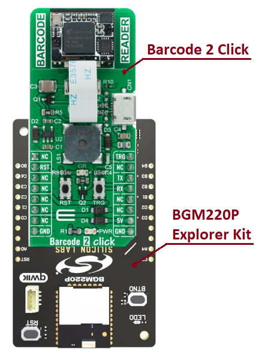

# EM3080-W - Barcode 2 Click (Mikroe) #

## Summary ##

This project shows the implementation of a Barcode reader using Barcode 2 Click board.

Barcode 2 Click is an adapter add-on board that contains a computerized image recognition system that is compliant with a wide range of different 1D and 2D barcode protocols. Barcode 2 Click can be used for both emerging mobile phone-based barcode applications, like coupons, e-tickets and boarding passes, and traditional applications.

## Table Of Contents ##

- [Required Hardware](#required-hardware)
- [Hardware Connection](#hardware-connection)
- [Setup](#setup)
  - [Create a project based on an example project](#create-a-project-based-on-an-example-project)
  - [Start with an empty example project](#start-with-an-empty-example-project)
- [How It Works](#how-it-works)
- [Report Bugs & Get Support](#report-bugs--get-support)

## Required Hardware ##

- 1x [Silicon Labs BLE Explorer Kit](https://www.silabs.com/development-tools/wireless/bluetooth) based on the EFR32 SoC, such as:
  - [BGM220-EK4314A](https://www.silabs.com/development-tools/wireless/bluetooth/bgm220-explorer-kit)
  - [BG22-EK4108A](https://www.silabs.com/development-tools/wireless/bluetooth/bg22-explorer-kit?tab=overview)
  - [xG24-EK2703A](https://www.silabs.com/development-tools/wireless/efr32xg24-explorer-kit?tab=overview)
  - [xG22-EK2710A](https://www.silabs.com/development-tools/wireless/efr32xg22e-explorer-kit?tab=overview)

  *or*

  1x [Silicon Labs Wi-Fi Development Kit](https://www.silabs.com/development-tools/wireless/wi-fi) based on SiWG917, such as:
  - [SIWX917-DK2605A](https://www.silabs.com/development-tools/wireless/wi-fi/siwx917-dk2605a-wifi-6-bluetooth-le-soc-dev-kit)
  - [SIWX917-RB4338A](https://www.silabs.com/development-tools/wireless/wi-fi/siwx917-rb4338a-wifi-6-bluetooth-le-soc-radio-board) + [Si-MB4002A](https://www.silabs.com/development-tools/wireless/wireless-pro-kit-mainboard?tab=overview)
  - [SiW917Y-EK2708A](https://www.silabs.com/development-tools/wireless/wi-fi/siw917y-ek2708a-explorer-kit?tab=overview)

- 1x [Barcode 2 Click board](https://www.mikroe.com/barcode-2-click)

## Hardware Connection ##

The Silicon Labs Explorer Kit boards feature a mikroBUS™ socket, allowing the Barcode 2 Click board to connect easily via the mikroBUS header. Ensure that the 45-degree corner of the Barcode 2 board aligns with the 45-degree white line on the Explorer Kit. The hardware connection is illustrated in the image below.

For the Silicon Labs boards that do not have a mikroBUS™ socket, consider using the Wire Jumpers.

The tables below provide an overview of the pin connections.

**Silicon Labs BLE Explorer Kit:**

| Description | BRD4314A | BRD4108A | BRD2703A | BRD2710A | ↔ | Barcode 2 Click |
| --- | --- | --- | --- | --- | --- | --- |
| UART Receive  | PB2 | PB2 | PD5 | PB2 | ↔ | TX  |
| UART Transmit | PB1 | PB1 | PD4 | PB1 | ↔ | RX  |
| RESET         | PC6 | PC6 | PC8 | PC6 | ↔ | RST |
| Scan Trigger  | PB4 | PB4 | PA0 | PB4 | ↔ | TRG |

**Silicon Labs Wi-Fi Development Kit:**

| Description | BRD4338A + BRD4002A | BRD2605A | BRD2708A | ↔ | Barcode 2 Click |
| --- | --- | --- | --- | --- | --- |
| UART Receive  | GPIO_29 [P33] | GPIO_29 [EXP11] | ULP_GPIO_6 | ↔ | TX  |
| UART Transmit | GPIO_30 [P35] | GPIO_30 [EXP13] | ULP_GPIO_7 | ↔ | RX  |
| Reset         | GPIO_46 [P24] | GPIO_10 [EXP23] | GPIO_30    | ↔ | RST |
| Scan Trigger  | GPIO_47 [P26] | GPIO_11 [EXP22] | GPIO_12    | ↔ | TRG |

## Setup ##

You can either create a project based on an example project or start with an empty example project.

> [!IMPORTANT]
>
> - Make sure that the [Third Party Hardware Drivers](https://github.com/SiliconLabsSoftware/third_party_hw_drivers_extension) extension is installed as part of the SiSDK. If not, follow [this documentation](https://github.com/SiliconLabsSoftware/third_party_hw_drivers_extension/blob/master/README.md#how-to-add-to-simplicity-studio-ide).
> - **Third Party Hardware Drivers** extension must be enabled for the project to install the required components from this extension.

> [!TIP]
> To show all components in the **Third Party Hardware Drivers** extension, the **Evaluation** quality must be enabled in the Software Component view.

### Create a project based on an example project ###

1. From the Launcher Home, add your board to My Products, click on it, and click on the **EXAMPLE PROJECTS & DEMOS** tab. Find the example project filtering by "em3080-w".

2. Click **Create** button on the **Third Party Hardware Drivers - EM3080-W - Barcode 2 Click (Mikroe)** example. Example project creation dialog pops up -> click Create and Finish and Project should be generated.

    

3. Build and flash this example to the board.

### Start with an empty example project ###

1. Create an "Empty C Project" for your board using Simplicity Studio v5. Use the default project settings.

2. Copy the file `app/example/mikroe_barcode2_em3080w/app.c` into the project root folder (overwriting the existing file).

3. Open the .slcp file. Select the **SOFTWARE COMPONENTS** tab and install the following components:

   - **If the BLE Explorer Kit is used:**
     - [Services] → [Timers] → [Sleep Timer]
     - [Application] → [Utility] → [Assert]
     - [Services] → [IO Stream] → [IO Stream: EUSART] → default instance name: vcom
     - [Application] → [Utility] → [Log]
     - [Services] → [IO Stream] → [IO Stream: USART] → [mikroe] → Set "Receiver buffer size" to **256**
     - [Third Party Hardware Drivers] → [Sensors] → [EM3080-W - Barcode 2 Click (Mikroe)] → use default configuration

   - **If the Wi-Fi Development Kit is used:**
     - [WiSeConnect 3 SDK] → [Device] → [Si91x] → [MCU] → [Service] → [Sleep Timer for Si91x]
     - [Application] → [Utility] → [Assert]
     - [Third Party Hardware Drivers] → [Sensors] → [EM3080-W - Barcode 2 Click (Mikroe)] → use default configuration
     - [WiSeConnect 3 SDK] → [Device] → [Si91x] → [MCU] → [Peripheral] → [USART] → disable "USART0 DMA". Select the corresponding pins according to the table provided in [Hardware Connection](#hardware-connection)

4. Build and flash this example to the board.

## How It Works ##

After you flash the code to your board and power the connected boards, the application starts running automatically. Use Putty/Tera Term (or another program) to read the values of the serial output. Note that your board uses the default baud rate of 115200. First, the main program performs sensor initialization, after that it enables scanning and waits for the barcode to be detected. If the barcode or QR Code is detected, it displays the barcode's content to the console. After that, it disables scanning for 1 second. In the image below, you can see an example of how the output is displayed.

## Report Bugs & Get Support ##

To report bugs in the Application Examples projects, please create a new "Issue" in the "Issues" section of [third_party_hw_drivers_extension](https://github.com/SiliconLabsSoftware/third_party_hw_drivers_extension) repo. Please reference the board, project, and source files associated with the bug, and reference line numbers. If you are proposing a fix, also include information on the proposed fix. Since these examples are provided as-is, there is no guarantee that these examples will be updated to fix these issues.

Questions and comments related to these examples should be made by creating a new "Issue" in the "Issues" section of [third_party_hw_drivers_extension](https://github.com/SiliconLabsSoftware/third_party_hw_drivers_extension) repo.
