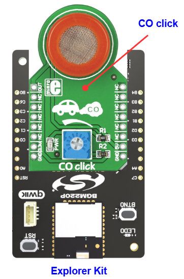

# MQ7 - CO Click (Mikroe) #

## Summary ##

This project aims to show the hardware driver that is used to interface with the MQ7 Sensor using Silicon Labs platform.

CO Click is a compact add-on board that can detect the presence of carbon monoxide. This board features MQ-7, a carbon monoxide sensor from Zhengzhou Winsen Electronics Technology. The gas sensing layer on the MQ-7 sensor unit is made of Tin dioxide (SnO2), an inorganic compound with lower conductivity in clean air (the conductivity increases as the levels of carbon monoxide rise). It has a high sensitivity to carbon monoxide and can be used to detect alcohol in concentrations from 20 to 2000ppm communication with the host MCU through the analog mikroBUS line. This Click board is suitable as a domestic CO gas leakage alarm, industrial CO gas alarm, and portable CO gas detector.

## Table Of Contents ##

- [Required Hardware](#required-hardware)
- [Hardware Connection](#hardware-connection)
- [Setup](#setup)
  - [Create a project based on an example project](#create-a-project-based-on-an-example-project)
  - [Start with an empty example project](#start-with-an-empty-example-project)
- [How It Works](#how-it-works)
- [Report Bugs & Get Support](#report-bugs--get-support)

## Required Hardware ##

- 1x [Silicon Labs BLE Explorer Kit](https://www.silabs.com/development-tools/wireless/bluetooth) based on the EFR32 SoC, such as:
  - [BGM220-EK4314A](https://www.silabs.com/development-tools/wireless/bluetooth/bgm220-explorer-kit)
  - [BG22-EK4108A](https://www.silabs.com/development-tools/wireless/bluetooth/bg22-explorer-kit?tab=overview)
  - [xG24-EK2703A](https://www.silabs.com/development-tools/wireless/efr32xg24-explorer-kit?tab=overview)
  - [xG22-EK2710A](https://www.silabs.com/development-tools/wireless/efr32xg22e-explorer-kit?tab=overview)

  *or*

  1x [Silicon Labs Wi-Fi Development Kit](https://www.silabs.com/development-tools/wireless/wi-fi) based on SiWG917, such as:
  - [SIWX917-DK2605A](https://www.silabs.com/development-tools/wireless/wi-fi/siwx917-dk2605a-wifi-6-bluetooth-le-soc-dev-kit)
  - [SIWX917-RB4338A](https://www.silabs.com/development-tools/wireless/wi-fi/siwx917-rb4338a-wifi-6-bluetooth-le-soc-radio-board) + [Si-MB4002A](https://www.silabs.com/development-tools/wireless/wireless-pro-kit-mainboard?tab=overview)
  - [SiW917Y-EK2708A](https://www.silabs.com/development-tools/wireless/wi-fi/siw917y-ek2708a-explorer-kit?tab=overview)

- 1x [CO Click](https://www.mikroe.com/co-click)

## Hardware Connection ##

The Silicon Labs Explorer Kit boards feature a mikroBUS™ socket, allowing the CO Click board to connect easily via the mikroBUS header. Ensure that the 45-degree corner of the CO Click board aligns with the 45-degree white line on the Explorer Kit. The hardware connection is illustrated in the image below.

For the Silicon Labs boards that do not have a mikroBUS™ socket, consider using the Wire Jumpers.

The tables below provide an overview of the pin connections.

**Silicon Labs BLE Explorer Kit:**

| Description | BRD4314A | BRD4108A | BRD2703A | BRD2710A | ↔ | CO Click |
| --- | --- | --- | --- | --- | --- | --- |
| Positive analog input | PB0 | PB0 | PB0 | PB0 | ↔ | OUT |

**Silicon Labs Wi-Fi Development Kit:**

| Description | BRD4338A + BRD4002A | BRD2605A | BRD2708A | ↔ | CO Click |
| --- | --- | --- | --- | --- | --- |
| Positive analog input | ULP_GPIO_1 [P16] | ULP_GPIO_1 [P4] | GPIO_29 | ↔ | OUT |

## Setup ##

You can either create a project based on an example project or start with an empty example project.

> [!IMPORTANT]
>
> - Make sure that the [Third Party Hardware Drivers](https://github.com/SiliconLabsSoftware/third_party_hw_drivers_extension) extension is installed as part of the SiSDK. If not, follow [this documentation](https://github.com/SiliconLabsSoftware/third_party_hw_drivers_extension/blob/master/README.md#how-to-add-to-simplicity-studio-ide).
> - **Third Party Hardware Drivers** extension must be enabled for the project to install the required components from this extension.

> [!TIP]
> To show all components in the **Third Party Hardware Drivers** extension, the **Evaluation** quality must be enabled in the Software Component view.

### Create a project based on an example project ###

1. From the Launcher Home, add your board to My Products, click on it, and click on the **EXAMPLE PROJECTS & DEMOS** tab. Find the example project filtering by *mq7*.

2. Click **Create** button on **Third Party Hardware Drivers - MQ7 - CO Click (Mikroe)**. Example project creation dialog pops up -> click Create and Finish and Project should be generated.

   

3. Build and flash this example to the board.

### Start with an empty example project ###

1. Create an "Empty C Project" for your board using Simplicity Studio v5. Use the default project settings.

2. Copy the file `app/example/mikroe_co_mq7/app.c` into the project root folder (overwriting the existing file).

3. Open the .slcp file. Select the **SOFTWARE COMPONENTS** tab and install the following components:

   - **If the BLE Explorer Kit is used:**
     - [Services] → [Timers] → [Sleep Timer]
     - [Services] → [IO Stream] → [IO Stream: USART] → default instance name: vcom
     - [Application] → [Utility] → [Log]
     - [Third Party Hardware Drivers] → [Sensors] → [MQ7 - CO Click (Mikroe)] → use default configuration

   - **If the Wi-Fi Development Kit is used:**
     - [WiSeConnect 3 SDK] → [Device] → [Si91x] → [MCU] → [Service] → [Sleep Timer for Si91x]
     - [WiSeConnect 3 SDK] → [Device] → [Si91x] → [MCU] → [Peripheral] → [ADC] → [channel_1] → Select the corresponding pins according to the table provided in [Hardware Connection](#hardware-connection)
     - [Third Party Hardware Drivers] → [Sensors] → [MQ7 - CO Click (Mikroe)]

4. Enable **Printf float**

   - Open Properties of the project.
   - Select C/C++ Build → Settings → Tool Settings → GNU ARM C Linker → General → Check **Printf float**.
     

5. Build and flash this example to the board.

## How It Works ##

The application shows the reading of the ADC values given by the sensors and prints in two forms (DEC and HEX).

You can launch Console that's integrated into Simplicity Studio or use a third-party terminal tool like Tera Term to receive the data from the USB. A screenshot of the console output is shown in the figure below.

## Report Bugs & Get Support ##

To report bugs in the Application Examples projects, please create a new "Issue" in the "Issues" section of [third_party_hw_drivers_extension](https://github.com/SiliconLabsSoftware/third_party_hw_drivers_extension) repo. Please reference the board, project, and source files associated with the bug, and reference line numbers. If you are proposing a fix, also include information on the proposed fix. Since these examples are provided as-is, there is no guarantee that these examples will be updated to fix these issues.

Questions and comments related to these examples should be made by creating a new "Issue" in the "Issues" section of [third_party_hw_drivers_extension](https://github.com/SiliconLabsSoftware/third_party_hw_drivers_extension) repo.
