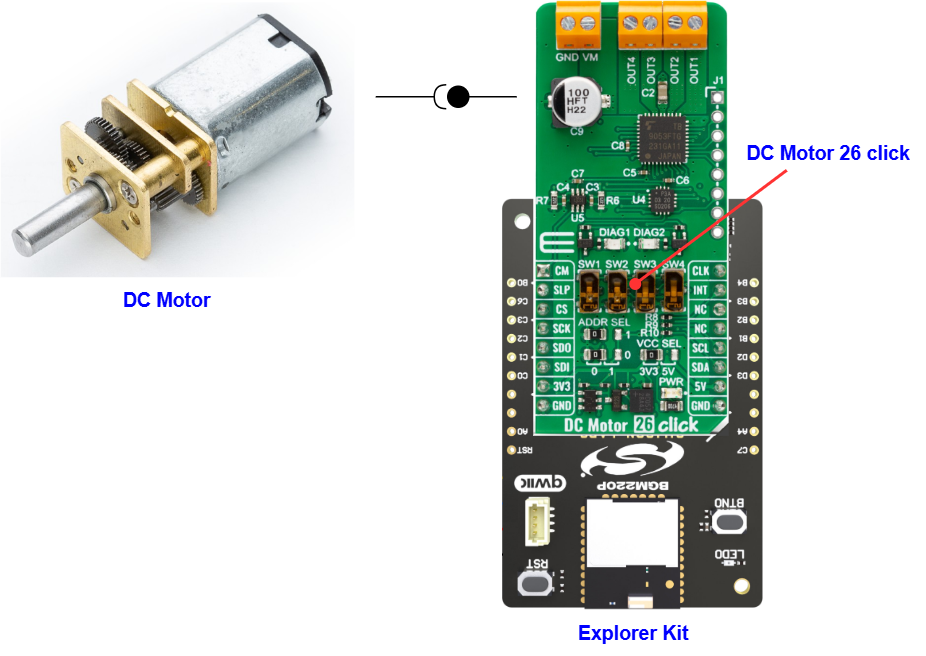

# TB9053FTG - DC Motor 26 Click (Mikroe) #

## Summary ##

MikroE DC Motor 26 Click features the TB9053FTG, a PWM-type, dual-channel, H-bridge, brushed DC motor driver. The TB9053FTG is rated for an operating voltage range from 4.5V to 28V, with the motor controlled directly through a PWM signal or SPI serial interface. This board can control one or two DC motors, selectable motor control functions and operational modes, current monitoring and more.

The example demonstrates the use of MikroE DC Motor 26 Click board by controlling the speed of a DC motor over the PWM duty cycle as well as displaying the current consumption of the motor with the Silicon Labs Platform.

## Table Of Contents ##

- [Required Hardware](#required-hardware)
- [Hardware Connection](#hardware-connection)
- [Setup](#setup)
  - [Create a project based on an example project](#create-a-project-based-on-an-example-project)
  - [Start with an empty example project](#start-with-an-empty-example-project)
- [How It Works](#how-it-works)
- [Report Bugs & Get Support](#report-bugs--get-support)

## Required Hardware ##

- 1x [Silicon Labs BLE Explorer Kit](https://www.silabs.com/development-tools/wireless/bluetooth) based on the EFR32 SoC, such as:
  - [BGM220-EK4314A](https://www.silabs.com/development-tools/wireless/bluetooth/bgm220-explorer-kit)
  - [BG22-EK4108A](https://www.silabs.com/development-tools/wireless/bluetooth/bg22-explorer-kit?tab=overview)
  - [xG24-EK2703A](https://www.silabs.com/development-tools/wireless/efr32xg24-explorer-kit?tab=overview)
  - [xG22-EK2710A](https://www.silabs.com/development-tools/wireless/efr32xg22e-explorer-kit?tab=overview)

  *or*

  1x [Silicon Labs Wi-Fi Development Kit](https://www.silabs.com/development-tools/wireless/wi-fi) based on SiWG917, such as:
  - [SIWX917-DK2605A](https://www.silabs.com/development-tools/wireless/wi-fi/siwx917-dk2605a-wifi-6-bluetooth-le-soc-dev-kit)
  - [SIWX917-RB4338A](https://www.silabs.com/development-tools/wireless/wi-fi/siwx917-rb4338a-wifi-6-bluetooth-le-soc-radio-board) + [Si-MB4002A](https://www.silabs.com/development-tools/wireless/wireless-pro-kit-mainboard?tab=overview)

- 1x [DC Motor 26 Click](https://www.mikroe.com/dc-motor-26-click)
- 1x [DC Motor](https://www.mikroe.com/dc-gear-motor)

## Hardware Connection ##

The Silicon Labs Explorer Kit boards feature a mikroBUS™ socket, allowing the DC Motor 26 Click board to connect easily via the mikroBUS header. Ensure that the 45-degree corner of the DC Motor 26 Click board aligns with the 45-degree white line on the Explorer Kit. The hardware connection is illustrated in the image below.

For the Silicon Labs boards that do not have a mikroBUS™ socket, consider using the Wire Jumpers.

The tables below provide an overview of the pin connections.

**Silicon Labs BLE Explorer Kit:**

| Description | BRD4314A | BRD4108A | BRD2703A | BRD2710A | ↔ | DC Motor 26 Click |
| --- | --- | --- | --- | --- | --- | --- |
| I2C_SDA | PD3 | PD3 | PB5 | PD3 | ↔ | SDA |
| I2C_SCL | PD2 | PD2 | PB4 | PD2 | ↔ | SCL |
| SPI CS PIN  | PC3 | PC3 | PC0 | PC3 | ↔ | CS  |
| SPI CLK PIN | PC2 | PC2 | PC1 | PC2 | ↔ | SCK |
| SPI RX PIN  | PC1 | PC1 | PC2 | PC1 | ↔ | SDO |
| SPI TX PIN  | PC0 | PC0 | PC3 | PC0 | ↔ | SDI |
| Channel Current Monitor  | PB0 | PB0 | PB0 | PB0 | ↔ | CM  |
| Sleep / ID SEL           | PC6 | PC6 | PC8 | PC6 | ↔ | SLP |
| Interrupt                | PB3 | PB3 | PB1 | PB3 | ↔ | INT |
| PWM Signal               | PB4 | PB4 | PA0 | PB4 | ↔ | CLK |

**Silicon Labs Wi-Fi Development Kit:**

| Description | BRD4338A + BRD4002A | BRD2605A | ↔ | DC Motor 26 Click |
| --- | --- | --- | --- | --- |
| I2C_SDA | ULP_GPIO_6 [EXP_16] | ULP_GPIO_6 [P16] | ↔ | SDA |
| I2C_SCL | ULP_GPIO_7 [EXP_15] | ULP_GPIO_7 [P15] | ↔ | SCL |
| SSI_MASTER_CLK_PIN  | GPIO_25 [P25] | GPIO_25 [P3] | ↔ | SCK |
| SSI_MASTER_MOSI_PIN | GPIO_26 [P27] | GPIO_26 [P5] | ↔ | SDI |
| SSI_MASTER_MISO_PIN | GPIO_27 [P29] | GPIO_27 [P7] | ↔ | SDO |
| CS                       | GPIO_49 [P30] | GPIO_6 [P21] | ↔ | CS  |
| Channel Current Monitor  | ULP_GPIO_1 [P16] | ULP_GPIO_1 [P4] | ↔ | CM  |
| Sleep / ID SEL           | GPIO_46 [P24]    | GPIO_10 [P23]   | ↔ | SLP |
| Interrupt                | GPIO_47 [P26]    | GPIO_11 [P22]   | ↔ | INT |
| PWM Signal               | GPIO_48 [P28]    | GPIO_12 [P25]   | ↔ | CLK |

> [!NOTE]
> The DC Motor 26 click board switches should be set as follows: SW 1-2-3-4 : H-H-L-L. This sets the click board as a SPI controlled single-channel device so the motor should be connected to OUT1/2 and OUT3/4.

## Setup ##

You can either create a project based on an example project or start with an empty example project.

> [!IMPORTANT]
>
> - Make sure that the [Third Party Hardware Drivers](https://github.com/SiliconLabsSoftware/third_party_hw_drivers_extension) extension is installed as part of the SiSDK. If not, follow [this documentation](https://github.com/SiliconLabsSoftware/third_party_hw_drivers_extension/blob/master/README.md#how-to-add-to-simplicity-studio-ide).
> - **Third Party Hardware Drivers** extension must be enabled for the project to install the required components from this extension.

> [!TIP]
> To show all components in the **Third Party Hardware Drivers** extension, the **Evaluation** quality must be enabled in the Software Component view.

### Create a project based on an example project ###

1. From the Launcher Home, add your device to My Products, click on it, and click on the **EXAMPLE PROJECTS & DEMOS** tab. Find the example project filtering by **"motor 26"**.

2. Click the **Create** button on the **Third Party Hardware Drivers - TB9053FTG - DC Motor 26 Click (Mikroe)** example. Example project creation dialog pops up -> click Create and Finish and Project should be generated.

   

3. Build and flash this example to the board.

### Start with an empty example project ###

1. Create an "Empty C Project" for your board using Simplicity Studio v5. Use the default project settings.

2. Copy the file `app/example/mikroe_dcmotor26_tb9053ftg/app.c` into the project root folder (overwriting the existing file).

3. Open the .slcp file. Select the **SOFTWARE COMPONENTS** tab and install the following components:

   - **If the BLE Explorer Kit is used:**
     - [Services] → [IO Stream] → [IO Stream: EUSART] → default instance name: vcom.
     - [Application] → [Utility] → [Log]
     - [Application] → [Utility] → [Assert]
     - [Services] → [Timers] → [Sleep Timer]
     - [Third Party Hardware Drivers] → [Motor Control] → [TB9053FTG - DC Motor 26 Click (Mikroe)] → use default configuration

   - **If the Wi-Fi Development Kit is used:**
     - [WiSeConnect 3 SDK] → [Device] → [Si91x] → [MCU] → [Service] → [Sleep Timer for Si91x]
     - [WiSeConnect 3 SDK] → [Device] → [Si91x] → [MCU] → [Peripheral] → [PWM] → [channel_0] → use default configuration
     - [WiSeConnect 3 SDK] → [Device] → [Si91x] → [MCU] → [Peripheral] → [ADC] → [channel_1] → use default configuration
     - [WiSeConnect 3 SDK] → [Device] → [Si91x] → [MCU] → [Peripheral] → [I2C] → [i2c2] → use default configuration
     - [WiSeConnect 3 SDK] → [Device] → [Si91x] → [MCU] → [Peripheral] → [SSI] → [primary] → use default configuration
     - [Third Party Hardware Drivers] → [Motor Control] → [TB9053FTG - DC Motor 26 Click (Mikroe)] → use default configuration

4. Enable **Printf float**

   - Open Properties of the project.
   - Select C/C++ Build → Settings → Tool Settings → GNU ARM C Linker → General → Check **Printf float**.

5. Build and flash this example to the board.

## How It Works ##

The example controls a DC motor combined with two channels and monitors the power consumption of the motor. When the rotation direction is about to change, the DC motor shuts off for 3 seconds prior to starting in forward mode. As the motor starts to rev up, the rotation speed increases to the maximum speed controlled by the PWM signal. Then, it starts to change its function to brake mode after 3 seconds of operation. In the brake mode, the DC motor stops immediately, then the DC motor runs in the reverse direction and the motor speeds up again.

You can launch Console, which is integrated into Simplicity Studio, or you can use a third-party terminal tool like Putty to receive the data from USB. A screenshot of the console output and an actual test image are shown in the figure below.

## Report Bugs & Get Support ##

To report bugs in the Application Examples projects, please create a new "Issue" in the "Issues" section of [third_party_hw_drivers_extension](https://github.com/SiliconLabsSoftware/third_party_hw_drivers_extension) repo. Please reference the board, project, and source files associated with the bug, and reference line numbers. If you are proposing a fix, also include information on the proposed fix. Since these examples are provided as-is, there is no guarantee that these examples will be updated to fix these issues.

Questions and comments related to these examples should be made by creating a new "Issue" in the "Issues" section of [third_party_hw_drivers_extension](https://github.com/SiliconLabsSoftware/third_party_hw_drivers_extension) repo.
