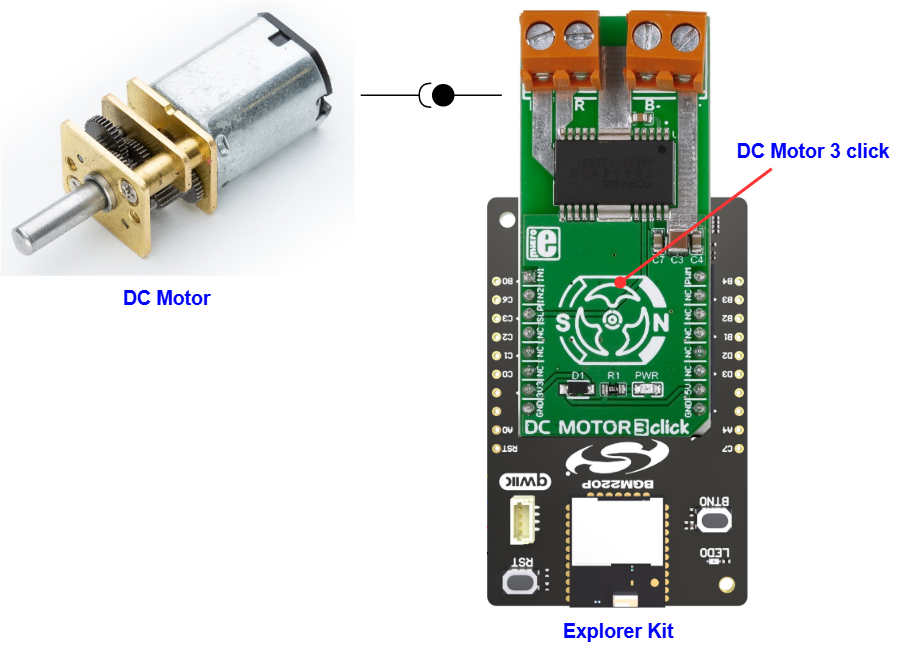

# TB6549FG - DC Motor 3 Click (Mikroe) #

## Summary ##

This project aims to show the hardware driver that is used to interface with the DC motor driver using the TB6549FG from Toshiba with the Silicon Labs Platform.

DC MOTOR 3 Click is a mikroBUS™ add-on board with a Toshiba TB6549FG full-bridge driver for direct current motors. The IC is capable of outputting currents of up to 3.5 A with 30V, making it suitable for high-power motors.

## Table Of Contents ##

- [Required Hardware](#required-hardware)
- [Hardware Connection](#hardware-connection)
- [Setup](#setup)
  - [Create a project based on an example project](#create-a-project-based-on-an-example-project)
  - [Start with an empty example project](#start-with-an-empty-example-project)
- [How It Works](#how-it-works)
- [Report Bugs & Get Support](#report-bugs--get-support)

## Required Hardware ##

- 1x [Silicon Labs BLE Explorer Kit](https://www.silabs.com/development-tools/wireless/bluetooth) based on the EFR32 SoC, such as:
  - [BGM220-EK4314A](https://www.silabs.com/development-tools/wireless/bluetooth/bgm220-explorer-kit)
  - [BG22-EK4108A](https://www.silabs.com/development-tools/wireless/bluetooth/bg22-explorer-kit?tab=overview)
  - [xG24-EK2703A](https://www.silabs.com/development-tools/wireless/efr32xg24-explorer-kit?tab=overview)
  - [xG22-EK2710A](https://www.silabs.com/development-tools/wireless/efr32xg22e-explorer-kit?tab=overview)

  *or*

  1x [Silicon Labs Wi-Fi Development Kit](https://www.silabs.com/development-tools/wireless/wi-fi) based on SiWG917, such as:
  - [SIWX917-DK2605A](https://www.silabs.com/development-tools/wireless/wi-fi/siwx917-dk2605a-wifi-6-bluetooth-le-soc-dev-kit)
  - [SIWX917-RB4338A](https://www.silabs.com/development-tools/wireless/wi-fi/siwx917-rb4338a-wifi-6-bluetooth-le-soc-radio-board) + [Si-MB4002A](https://www.silabs.com/development-tools/wireless/wireless-pro-kit-mainboard?tab=overview)
  - [SiW917Y-EK2708A](https://www.silabs.com/development-tools/wireless/wi-fi/siw917y-ek2708a-explorer-kit?tab=overview)

- 1x [DC Motor 3 Click](https://www.mikroe.com/dc-motor-3-click)
- 1x [DC Motor](https://www.mikroe.com/dc-gear-motor)

## Hardware Connection ##

The Silicon Labs Explorer Kit boards feature a mikroBUS™ socket, allowing the DC Motor 3 Click board to connect easily via the mikroBUS header. Ensure that the 45-degree corner of the DC Motor 3 Click board aligns with the 45-degree white line on the Explorer Kit. The hardware connection is illustrated in the image below.

For the Silicon Labs boards that do not have a mikroBUS™ socket, consider using the Wire Jumpers.

The tables below provide an overview of the pin connections.

**Silicon Labs BLE Explorer Kit:**

| Description | BRD4314A | BRD4108A | BRD2703A | BRD2710A | ↔ | DC Motor 3 Click |
| --- | --- | --- | --- | --- | --- | --- |
| Control Signal Input 1  | PB0 | PB0 | PB0 | PB0 | ↔ | IN1  |
| Control Signal Input 2 | PC6 | PC6 | PC8 | PC6 | ↔ | IN2 |
| Standby Mode  | PC3 | PC3 | PC0 | PC3 | ↔ | SLP |
| External sync  | PB4 | PB4 | PA0 | PB4 | ↔ | PWM |

**Silicon Labs Wi-Fi Development Kit:**

| Description | BRD4338A + BRD4002A | BRD2605A | BRD2708A | ↔ | DC Motor 3 Click |
| --- | --- | --- | --- | --- | --- |
| Control Signal Input 1 | GPIO_48 [P28] | GPIO_12 [P25] | GPIO_29 | ↔ | IN1 |
| Control Signal Input 2 | GPIO_47 [P26] | GPIO_11 [P22] | GPIO_30 | ↔ | IN2 |
| Standby Mode | GPIO_46 [P24] | GPIO_10 [P23] | GPIO_28 | ↔ | SLP |
| External sync  | GPIO_7 [P20] | GPIO_7 [P24] | GPIO_12 | ↔ | PWM  |

## Setup ##

You can either create a project based on an example project or start with an empty example project.

> [!IMPORTANT]
>
> - Make sure that the [Third Party Hardware Drivers](https://github.com/SiliconLabsSoftware/third_party_hw_drivers_extension) extension is installed as part of the SiSDK. If not, follow [this documentation](https://github.com/SiliconLabsSoftware/third_party_hw_drivers_extension/blob/master/README.md#how-to-add-to-simplicity-studio-ide).
> - **Third Party Hardware Drivers** extension must be enabled for the project to install the required components from this extension.

> [!TIP]
> To show all components in the **Third Party Hardware Drivers** extension, the **Evaluation** quality must be enabled in the Software Component view.

### Create a project based on an example project ###

1. From the Launcher Home, add your board to My Products, click on it, and click on the **EXAMPLE PROJECTS & DEMOS** tab. Find the example project filtering by *dc*

2. Click **Create** button on the **Third Party Hardware Drivers - TB6549FG - DC Motor 3 Click (Mikroe)** example. Example project creation dialog pops up -> click Create and Finish and Project should be generated.

   

3. Build and flash this example to the board.

### Start with an empty example project ###

1. Create an "Empty C Project" for your board using Simplicity Studio v5. Use the default project settings.

2. Copy the file `app/example/mikroe_dcmotor3_tb6549fg/app.c` into the project root folder (overwriting the existing file).

3. Open the .slcp file. Select the **SOFTWARE COMPONENTS** tab and install the following components:

   - **If the BLE Explorer Kit is used:**
     - [Services] → [IO Stream] → [IO Stream: USART] → default instance name: vcom
     - [Application] → [Utility] → [Log]
     - [Services] → [Timers] → [Sleep Timer]
     - [Third Party Hardware Drivers] → [Miscellaneous] → [TB6549FG - DC MOTOR 3 Click (Mikroe)]

   - **If the Wi-Fi Development Kit is used:**
     - [WiSeConnect 3 SDK] → [Device] → [Si91x] → [MCU] → [Service] → [Sleep Timer for Si91x]
     - [WiSeConnect 3 SDK] → [Device] → [Si91x] → [MCU] → [Peripheral] → [PWM] → [channel_0] → use default configuration. **Note**: For the BRD2708A board, PWM channel 3 should be used and configured as illustrated in the figure below.
       
     - [Third Party Hardware Drivers] → [Miscellaneous] → [TB6549FG - DC MOTOR 3 Click (Mikroe)]

4. Build and flash this example to the board.

## How It Works ##

This example demonstrates the use of DC Motor 3 Click board. DC Motor 3 Click communicates with the register via PWM interface.
It shows moving in the left direction from slow to fast speed and from fast to slow speed.
Results are being sent to the USART Terminal where you can track their changes.

You can launch Console that's integrated into Simplicity Studio or use a third-party terminal tool like Tera Term to receive the data from the USB. A screenshot of the console output and an actual test image are shown in the figure below.

## Report Bugs & Get Support ##

To report bugs in the Application Examples projects, please create a new "Issue" in the "Issues" section of [third_party_hw_drivers_extension](https://github.com/SiliconLabsSoftware/third_party_hw_drivers_extension) repo. Please reference the board, project, and source files associated with the bug, and reference line numbers. If you are proposing a fix, also include information on the proposed fix. Since these examples are provided as-is, there is no guarantee that these examples will be updated to fix these issues.

Questions and comments related to these examples should be made by creating a new "Issue" in the "Issues" section of [third_party_hw_drivers_extension](https://github.com/SiliconLabsSoftware/third_party_hw_drivers_extension) repo.
