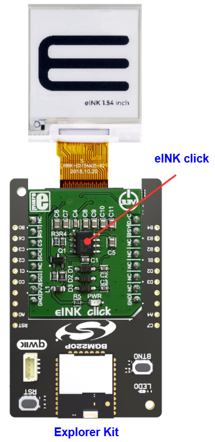

# E-Paper Display - eINK Click (Mikroe) #

## Summary ##

This project aims to show the hardware driver that is used to interface with eINK Click and E-Paper display using the Silicon Labs platform.

E-Paper display is based on Active Matrix Electrophoretic Display (AMEPD) technology and has an integrated pixel driver, which uses the SPI interface to communicate with the host MCU. The screen displays a clear and crisp graphics, and has an ultra-wide viewing range. Another key feature of the E-Ink technology is the extremely low power consumption, even when the display actively refresh its content.

## Table Of Contents ##

- [Required Hardware](#required-hardware)
- [Hardware Connection](#hardware-connection)
- [Setup](#setup)
  - [Create a project based on an example project](#create-a-project-based-on-an-example-project)
  - [Start with an empty example project](#start-with-an-empty-example-project)
- [How It Works](#how-it-works)
- [Report Bugs & Get Support](#report-bugs--get-support)

## Required Hardware ##

- 1x [Silicon Labs BLE Explorer Kit](https://www.silabs.com/development-tools/wireless/bluetooth) based on the EFR32 SoC, such as:
  - [BGM220-EK4314A](https://www.silabs.com/development-tools/wireless/bluetooth/bgm220-explorer-kit)
  - [BG22-EK4108A](https://www.silabs.com/development-tools/wireless/bluetooth/bg22-explorer-kit?tab=overview)
  - [xG24-EK2703A](https://www.silabs.com/development-tools/wireless/efr32xg24-explorer-kit?tab=overview)
  - [xG22-EK2710A](https://www.silabs.com/development-tools/wireless/efr32xg22e-explorer-kit?tab=overview)

  *or*

  1x [Silicon Labs Wi-Fi Development Kit](https://www.silabs.com/development-tools/wireless/wi-fi) based on SiWG917, such as:
  - [SIWX917-DK2605A](https://www.silabs.com/development-tools/wireless/wi-fi/siwx917-dk2605a-wifi-6-bluetooth-le-soc-dev-kit)
  - [SIWX917-RB4338A](https://www.silabs.com/development-tools/wireless/wi-fi/siwx917-rb4338a-wifi-6-bluetooth-le-soc-radio-board) + [Si-MB4002A](https://www.silabs.com/development-tools/wireless/wireless-pro-kit-mainboard?tab=overview)
  - [SiW917Y-EK2708A](https://www.silabs.com/development-tools/wireless/wi-fi/siw917y-ek2708a-explorer-kit?tab=overview)

- 1x [eINK Click - without display](https://www.mikroe.com/eink-click-without-display)
- 1x E-Paper display as listed below:
  - [E-Paper display 1,54" 200x200 dots](https://www.mikroe.com/e-paper-display-154-200x200-dots)
  - [E-Paper display 2,13" 122x250 dots](https://www.mikroe.com/e-paper-display-213-122x250-dots)
  - [E-Paper display 2,9" 296x128 dots](https://www.mikroe.com/e-paper-display-29-inches)

## Hardware Connection ##

The Silicon Labs Explorer Kit boards feature a mikroBUS™ socket, allowing the eINK Click board to connect easily via the mikroBUS header. Ensure that the 45-degree corner of the eINK Click board aligns with the 45-degree white line on the Explorer Kit. The hardware connection is illustrated in the image below.

For the Silicon Labs boards that do not have a mikroBUS™ socket, consider using the Wire Jumpers.

The tables below provide an overview of the pin connections.

**Silicon Labs BLE Explorer Kit:**

| Description | BRD4314A | BRD4108A | BRD2703A | BRD2710A | ↔ | Cap Touch 2 Click Board |
| --- | --- | --- | --- | --- | --- | --- |
| SPI CS PIN  | PC3 | PC3 | PC0 | PC3 | ↔ | CS  |
| SPI CLK PIN | PC2 | PC2 | PC1 | PC2 | ↔ | SCK |
| SPI TX PIN  | PC0 | PC0 | PC3 | PC0 | ↔ | SDI |
| Busy indicator  | PB3 | PB3 | PB1 | PB3 | ↔ | BSY |
| Reset           | PC6 | PC6 | PC8 | PC6 | ↔ | RST |
| Data/Config     | PB4 | PB4 | PA0 | PB4 | ↔ | D/C |

**Silicon Labs Wi-Fi Development Kit:**

| Description | BRD4338A + BRD4002A | BRD2605A | BRD2708A | ↔ | Cap Touch 2 Click Board |
| --- | --- | --- | --- | --- | --- |
| RTE_GSPI_MASTER_CLK_PIN  | GPIO_25 [P25] | GPIO_25 [P3] | GPIO_25 | ↔ | SCK |
| RTE_GSPI_MASTER_MOSI_PIN | GPIO_27 [P29] | GPIO_27 [P7] | GPIO_27 | ↔ | SDI |
| RTE_GSPI_MASTER_CS0_PIN  | GPIO_28 [P31] | GPIO_28 [P9] | GPIO_28 | ↔ | CS  |
| Busy indicator | GPIO_46 [P24] | GPIO_10 [P23] | UULP_VBAT_GPIO_2 | ↔ | BSY |
| Reset          | GPIO_47 [P26] | GPIO_11 [P22] | GPIO_30 | ↔ | RST |
| Data/Config    | GPIO_48 [P28] | GPIO_12 [P25] | GPIO_12 | ↔ | D/C |

## Setup ##

You can either create a project based on an example project or start with an empty example project.

> [!IMPORTANT]
>
> - Make sure that the [Third Party Hardware Drivers](https://github.com/SiliconLabsSoftware/third_party_hw_drivers_extension) extension is installed as part of the SiSDK. If not, follow [this documentation](https://github.com/SiliconLabsSoftware/third_party_hw_drivers_extension/blob/master/README.md#how-to-add-to-simplicity-studio-ide).
> - **Third Party Hardware Drivers** extension must be enabled for the project to install the required components from this extension.

> [!TIP]
> To show all components in the **Third Party Hardware Drivers** extension, the **Evaluation** quality must be enabled in the Software Component view.

### Create a project based on an example project ###

1. From the Launcher Home, add your device to My Products, click on it, and click on the **EXAMPLE PROJECTS & DEMOS** tab. Find the example project filtering by **eink**.

2. Click **Create** button on the **Third Party Hardware Drivers - E-Paper Display - eINK Click (Mikroe)** example. Example project creation dialog pops up -> click Create and Finish and Project should be generated.

   

3. Build and flash this example to the board.

### Start with an empty example project ###

1. Create an "Empty C Project" for the your board using Simplicity Studio v5. Use the default project settings.

2. Copy the file `app/example/mikroe_eink_display/app.c` into the project root folder (overwriting the existing file).

3. Open the .slcp file. Select the **SOFTWARE COMPONENTS** tab and install the following components:

   - **If the BLE Explorer Kit is used:**
     - [Third Party Hardware Drivers] → [Display & LED] → [E-Paper Display - eINK Click (Mikroe)] → Select the eINK Display Resolution corresponding to the E-Paper Display used
     - [Third Party Hardware Drivers] → [Services] → [GLIB - OLED Graphics Library]

   - **If the Wi-Fi Development Kit is used:**
     - [Third Party Hardware Drivers] → [Display & LED] → [E-Paper Display - eINK Click (Mikroe)] → Select the eINK Display Resolution corresponding to the E-Paper Display used
     - [Third Party Hardware Drivers] → [Services] → [GLIB - OLED Graphics Library]

4. Build and flash this example to the board.

## How It Works ##

### Testing ###

After setting up all the required components, flash the code to the Explorer Kit and you will see the result looks like below.

## Report Bugs & Get Support ##

To report bugs in the Application Examples projects, please create a new "Issue" in the "Issues" section of [third_party_hw_drivers_extension](https://github.com/SiliconLabsSoftware/third_party_hw_drivers_extension) repo. Please reference the board, project, and source files associated with the bug, and reference line numbers. If you are proposing a fix, also include information on the proposed fix. Since these examples are provided as-is, there is no guarantee that these examples will be updated to fix these issues.

Questions and comments related to these examples should be made by creating a new "Issue" in the "Issues" section of [third_party_hw_drivers_extension](https://github.com/SiliconLabsSoftware/third_party_hw_drivers_extension) repo.
