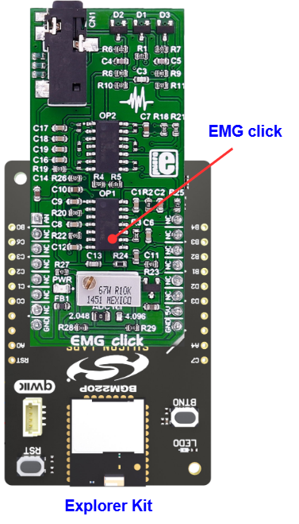

# EMG Click (Mikroe) #

## Summary ##

This example project shows an example of Mikroe EMG Click board driver integration with the Silicon Labs Platform.

EMG click measures the electrical activity produced by the skeletal muscles. It carries the MCP609 operational amplifier and the MAX6106 micropower voltage reference.
EMG click is designed to run on a 5V power supply. The click board™ has an analog output (AN pin).

This sensor is often used to diagnose the health of the muscles, and the neurons that control them.

## Table Of Contents ##

- [Required Hardware](#required-hardware)
- [Hardware Connection](#hardware-connection)
- [Setup](#setup)
  - [Create a project based on an example project](#create-a-project-based-on-an-example-project)
  - [Start with an empty example project](#start-with-an-empty-example-project)
- [How It Works](#how-it-works)
- [Report Bugs & Get Support](#report-bugs--get-support)

## Required Hardware ##

- 1x [Silicon Labs BLE Explorer Kit](https://www.silabs.com/development-tools/wireless/bluetooth) based on the EFR32 SoC, such as:
  - [BGM220-EK4314A](https://www.silabs.com/development-tools/wireless/bluetooth/bgm220-explorer-kit)
  - [BG22-EK4108A](https://www.silabs.com/development-tools/wireless/bluetooth/bg22-explorer-kit?tab=overview)
  - [xG24-EK2703A](https://www.silabs.com/development-tools/wireless/efr32xg24-explorer-kit?tab=overview)
  - [xG22-EK2710A](https://www.silabs.com/development-tools/wireless/efr32xg22e-explorer-kit?tab=overview)

  *or*

  1x [Silicon Labs Wi-Fi Development Kit](https://www.silabs.com/development-tools/wireless/wi-fi) based on SiWG917, such as:
  - [SIWX917-DK2605A](https://www.silabs.com/development-tools/wireless/wi-fi/siwx917-dk2605a-wifi-6-bluetooth-le-soc-dev-kit)
  - [SIWX917-RB4338A](https://www.silabs.com/development-tools/wireless/wi-fi/siwx917-rb4338a-wifi-6-bluetooth-le-soc-radio-board) + [Si-MB4002A](https://www.silabs.com/development-tools/wireless/wireless-pro-kit-mainboard?tab=overview)
  - [SiW917Y-EK2708A](https://www.silabs.com/development-tools/wireless/wi-fi/siw917y-ek2708a-explorer-kit?tab=overview)

- 1x [EMG Click](https://www.mikroe.com/emg-click)
- 1x [ECG/EMG cable](https://www.mikroe.com/ecg-cable)
- 3x [Disposable adhesive pads](https://www.mikroe.com/ecg-30pcs)

## Hardware Connection ##

The Silicon Labs Explorer Kit boards feature a mikroBUS™ socket, allowing the EMG Click board to connect easily via the mikroBUS header. Ensure that the 45-degree corner of the EMG Click board aligns with the 45-degree white line on the Explorer Kit. The hardware connection is illustrated in the image below.

For the Silicon Labs boards that do not have a mikroBUS™ socket, consider using the Wire Jumpers.

The tables below provide an overview of the pin connections.

**Silicon Labs BLE Explorer Kit:**

| Description | BRD4314A | BRD4108A | BRD2703A | BRD2710A | ↔ | EMG Click |
| --- | --- | --- | --- | --- | --- | --- |
| Positive analog input | PB0 | PB0 | PB0 | PB0 | ↔ | OUT |

**Silicon Labs Wi-Fi Development Kit:**

| Description | BRD4338A + BRD4002A | BRD2605A | BRD2708A | ↔ | EMG Click |
| --- | --- | --- | --- | --- | --- |
| Positive analog input | ULP_GPIO_1 [P16] | ULP_GPIO_1 [P4] | GPIO_29 | ↔ | OUT |

The electrodes are connected to the board with a cable that plugs into the onboard 3.5mm phone jack.

## Setup ##

You can either create a project based on an example project or start with an empty example project.

> [!IMPORTANT]
>
> - Make sure that the [Third Party Hardware Drivers](https://github.com/SiliconLabsSoftware/third_party_hw_drivers_extension) extension is installed as part of the SiSDK. If not, follow [this documentation](https://github.com/SiliconLabsSoftware/third_party_hw_drivers_extension/blob/master/README.md#how-to-add-to-simplicity-studio-ide).
> - **Third Party Hardware Drivers** extension must be enabled for the project to install the required components from this extension.

> [!TIP]
> To show all components in the **Third Party Hardware Drivers** extension, the **Evaluation** quality must be enabled in the Software Component view.

### Create a project based on an example project ###

1. From the Launcher Home, add your board to My Products, click on it, and click on the **EXAMPLE PROJECTS & DEMOS** tab. Find the example project filtering by **"emg"**.

2. Click **Create** button on **Third Party Hardware Drivers - EMG Click (Mikroe)**. Example project creation dialog pops up -> click Create and Finish and Project should be generated.

   

3. Build and flash this example to the board.

### Start with an empty example project ###

1. Create an "Empty C Project" for your board using Simplicity Studio v5. Use the default project settings.

2. Copy the file `app/example/mikroe_emg/app.c` into the project root folder (overwriting the existing file).

3. Open the .slcp file. Select the **SOFTWARE COMPONENTS** tab and install the following components:

   - **If the BLE Explorer Kit is used:**
     - [Services] → [IO Stream] → [IO Stream: USART] → default instance name: **vcom**
     - [Application] → [Utility] → [Log]
     - [Services] → [Timers] → [Sleep Timer]
     - [Third Party Hardware Drivers] → [Sensors] → [EMG Click (Mikroe)] → use the default configuration.

   - **If the Wi-Fi Development Kit is used:**
     - [WiSeConnect 3 SDK] → [Device] → [Si91x] → [MCU] → [Service] → [Sleep Timer for Si91x]
     - [WiSeConnect 3 SDK] → [Device] → [Si91x] → [MCU] → [Peripheral] → [ADC] → [channel_1] → Select the corresponding pins according to the table provided in [Hardware Connection](#hardware-connection)
     - [Third Party Hardware Drivers] → [Sensors] → [EMG Click (Mikroe)]

4. Build and flash this example to the board.

## How It Works ##

### Driver Layer Diagram ###

### Testing ###

This example reads the ADC value and sends results on the serial every 5 ms.
To record an EMG, you will need the following things:

- Flash the example to your board

- An onboard 3.5mm audio jack is used to connect cables/electrodes to the EMG Click board. The electrode collects voltage from the skin (few milliVolts).
For optimal results place the first DRL electrode on the wrist of the hand. Place the second and third electrodes on the muscle you want to measure

  

- On your PC, use [MikroPlot](https://libstock.mikroe.com/projects/view/1937/mikroplot-data-visualization-tool) tool (Windows) that can be used to generate an EMG graph. It’s a simple tool to help you visualize sensor data recorded over time.
The graph is generated from data sent from the microcontroller as below

  

## Report Bugs & Get Support ##

To report bugs in the Application Examples projects, please create a new "Issue" in the "Issues" section of [third_party_hw_drivers_extension](https://github.com/SiliconLabsSoftware/third_party_hw_drivers_extension) repo. Please reference the board, project, and source files associated with the bug, and reference line numbers. If you are proposing a fix, also include information on the proposed fix. Since these examples are provided as-is, there is no guarantee that these examples will be updated to fix these issues.

Questions and comments related to these examples should be made by creating a new "Issue" in the "Issues" section of [third_party_hw_drivers_extension](https://github.com/SiliconLabsSoftware/third_party_hw_drivers_extension) repo.
