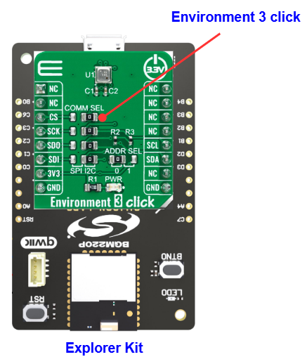
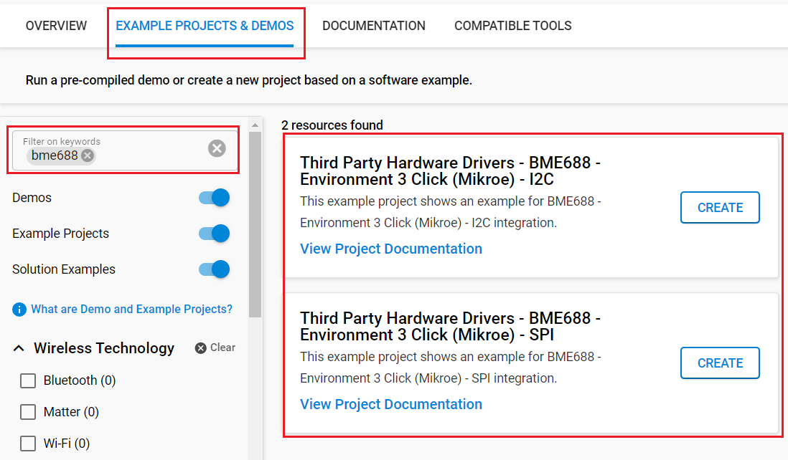

# BME688 - Environment 3 Click (Mikroe) #

## Summary ##

This project aims to show the hardware driver that is used to interface with the BME688 Sensor using the Silicon Labs platform. This driver is based on [BME68x Sensor API](https://github.com/BoschSensortec/BME68x-Sensor-API) from Bosch Sensortec.

BME688 is a first gas sensor with Artificial Intelligence (AI), and integrated high-linearity/high-accuracy pressure, humidity, and temperature sensors from Bosch Sensortec. The BME688 can be used for indoor and outdoor air quality measurement, detection of unusual gases and smells, and various temperature and humidity-related applications.
For more information, see [Gas Sensor BME688](https://www.bosch-sensortec.com/products/environmental-sensors/gas-sensors/bme688/).

## Table Of Contents ##

- [Required Hardware](#required-hardware)
- [Hardware Connection](#hardware-connection)
- [Setup](#setup)
  - [Create a project based on an example project](#create-a-project-based-on-an-example-project)
  - [Start with an empty example project](#start-with-an-empty-example-project)
- [How It Works](#how-it-works)
- [Report Bugs & Get Support](#report-bugs--get-support)

## Required Hardware ##

- 1x [Silicon Labs BLE Explorer Kit](https://www.silabs.com/development-tools/wireless/bluetooth) based on the EFR32 SoC, such as:
  - [BGM220-EK4314A](https://www.silabs.com/development-tools/wireless/bluetooth/bgm220-explorer-kit)
  - [BG22-EK4108A](https://www.silabs.com/development-tools/wireless/bluetooth/bg22-explorer-kit?tab=overview)
  - [xG24-EK2703A](https://www.silabs.com/development-tools/wireless/efr32xg24-explorer-kit?tab=overview)
  - [xG22-EK2710A](https://www.silabs.com/development-tools/wireless/efr32xg22e-explorer-kit?tab=overview)

  *or*

  1x [Silicon Labs Wi-Fi Development Kit](https://www.silabs.com/development-tools/wireless/wi-fi) based on SiWG917, such as:
  - [SIWX917-DK2605A](https://www.silabs.com/development-tools/wireless/wi-fi/siwx917-dk2605a-wifi-6-bluetooth-le-soc-dev-kit)
  - [SIWX917-RB4338A](https://www.silabs.com/development-tools/wireless/wi-fi/siwx917-rb4338a-wifi-6-bluetooth-le-soc-radio-board) + [Si-MB4002A](https://www.silabs.com/development-tools/wireless/wireless-pro-kit-mainboard?tab=overview)
  - [SiW917Y-EK2708A](https://www.silabs.com/development-tools/wireless/wi-fi/siw917y-ek2708a-explorer-kit?tab=overview)

- 1x [Environment 3 Click board](https://www.mikroe.com/environment-3-click) based on BME688

## Hardware Connection ##

The Silicon Labs Explorer Kit boards feature a mikroBUS™ socket, allowing the Environment 3 Click board to connect easily via the mikroBUS header. Ensure that the 45-degree corner of the Environment 3 Click board aligns with the 45-degree white line on the Explorer Kit. The hardware connection is illustrated in the image below.

For the Silicon Labs boards that do not have a mikroBUS™ socket, consider using the Wire Jumpers.

The tables below provide an overview of the pin connections.

**Silicon Labs BLE Explorer Kit:**

*I2C interface:*

| Description | BRD4314A | BRD4108A | BRD2703A | BRD2710A | ↔ | Environment 3 Click |
| --- | --- | --- | --- | --- | --- | --- |
| I2C_SDA | PD3 | PD3 | PB5 | PD3 | ↔ | SDA |
| I2C_SCL | PD2 | PD2 | PB4 | PD2 | ↔ | SCL |

*SPI interface:*

| Description | BRD4314A | BRD4108A | BRD2703A | BRD2710A | ↔ | Environment 3 Click |
| --- | --- | --- | --- | --- | --- | --- |
| SPI CS PIN  | PC3 | PC3 | PC0 | PC3 | ↔ | CS  |
| SPI CLK PIN | PC2 | PC2 | PC1 | PC2 | ↔ | SCK |
| SPI RX PIN  | PC1 | PC1 | PC2 | PC1 | ↔ | SDO |
| SPI TX PIN  | PC0 | PC0 | PC3 | PC0 | ↔ | SDI |

**Silicon Labs Wi-Fi Development Kit:**

*I2C interface:*

| Description | BRD4338A + BRD4002A | BRD2605A | BRD2708A | ↔ | Environment 3 Click |
| --- | --- | --- | --- | --- | --- |
| I2C_SDA | ULP_GPIO_6 [EXP_16] | ULP_GPIO_6 [P16] | GPIO_6 | ↔ | SDA |
| I2C_SCL | ULP_GPIO_7 [EXP_15] | ULP_GPIO_7 [P15] | GPIO_7 | ↔ | SCL |

*SPI interface:*

| Description | BRD4338A + BRD4002A | BRD2605A | BRD2708A | ↔ | Environment 3 Click |
| --- | --- | --- | --- | --- | --- |
| RTE_GSPI_MASTER_CLK_PIN  | GPIO_25 [P25] | GPIO_25 [P3] | GPIO_25 | ↔ | SCK |
| RTE_GSPI_MASTER_MISO_PIN | GPIO_26 [P27] | GPIO_26 [P5] | GPIO_26 | ↔ | SDO |
| RTE_GSPI_MASTER_MOSI_PIN | GPIO_27 [P29] | GPIO_27 [P7] | GPIO_27 | ↔ | SDI |
| RTE_GSPI_MASTER_CS0_PIN  | GPIO_28 [P31] | GPIO_28 [P9] | GPIO_28 | ↔ | CS  |

## Setup ##

You can either create a project based on an example project or start with an empty example project.

> [!IMPORTANT]
>
> - Make sure that the [Third Party Hardware Drivers](https://github.com/SiliconLabsSoftware/third_party_hw_drivers_extension) extension is installed as part of the SiSDK. If not, follow [this documentation](https://github.com/SiliconLabsSoftware/third_party_hw_drivers_extension/blob/master/README.md#how-to-add-to-simplicity-studio-ide).
> - **Third Party Hardware Drivers** extension must be enabled for the project to install the required components from this extension.

> [!TIP]
> To show all components in the **Third Party Hardware Drivers** extension, the **Evaluation** quality must be enabled in the Software Component view.

### Create a project based on an example project ###

1. From the Launcher Home, add your board to My Products, click on it, and click on the **EXAMPLE PROJECTS & DEMOS** tab. Find the example project filtering by 'bme688'.

2. Click **Create** button on the example:

   - **Third Party Hardware Drivers - BME688 - Environment 3 Click (Mikroe) - I2C** if using the I2C interface.

   - **Third Party Hardware Drivers - BME688 - Environment 3 Click (Mikroe) - SPI** if using the SPI interface.

   Example project creation dialog pops up -> click Create and Finish and Project should be generated.

   

3. Build and flash this example to the board.

### Start with an empty example project ###

1. Create an "Empty C Project" for your board using Simplicity Studio v5. Use the default project settings.

2. Copy the file `app/example/mikroe_environment3_bme688/app.c` into the project root folder (overwriting the existing file).

3. Open the .slcp file. Select the **SOFTWARE COMPONENTS** tab and install the following components:

   - **If the BLE Explorer Kit is used**
     - [Services] → [IO Stream] → [IO Stream: EUSART] → default instance name: vcom
     - [Application] → [Utility] → [Log]
     - **If using I2C interface:**
       - [Platform] → [Driver] → [I2C] → [I2CSPM] → [mikroe instance]
       - [Third Party Hardware Drivers] → [Sensors] → [BME688 - Environment 3 Click (Mikroe) - I2C] → use default configuration
     - **If using SPI interface:**
       - [Platform] → [Driver] → [SPI] → [SPIDRV] → [mikroe instance]
       - [Third Party Hardware Drivers] → [Sensors] → [BME688 - Environment 3 Click (Mikroe) - SPI] → use default configuration

   - **If the Wi-Fi Development Kit is used:**
     - **If using I2C interface:**
       - [WiSeConnect 3 SDK] → [Device] → [Si91x] → [MCU] → [Peripheral] → [I2C] → [i2c2] → Select the corresponding pins according to the table provided in [Hardware Connection](#hardware-connection)
       - [Third Party Hardware Drivers] → [Sensors] → [BME688 - Environment 3 Click (Mikroe) - I2C] → use default configuration
     - **If using I2C interface:**
       - [Third Party Hardware Drivers] → [Sensors] → [BME688 - Environment 3 Click (Mikroe) - SPI] → use the default configuration

4. Enable **Printf float**

   - Open Properties of the project.
   - Select C/C++ Build → Settings → Tool Settings → GNU ARM C Linker → General → Check **Printf float**.
     

5. Build and flash this example to the board.

## How It Works ##

After you flash the code to your board and power the connected boards, the application starts running automatically. Use Putty/Tera Term (or another program) to read the values of the serial output. Note that your board uses the default baud rate of 115200.
In the image below you can see an example of how the output is displayed. The application reads the temperature, humidity, pressure, and gas resistance data from the sensor in the forced mode and displays all values on the console. There is a periodic timer in the code, which determines the sampling intervals; the default sensor sampling rate is 2000 ms. If you need more frequent sampling, it is possible to change the corresponding timer value of the "app.c" file.

## Report Bugs & Get Support ##

To report bugs in the Application Examples projects, please create a new "Issue" in the "Issues" section of [third_party_hw_drivers_extension](https://github.com/SiliconLabsSoftware/third_party_hw_drivers_extension) repo. Please reference the board, project, and source files associated with the bug, and reference line numbers. If you are proposing a fix, also include information on the proposed fix. Since these examples are provided as-is, there is no guarantee that these examples will be updated to fix these issues.

Questions and comments related to these examples should be made by creating a new "Issue" in the "Issues" section of [third_party_hw_drivers_extension](https://github.com/SiliconLabsSoftware/third_party_hw_drivers_extension) repo.
