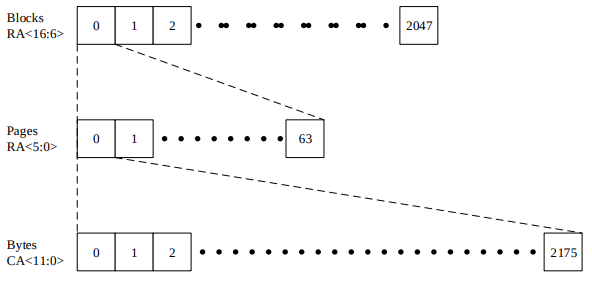
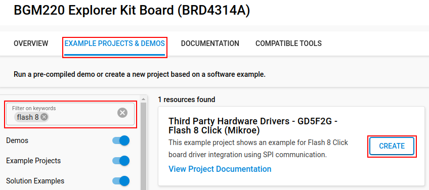
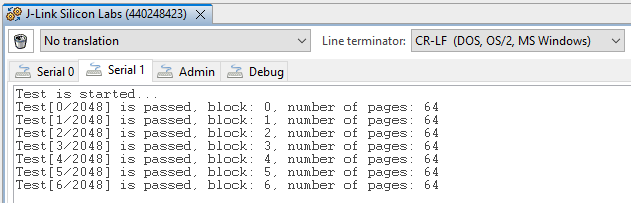

# GD5F2G - Flash 8 Click (Mikroe) #

## Summary ##

This project aims to implement a hardware driver interacting with the Mikroe Flash 8 Click board.

Flash 8 Click is a compact add-on board representing a highly reliable memory solution. This board features the [GD5F2GQ5UEYIGR](https://download.mikroe.com/documents/datasheets/GD5F2GQ5UEYIGR_datasheet.pdf), a 2Gb high-density non-volatile memory storage solution for embedded systems from [GigaDevice Semiconductor](https://www.mikroe.com/partners/gigadevice). It is based on an industry-standard NAND Flash memory core, representing an attractive alternative to SPI-NOR and standard parallel NAND Flash with advanced features. The GD5F2GQ5UEYIGR also has advanced security features (8K-Byte OTP region), software/hardware write protection, can withstand many write cycles (minimum 100k), and has a data retention period greater than ten years. This Click board™ is suitable for storage and data transfer in consumer devices and industrial applications.

The memory area of the Flash 8 Click is divided into 2048 blocks. Each block contains 64 pages, and each page has 2048 bytes for data storage and 128 bytes for spare area.

## Table Of Contents ##

- [Required Hardware](#required-hardware)
- [Hardware Connection](#hardware-connection)
- [Setup](#setup)
- [Create a project based on an example project](#create-a-project-based-on-an-example-project)
- [Start with an empty example project](#start-with-an-empty-example-project)
- [How It Works](#how-it-works)
- [Report Bugs & Get Support](#report-bugs--get-support)

## Required Hardware ##

- 1x [Silicon Labs BLE Explorer Kit](https://www.silabs.com/development-tools/wireless/bluetooth) based on the EFR32 SoC, such as:
- [BGM220-EK4314A](https://www.silabs.com/development-tools/wireless/bluetooth/bgm220-explorer-kit)
- [BG22-EK4108A](https://www.silabs.com/development-tools/wireless/bluetooth/bg22-explorer-kit?tab=overview)
- [xG24-EK2703A](https://www.silabs.com/development-tools/wireless/efr32xg24-explorer-kit?tab=overview)
- [xG22-EK2710A](https://www.silabs.com/development-tools/wireless/efr32xg22e-explorer-kit?tab=overview)

*or*

1x [Silicon Labs Wi-Fi Development Kit](https://www.silabs.com/development-tools/wireless/wi-fi) based on SiWG917, such as:
- [SIWX917-DK2605A](https://www.silabs.com/development-tools/wireless/wi-fi/siwx917-dk2605a-wifi-6-bluetooth-le-soc-dev-kit)
- [SIWX917-RB4338A](https://www.silabs.com/development-tools/wireless/wi-fi/siwx917-rb4338a-wifi-6-bluetooth-le-soc-radio-board) + [Si-MB4002A](https://www.silabs.com/development-tools/wireless/wireless-pro-kit-mainboard?tab=overview)
- [SiW917Y-EK2708A](https://www.silabs.com/development-tools/wireless/wi-fi/siw917y-ek2708a-explorer-kit?tab=overview)

- 1x [Flash 8 Click board](https://www.mikroe.com/flash-8-click?srsltid=AfmBOopz_z_56_gFpsgsZfrQjyabcuUCAF-E0LWPVOlklMq6jlQmkXj-)

## Hardware Connection ##

The Silicon Labs Explorer Kit boards feature a mikroBUS™ socket, allowing the Flash 8 Click board to connect easily via the mikroBUS header. Ensure that the 45-degree corner of the Flash 8 Click board aligns with the 45-degree white line on the Explorer Kit. The hardware connection is illustrated in the image below.

For Silicon Labs boards without a mikroBUS™ socket, consider using wire jumpers.

The tables below provide an overview of the pin connections.

**Silicon Labs BLE Explorer Kit:**

| Description | BRD4314A | BRD4108A | BRD2703A | BRD2710A | <--> | Flash 8 Click |
| --- | --- | --- | --- | --- | --- | --- |
| SPI CS PIN (CS) | PC3 | PC3 | PC0 | PC3 | <--> | CS |
| SPI CLK PIN (SCK) | PC2 | PC2 | PC1 | PC2 | <--> | SCK |
| SPI RX PIN (MISO)  | PC1 | PC1 | PC2 | PC1 | <--> | SDO |
| SPI TX PIN (MOSI) | PC0 | PC0 | PC3 | PC0 | <--> | SDI |
| QSPI IO2 / Write Protection | PC6 | PC6 | PC8 | PC6 | <--> | WP |
| QSPI IO3 / SPI Suspension | PB4 | PB4 | PA0 | PB4 | <--> | HLD |

**Silicon Labs Wi-Fi Development Kit:**

| Description | BRD4338A + BRD4002A | BRD2605A | BRD2708A | <--> | Flash 8 Click |
| --- | --- | --- | --- | --- | --- |
| RTE_GSPI_MASTER_CLK_PIN | GPIO_25 [P25] | GPIO_25 [P3] | GPIO_25 | <--> | SCK |
| RTE_GSPI_MASTER_MISO_PIN | GPIO_26 [P27] | GPIO_26 [P5] | GPIO_26 | <--> | SDO |
| RTE_GSPI_MASTER_MOSI_PIN | GPIO_27 [P29] | GPIO_27 [P7] | GPIO_27 | <--> | SDI |
| RTE_GSPI_MASTER_CS0_PIN | GPIO_28 [P31] | GPIO_28 [P9] | GPIO_28 | <--> | CS |
| QSPI IO2 / Write Protection | GPIO_49 [P30] | GPIO_10 [P23] | UULP_VBAT_GPIO_2 | <--> | WP |
| QSPI IO3 / SPI Suspension | GPIO_48 [P28] | GPIO_11 [P22] | GPIO_30 | <--> | HLD |

## Setup ##

You can either create a project using an example project or start with an empty example project.

> [!IMPORTANT]
>
> - Make sure that the [Third Party Hardware Drivers](https://github.com/SiliconLabsSoftware/third_party_hw_drivers_extension) extension is installed as part of the SiSDK. If not, follow [this documentation](https://github.com/SiliconLabsSoftware/third_party_hw_drivers_extension/blob/master/README.md#how-to-add-to-simplicity-studio-ide).
> - **Third Party Hardware Drivers** extension must be enabled for the project to install the required components from this extension.

> [!TIP]
> To see all components in the **Third Party Hardware Drivers** extension, ensure that the **Evaluation** quality is enabled in the Software Component view.

### Create a project based on an example project ###

1. From the Launcher Home, add your device to My Products, click on it, and click on the **EXAMPLE PROJECTS & DEMOS** tab. Find the example project filtering by "*flash 8*".

2. Click **Create** button on the **Third Party Hardware Drivers - GD5F2G - Flash 8 Click (Mikroe)** example. When the project creation dialog appears, click Create and Finish. The project will be generated.

3. Build and flash this example to the board.

### Start with an empty example project ###

1. Create an "Empty C Project" for your board using Simplicity Studio v5. Use the default project settings.

2. Copy the file 'app/example/mikroe_flash8_gd5f2g/app.c' into the project root folder (overwriting the existing file).

3. Install the software components:

- Open the .slcp file in the project.

- Select the SOFTWARE COMPONENTS tab.

- Install the following components:

  **If the BGM220P Explorer Kit is used:**

  - [Application] → [Utility] → [Assert]
  - [Application] → [Utility] → [Log]
  - [Services] → [Timers] → [Sleep Timer]
  - [Services] → [IO Stream] → [IO Stream: USART] → default instance name: vcom
  - [Third Party Hardware Drivers] → [Storage] → [GD5F2G - Flash 8 Click (Mikroe)]
  - [Third Party Hardware Drivers] → [Services] → [NAND flash driver - SPI]

  **If the Wi-Fi Development Kit is used:**

  - [WiSeConnect 3 SDK] → [Device] → [Si91x] → [MCU] → [Service] → [Sleep Timer for Si91x]
  - [WiSeConnect 3 SDK] → [Device] → [Si91x] → [MCU] → [Peripheral] → [GSPI]
  - [Third Party Hardware Drivers] → [Storage] → [NAND flash driver - SPI]

4. Build and flash this example to the board.

## How It Works ##

After you flashed the code to your board and powered the connected boards, the application starts running automatically. Use PuTTY, Tera Term, or another terminal program to view the output. You can see the result in the image below. Note that the BGM220P board uses the default baud rate of 115200.

## Report Bugs & Get Support ##

To report bugs in the Application Examples projects, please create a new "Issue" in the "Issues" section of [third_party_hw_drivers_extension](https://github.com/SiliconLabsSoftware/third_party_hw_drivers_extension) repo. Please reference the board, project, and source files associated with the bug, and reference line numbers. If you are proposing a fix, also include information on the proposed fix. Since these examples are provided as-is, there is no guarantee that these examples will be updated to fix these issues.

Questions and comments related to these examples should be made by creating a new "Issue" in the "Issues" section of [third_party_hw_drivers_extension](https://github.com/SiliconLabsSoftware/third_party_hw_drivers_extension) repo.
