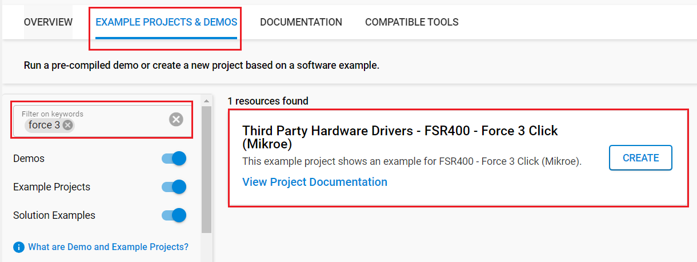

# FSR 400 - Force 3 Click (Mikroe) #

## Summary ##

This project shows the driver implementation of a Force Sensing Resistor sensor using the FSR 400 sensor with the Silicon Labs Platform.

Force 3 Click is a compact add-on board with circuitry for implementing Force Sensing Resistor into your projects whose resistance changes when a force, pressure, or mechanical stress is applied. This board features an FSR 400 series 34-00004 single zone Force Sensing Resistor from Interlink Electronics, a robust polymer thick film (PTF) device that exhibits a decrease in resistance with an increase in force applied to the surface of the sensor. Simple and easy to integrate, ultra-thin, and cost-effective, Force 3 Click has an actuation force as low as 0.2N and a sensitivity range of up to 20N. It also provides 2-Wire I2C compatible control interface using an MCP3221, low-power 12-bit resolution A/D converter. This Click board™ is optimized for use in human-machine interface devices including automotive electronics, medical systems, industrial controls and robotics.

## Table Of Contents ##

- [Required Hardware](#required-hardware)
- [Hardware Connection](#hardware-connection)
- [Setup](#setup)
  - [Create a project based on an example project](#create-a-project-based-on-an-example-project)
  - [Start with an empty example project](#start-with-an-empty-example-project)
- [How It Works](#how-it-works)
- [Report Bugs & Get Support](#report-bugs--get-support)

## Required Hardware ##

- 1x [Silicon Labs BLE Explorer Kit](https://www.silabs.com/development-tools/wireless/bluetooth) based on the EFR32 SoC, such as:
  - [BGM220-EK4314A](https://www.silabs.com/development-tools/wireless/bluetooth/bgm220-explorer-kit)
  - [BG22-EK4108A](https://www.silabs.com/development-tools/wireless/bluetooth/bg22-explorer-kit?tab=overview)
  - [xG24-EK2703A](https://www.silabs.com/development-tools/wireless/efr32xg24-explorer-kit?tab=overview)
  - [xG22-EK2710A](https://www.silabs.com/development-tools/wireless/efr32xg22e-explorer-kit?tab=overview)

  *or*

  1x [Silicon Labs Wi-Fi Development Kit](https://www.silabs.com/development-tools/wireless/wi-fi) based on SiWG917, such as:
  - [SIWX917-DK2605A](https://www.silabs.com/development-tools/wireless/wi-fi/siwx917-dk2605a-wifi-6-bluetooth-le-soc-dev-kit)
  - [SIWX917-RB4338A](https://www.silabs.com/development-tools/wireless/wi-fi/siwx917-rb4338a-wifi-6-bluetooth-le-soc-radio-board) + [Si-MB4002A](https://www.silabs.com/development-tools/wireless/wireless-pro-kit-mainboard?tab=overview)
  - [SiW917Y-EK2708A](https://www.silabs.com/development-tools/wireless/wi-fi/siw917y-ek2708a-explorer-kit?tab=overview)

- 1x [Force 3 Click board](https://www.mikroe.com/force-3-click) based on FSR 400 sensor

## Hardware Connection ##

The Silicon Labs Explorer Kit boards feature a mikroBUS™ socket, allowing the Force 3 Click board to connect easily via the mikroBUS header. Ensure that the 45-degree corner of the Force 3 Click board aligns with the 45-degree white line on the Explorer Kit. The hardware connection is illustrated in the image below.

For the Silicon Labs boards that do not have a mikroBUS™ socket, consider using the Wire Jumpers.

The tables below provide an overview of the pin connections.

**Silicon Labs BLE Explorer Kit:**

| Description | BRD4314A | BRD4108A | BRD2703A | BRD2710A | ↔ | Force 3 Click |
| --- | --- | --- | --- | --- | --- | --- |
| I2C_SDA | PD3 | PD3 | PB5 | PD3 | ↔ | SDA |
| I2C_SCL | PD2 | PD2 | PB4 | PD2 | ↔ | SCL |

**Silicon Labs Wi-Fi Development Kit:**

| Description | BRD4338A + BRD4002A | BRD2605A | BRD2708A | ↔ | Force 3 Click |
| --- | --- | --- | --- | --- | --- |
| I2C_SDA | ULP_GPIO_6 [EXP_16] | ULP_GPIO_6 [P16] | GPIO_6 | ↔ | SDA |
| I2C_SCL | ULP_GPIO_7 [EXP_15] | ULP_GPIO_7 [P15] | GPIO_7 | ↔ | SCL |

## Setup ##

You can either create a project based on an example project or start with an empty example project.

> [!IMPORTANT]
>
> - Make sure that the [Third Party Hardware Drivers](https://github.com/SiliconLabsSoftware/third_party_hw_drivers_extension) extension is installed as part of the SiSDK. If not, follow [this documentation](https://github.com/SiliconLabsSoftware/third_party_hw_drivers_extension/blob/master/README.md#how-to-add-to-simplicity-studio-ide).
> - **Third Party Hardware Drivers** extension must be enabled for the project to install the required components from this extension.

> [!TIP]
> To show all components in the **Third Party Hardware Drivers** extension, the **Evaluation** quality must be enabled in the Software Component view.

### Create a project based on an example project ###

1. From the Launcher Home, add your device to My Products, click on it, and click on the **EXAMPLE PROJECTS & DEMOS** tab. Find the example project filtering by *force 3*.

2. Click **Create** button on the **Third Party Hardware Drivers - FSR400 - Force 3 Click (Mikroe)** example. Example project creation dialog pops up -> click Create and Finish and Project should be generated.

   

3. Build and flash this example to the board.

### Start with an empty example project ###

1. Create an "Empty C Project" for your board using Simplicity Studio v5. Use the default project settings.

2. Copy the file 'app/example/mikroe_force3_fsr400/app.c' into the project root folder (overwriting the existing file).

3. Open the .slcp file. Select the **SOFTWARE COMPONENTS** tab and install the following components:

   - **If the BLE Explorer Kit is used:**
     - [Services] → [Timers] → [Sleep Timer]
     - [Services] → [IO Stream] → [IO Stream: USART] → default instance name: vcom
     - [Application] → [Utility] → [Log]
     - [Third Party Hardware Drivers] → [Sensors] → [FSR 400 - Force 3 Click (Mikroe)]

   - **If the Wi-Fi Development Kit is used:**
     - [WiSeConnect 3 SDK] → [Device] → [Si91x] → [MCU] → [Service] → [Sleep Timer for Si91x]
     - [WiSeConnect 3 SDK] → [Device] → [Si91x] → [MCU] → [Peripheral] → [I2C] → [i2c2] → Select the corresponding pins according to the table provided in [Hardware Connection](#hardware-connection)
     - [Third Party Hardware Drivers] → [Sensors] → [FSR 400 - Force 3 Click (Mikroe)]

4. Build and flash this example to the board.

## How It Works ##

After you flashed the code to the your board and powered the connected boards, the application starts running automatically. Use Putty/Tera Term (or another program) to read the values of the serial output. Note that the BGM220P board uses the default baud rate of 115200.

In the below image, you can see an example of how the output is displayed. The main program reads the raw ADC value from the sensor. Then convert it to the relative pressure on the sensor.

There is a periodic timer in the code, which determines the sampling intervals; the default sensor sampling rate is 500 ms. If you need more frequent sampling, it is possible to change the corresponding timer value of the "app.c" file.

## Report Bugs & Get Support ##

To report bugs in the Application Examples projects, please create a new "Issue" in the "Issues" section of [third_party_hw_drivers_extension](https://github.com/SiliconLabsSoftware/third_party_hw_drivers_extension) repo. Please reference the board, project, and source files associated with the bug, and reference line numbers. If you are proposing a fix, also include information on the proposed fix. Since these examples are provided as-is, there is no guarantee that these examples will be updated to fix these issues.

Questions and comments related to these examples should be made by creating a new "Issue" in the "Issues" section of [third_party_hw_drivers_extension](https://github.com/SiliconLabsSoftware/third_party_hw_drivers_extension) repo.
