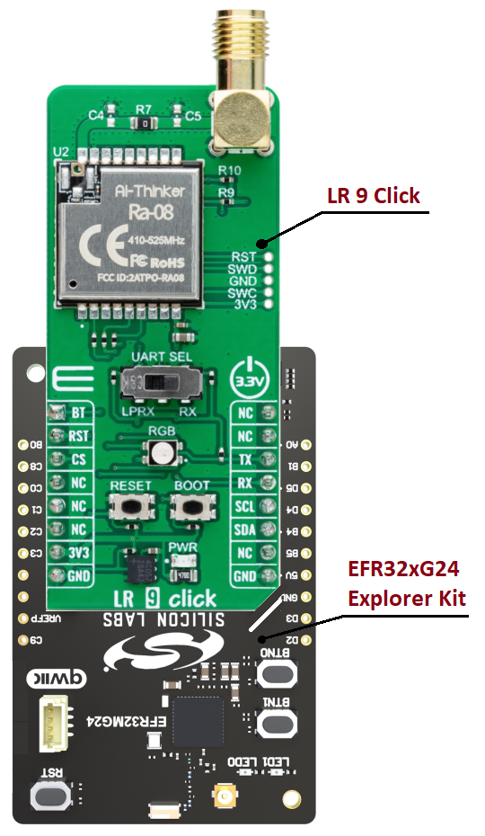

# RA-08 - LR 9 Click (Mikroe) #

## Summary ##

This example project shows an example of Mikroe LR 9 Click board driver integration with the Silicon Labs Platform.

LR 9 Click is based on the RA-08, a LoRaWAN module from Ai-Thinker Technology. This module is made for ultra-long-range spread spectrum communication tasks powered by the ASR6601. The ASR6601 is an LPWAN wireless communication system-on-chip (SoC) that combines RF transceivers, modems, and a 32-bit RISC microcontroller (MCU).

This example demonstrates the ability to transmit and receive data via the LoRaWan network between two Silicon Labs boards using the AT instruction set. The example uses LR 9 click to process incoming data and display them on the screen.

## Table Of Contents ##

- [Required Hardware](#required-hardware)
- [Hardware Connection](#hardware-connection)
- [Setup](#setup)
  - [Create a project based on an example project](#create-a-project-based-on-an-example-project)
  - [Start with an empty example project](#start-with-an-empty-example-project)
- [How It Works](#how-it-works)
- [Report Bugs & Get Support](#report-bugs--get-support)

## Required Hardware ##

- 2x [Silicon Labs BLE Explorer Kit](https://www.silabs.com/development-tools/wireless/bluetooth) based on the EFR32 SoC, such as:
  - [BGM220-EK4314A](https://www.silabs.com/development-tools/wireless/bluetooth/bgm220-explorer-kit)
  - [BG22-EK4108A](https://www.silabs.com/development-tools/wireless/bluetooth/bg22-explorer-kit?tab=overview)
  - [xG24-EK2703A](https://www.silabs.com/development-tools/wireless/efr32xg24-explorer-kit?tab=overview)
  - [xG22-EK2710A](https://www.silabs.com/development-tools/wireless/efr32xg22e-explorer-kit?tab=overview)

- 2x [LR 9 Click](https://www.mikroe.com/lr-9-click)

## Hardware Connection ##

The Silicon Labs Explorer Kit boards feature a mikroBUS™ socket, allowing the LR 9 Click board to connect easily via the mikroBUS header. Ensure that the 45-degree corner of the LR 9 board aligns with the 45-degree white line on the Explorer Kit. The hardware connection is illustrated in the image below.



For the Silicon Labs boards that do not have a mikroBUS™ socket, consider using the Wire Jumpers.

The table below provides an overview of the pin connections.

| Description | BRD4314A | BRD4108A | BRD2703A | BRD2710A | ↔ | LR 9 Click |
| --- | --- | --- | --- | --- | --- | --- |
| UART Receive  | PB2 | PB2 | PD5 | PB2 | ↔ | TX  |
| UART Transmit | PB1 | PB1 | PD4 | PB1 | ↔ | RX  |
| RESET | PC6 | PC6 | PC8 | PC6 | ↔ | RST |

> [!IMPORTANT]
>
> - There is a switch on the board allows the selection of the UART interface's function. Make sure that it is in the LPRX position for exchanging AT commands.
> - Don't need to connect to the BT pin since the default of this pin is low for normal operating mode. For more details, please check [RA-08_datasheet](https://download.mikroe.com/documents/datasheets/RA-08_datasheet.pdf).

## Setup ##

You can either create a project based on an example project or start with an empty example project.

> [!IMPORTANT]
>
> - Make sure that the [Third Party Hardware Drivers](https://github.com/SiliconLabsSoftware/third_party_hw_drivers_extension) extension is installed as part of the SiSDK. If not, follow [this documentation](https://github.com/SiliconLabsSoftware/third_party_hw_drivers_extension/blob/master/README.md#how-to-add-to-simplicity-studio-ide).
> - **Third Party Hardware Drivers** extension must be enabled for the project to install the required components from this extension.

> [!TIP]
> To show all components in the **Third Party Hardware Drivers** extension, the **Evaluation** quality must be enabled in the Software Component view.

### Create a project based on an example project ###

1. From the Launcher Home, add your board to My Products, click on it, and click on the **EXAMPLE PROJECTS & DEMOS** tab. Find the example project filtering by *lr*.

2. Click the **Create** button on the **Third Party Hardware Drivers - RA-08 - LR 9 Click (Mikroe)** example. Example project creation dialog pops up -> click Create and Finish and Project should be generated.

   

3. Build and flash this example to the board.

### Start with an empty example project ###

1. Create an "Empty C Project" for your board using Simplicity Studio v5. Use the default project settings.

2. Copy the file `app/example/mikroe_lr_ra_08/app.c` into the project root folder (overwriting the existing file).

3. Open the .slcp file. Select the **SOFTWARE COMPONENTS** tab and install the following components:

   - [Services] → [Timers] → [Sleep Timer]
   - [Services] → [IO Stream] → [IO Stream: USART] → use an instance name: **mikroe**
   - [Services] → [IO Stream] → [IO Stream: ESART] → use the default instance name: **vcom**
   - [Application] → [Utility] → [Log]
   - [Third Party Hardware Drivers] → [Wireless Connectivity] → [RA-08 - LR 9 Click (Mikroe)] → use default configuration

4. Build and flash this example to the board.

## How It Works ##

The example uses two Silicon Labs boards for each direction. One runs in the transmitter role and the other operates in the receiver role. The transmitter sends a "Silabs" string every two seconds. The receiver parses the incoming data and displays the string on the screen.

The source code is suitable for running in two roles. However, the original code is used for the transmitter role. To create the receiver device, the `DEMO_APP_TRANSMITTER` macro in the `app.c` file should be commented.

```c
// Comment the line below to switch application mode to receiver
#define DEMO_APP_TRANSMITTER
```

You can launch Console, which is integrated into Simplicity Studio or you can use a third-party terminal tool like Tera Term to receive the data. Data is coming from the UART COM port. A screenshot of the console output of the receiver device is shown in the figure below.

| Transmitter | Receiver |
| :-----------: | :--------: |
| |  |

## Report Bugs & Get Support ##

To report bugs in the Application Examples projects, please create a new "Issue" in the "Issues" section of [third_party_hw_drivers_extension](https://github.com/SiliconLabsSoftware/third_party_hw_drivers_extension) repo. Please reference the board, project, and source files associated with the bug, and reference line numbers. If you are proposing a fix, also include information on the proposed fix. Since these examples are provided as-is, there is no guarantee that these examples will be updated to fix these issues.

Questions and comments related to these examples should be made by creating a new "Issue" in the "Issues" section of [third_party_hw_drivers_extension](https://github.com/SiliconLabsSoftware/third_party_hw_drivers_extension) repo.
