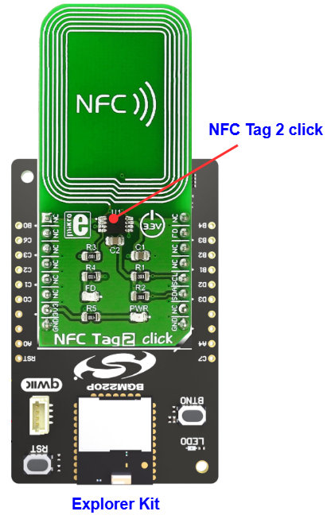

# NT3H2111 - NFC Tag 2 Click #

[](https://siliconlabs-massmarket.github.io/repository-catalog/#applications-list?filter=Access%20Control)
[](https://siliconlabs-massmarket.github.io/repository-catalog/#applications-list?filter=Entertainment%20Devices)
[](https://siliconlabs-massmarket.github.io/repository-catalog/#applications-list?filter=EV%20Charging%20Stations)
[](https://siliconlabs-massmarket.github.io/repository-catalog/#applications-list?filter=Factory%20Automation)
[](https://siliconlabs-massmarket.github.io/repository-catalog/#applications-list?filter=Smart%20Buildings)
[](https://siliconlabs-massmarket.github.io/repository-catalog/#applications-list?filter=Smart%20Locks)
[](https://siliconlabs-massmarket.github.io/repository-catalog/#applications-list?filter=Wi--Fi%20Access%20Points)

## Summary ##

This project shows the implementation of an NFC Tag module that carries the NT3H2111 from NXP.

NT3H2111 is an NFC Forum Type 2 Tag (T2T) compliant tag IC with an I2C interface to an MCU host. It is perfectly suited for NFC applications that require energy harvesting NFC Forum Type 2 Tag.

## Table Of Contents ##

- [Required Hardware](#required-hardware)
- [Hardware Connection](#hardware-connection)
- [Setup](#setup)
  - [Create a project based on an example project](#create-a-project-based-on-an-example-project)
  - [Start with an empty example project](#start-with-an-empty-example-project)
- [How It Works](#how-it-works)
- [Report Bugs & Get Support](#report-bugs--get-support)

## Required Hardware ##

- 1x [Silicon Labs BLE Explorer Kit](https://www.silabs.com/development-tools/wireless/bluetooth) based on the EFR32 SoC, such as:
  - [BGM220-EK4314A](https://www.silabs.com/development-tools/wireless/bluetooth/bgm220-explorer-kit)
  - [BG22-EK4108A](https://www.silabs.com/development-tools/wireless/bluetooth/bg22-explorer-kit?tab=overview)
  - [xG24-EK2703A](https://www.silabs.com/development-tools/wireless/efr32xg24-explorer-kit?tab=overview)
  - [xG22-EK2710A](https://www.silabs.com/development-tools/wireless/efr32xg22e-explorer-kit?tab=overview)

  *or*

  1x [Silicon Labs Wi-Fi Development Kit](https://www.silabs.com/development-tools/wireless/wi-fi) based on SiWG917, such as:
  - [SIWX917-DK2605A](https://www.silabs.com/development-tools/wireless/wi-fi/siwx917-dk2605a-wifi-6-bluetooth-le-soc-dev-kit)
  - [SIWX917-RB4338A](https://www.silabs.com/development-tools/wireless/wi-fi/siwx917-rb4338a-wifi-6-bluetooth-le-soc-radio-board) + [Si-MB4002A](https://www.silabs.com/development-tools/wireless/wireless-pro-kit-mainboard?tab=overview)
  - [SiW917Y-EK2708A](https://www.silabs.com/development-tools/wireless/wi-fi/siw917y-ek2708a-explorer-kit?tab=overview)

- 1x [NFC Tag 2 Click](https://www.mikroe.com/nfc-tag-2-click)

## Hardware Connection ##

The Silicon Labs Explorer Kit boards feature a mikroBUS™ socket, allowing the NFC Tag 2 Click board to connect easily via the mikroBUS header. Ensure that the 45-degree corner of the NFC Tag 2 Click board aligns with the 45-degree white line on the Explorer Kit. The hardware connection is illustrated in the image below.



For the Silicon Labs boards that do not have a mikroBUS™ socket, consider using the Wire Jumpers.

The tables below provide an overview of the pin connections.

**Silicon Labs BLE Explorer Kit:**

| Description | BRD4314A | BRD4108A | BRD2703A | BRD2710A | ↔ | NFC Tag 2 Click |
| --- | --- | --- | --- | --- | --- | --- |
| I2C_SDA | PD3 | PD3 | PB5 | PD3 | ↔ | SDA |
| I2C_SCL | PD2 | PD2 | PB4 | PD2 | ↔ | SCL |
| Field Detection | PB3 | PB3 | PB1 | PB3 | ↔ | FD |

**Silicon Labs Wi-Fi Development Kit:**

| Description | BRD4338A + BRD4002A | BRD2605A | BRD2708A | ↔ | NFC Tag 2 Click |
| --- | --- | --- | --- | --- | --- |
| I2C_SDA | ULP_GPIO_6 [EXP_16] | ULP_GPIO_6 [P16] | GPIO_6 | ↔ | SDA |
| I2C_SCL | ULP_GPIO_7 [EXP_15] | ULP_GPIO_7 [P15] | GPIO_7 | ↔ | SCL |
| Field Detection | GPIO_46 [P24] | GPIO_10 [P23] | UULP_VBAT_GPIO_2 | ↔ | FD |

## Setup ##

You can either create a project based on an example project or start with an empty example project.

> [!IMPORTANT]
>
> - Make sure that the [Third Party Hardware Drivers](https://github.com/SiliconLabsSoftware/third_party_hw_drivers_extension) extension is installed as part of the SiSDK. If not, follow [this documentation](https://github.com/SiliconLabsSoftware/third_party_hw_drivers_extension/blob/master/README.md#how-to-add-to-simplicity-studio-ide).
> - **Third Party Hardware Drivers** extension must be enabled for the project to install the required components from this extension.

> [!TIP]
> To show all components in the **Third Party Hardware Drivers** extension, the **Evaluation** quality must be enabled in the Software Component view.

### Create a project based on an example project ###

1. From the Launcher Home, add your board to My Products, click on it, and click on the **EXAMPLE PROJECTS & DEMOS** tab. Find the example project filtering by "nfc tag".

2. Click **Create** button on the project **Third Party Hardware Drivers - NT3H2111 - NFC Tag 2 Click (Mikroe) - I2C**. Example project creation dialog pops up -> click Create and Finish and Project should be generated.

    

3. Build and flash this example to the board.

### Start with an empty example project ###

1. Create an "Empty C Project" for the your board using Simplicity Studio v5. Use the default project settings.

2. Copy the file `app/example/mikroe_nfctag2_nt3h2111/app.c` into the project root folder (overwriting existing file).

3. Open the .slcp file. Select the **SOFTWARE COMPONENTS** tab and install the following components:

   - **If the BLE Explorer Kit board is used:**
     - [Services] → [IO Stream] → [IO Stream: USART] → default instance name: vcom
     - [Application] → [Utility] → [Log]
     - [Platform] → [Driver] → [I2C] → [I2CSPM] → mikroe instance
     - [Third Party Hardware Drivers] → [Wireless Connectivity] → [NT3H2111 - NFC Tag 2 Click (Mikroe) - I2C] → use default configuration

   - **If the Wi-Fi Development Kit is used:**
     - [WiSeConnect 3 SDK] → [Device] → [Si91x] → [MCU] → [Peripheral] → [I2C] → [i2c2] → Select the corresponding pins according to the table provided in [Hardware Connection](#hardware-connection)
     - [Third Party Hardware Drivers] → [Wireless Connectivity] → [NT3H2111 - NFC Tag 2 Click (Mikroe) - I2C] → use default configuration

4. Build and flash this example to the board.

## How It Works ##

### API Overview ###

```txt
 ---------------------------------------------
|                 Application                 |
|---------------------------------------------|
|              mikroe_nt3h2111.c              |
|---------------------------------------------|
|             mikroe_nt3h2111_i2c.c           |
|---------------------------------------------|
|                    emlib                    |
 ---------------------------------------------
```

`mikroe_nt3h2111.c`: implements the top-level APIs for application.

- Initialization API: Initialize I2C communication and FD interrupt
- memory block R/W APIs: read/write a memory block, given memory address
- specific register read/write APIs: specific register read/write to get and set settings for NT3H2x11
- I2C read/write APIs: read/write a memory block via I2C, given memory address
- I2C read/write register APIs: read/write a register via I2C, given block memory address and register address

### Testing ###

On your PC open a terminal program, such as the Console that is integrated in Simplicity Studio or a third-party tool terminal like Tera Term to receive the logs from the virtual COM port. Note that your board uses the default baud rate of 115200. Application would first call `nt3h2111_init` to initialize needed peripherals(I2C, GPIO FD). Then use register read/write APIs to adjust the settings on the NT3H2111. The example will call any function based on the character it receives over the serial connection.A screenshot of the console output is shown in the image below.


> [!TIP]
> After an NDEF message is written into NT3H2111 EEPROM, you can either use an NFC-enabled smartphone or use an RFID-reader module to read the data it contains.

A screenshot of an NFC-enabled smartphone that uses the *NFC Tools* application to read data from NT3H2111 is shown in the image below.


## Report Bugs & Get Support ##

To report bugs in the Application Examples projects, please create a new "Issue" in the "Issues" section of [third_party_hw_drivers_extension](https://github.com/SiliconLabsSoftware/third_party_hw_drivers_extension) repo. Please reference the board, project, and source files associated with the bug, and reference line numbers. If you are proposing a fix, also include information on the proposed fix. Since these examples are provided as-is, there is no guarantee that these examples will be updated to fix these issues.

Questions and comments related to these examples should be made by creating a new "Issue" in the "Issues" section of [third_party_hw_drivers_extension](https://github.com/SiliconLabsSoftware/third_party_hw_drivers_extension) repo.
