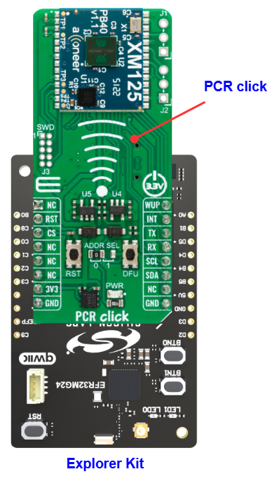

# XM125 - PCR Click (Mikroe) #

## Summary ##

This example project showcases the integration of the MikroE PCR Click board driver with the Silicon Labs Platform.

PCR Click is a compact add-on board that allows you to use a pulsed coherent radar (PCR) in your application. This board features the XM125, the Entry+ PCR module from Acconeer. The XM125 uses an Acconeer A121 pulsed coherent radar system based on a patented PCR technology with picosecond time resolution. The click board makes the perfect solution for developing high-precision people presence detection with the capability to recognize movement within configurable zones, motion detection, parking space occupancy detection, etc.

This example demonstrates the use of the PCR Click board by reading the distance between the click board and the object. The distance feature could be used to develop the high-precision people presence detection feature on smart devices.

## Table Of Contents ##

- [Required Hardware](#required-hardware)
- [Hardware Connection](#hardware-connection)
- [Setup](#setup)
  - [Create a project based on an example project](#create-a-project-based-on-an-example-project)
  - [Start with an empty example project](#start-with-an-empty-example-project)
- [How It Works](#how-it-works)
- [Report Bugs & Get Support](#report-bugs--get-support)

## Required Hardware ##

- 1x [Silicon Labs BLE Explorer Kit](https://www.silabs.com/development-tools/wireless/bluetooth) based on the EFR32 SoC, such as:
  - [BGM220-EK4314A](https://www.silabs.com/development-tools/wireless/bluetooth/bgm220-explorer-kit)
  - [BG22-EK4108A](https://www.silabs.com/development-tools/wireless/bluetooth/bg22-explorer-kit?tab=overview)
  - [xG24-EK2703A](https://www.silabs.com/development-tools/wireless/efr32xg24-explorer-kit?tab=overview)
  - [xG22-EK2710A](https://www.silabs.com/development-tools/wireless/efr32xg22e-explorer-kit?tab=overview)

  *or*

  1x [Silicon Labs Wi-Fi Development Kit](https://www.silabs.com/development-tools/wireless/wi-fi) based on SiWG917, such as:
  - [SIWX917-DK2605A](https://www.silabs.com/development-tools/wireless/wi-fi/siwx917-dk2605a-wifi-6-bluetooth-le-soc-dev-kit)
  - [SIWX917-RB4338A](https://www.silabs.com/development-tools/wireless/wi-fi/siwx917-rb4338a-wifi-6-bluetooth-le-soc-radio-board) + [Si-MB4002A](https://www.silabs.com/development-tools/wireless/wireless-pro-kit-mainboard?tab=overview)
  - [SiW917Y-EK2708A](https://www.silabs.com/development-tools/wireless/wi-fi/siw917y-ek2708a-explorer-kit?tab=overview)

- 1x [PCR Click](https://www.mikroe.com/pcr-click)

## Hardware Connection ##

The Silicon Labs Explorer Kit boards feature a mikroBUS™ socket, allowing the PCR Click board to connect easily via the mikroBUS header. Ensure that the 45-degree corner of the PCR board aligns with the 45-degree white line on the Explorer Kit. The hardware connection is illustrated in the image below.

For the Silicon Labs boards that do not have a mikroBUS™ socket, consider using the Wire Jumpers.

The tables below provide an overview of the pin connections.

**Silicon Labs BLE Explorer Kit:**

| Description | BRD4314A | BRD4108A | BRD2703A | BRD2710A | ↔ | PCR Click |
| --- | --- | --- | --- | --- | --- | --- |
| RESET          | PC6 | PC6 | PC8 | PC6 | ↔ | RST |
| Module Wake Up | PB4 | PB4 | PA0 | PB4 | ↔ | WUP |
| Interrupt      | PB3 | PB3 | PB1 | PB3 | ↔ | INT |
| I2C_SDA | PD3 | PD3 | PB5 | PD3 | ↔ | SDA |
| I2C_SCL | PD2 | PD2 | PB4 | PD2 | ↔ | SCL |

**Silicon Labs Wi-Fi Development Kit:**

| Description | BRD4338A + BRD4002A | BRD2605A | BRD2708A | ↔ | PCR Click |
| --- | --- | --- | --- | --- | --- |
| RESET          | GPIO_46 [P24] | GPIO_10 [EXP23] | GPIO_30 | ↔ | RST |
| Module Wake Up | GPIO_47 [P26] | GPIO_11 [EXP22] | GPIO_12 | ↔ | WUP |
| Interrupt      | GPIO_48 [P28] | GPIO_12 [EXP25] | UULP_VBAT_GPIO_2 | ↔ | INT |
| I2C_SDA        | ULP_GPIO_6 [EXP_16] | ULP_GPIO_6 [EXP16] | GPIO_6 | ↔ | SDA |
| I2C_SCL        | ULP_GPIO_7 [EXP_15] | ULP_GPIO_7 [EXP15] | GPIO_7 | ↔ | SCL |

## Setup ##

You can either create a project based on an example project or start with an empty example project.

> [!IMPORTANT]
>
> - Make sure that the [Third Party Hardware Drivers](https://github.com/SiliconLabsSoftware/third_party_hw_drivers_extension) extension is installed as part of the SiSDK. If not, follow [this documentation](https://github.com/SiliconLabsSoftware/third_party_hw_drivers_extension/blob/master/README.md#how-to-add-to-simplicity-studio-ide).
> - **Third Party Hardware Drivers** extension must be enabled for the project to install the required components from this extension.

> [!TIP]
> To show all components in the **Third Party Hardware Drivers** extension, the **Evaluation** quality must be enabled in the Software Component view.

### Create a project based on an example project ###

1. From the Launcher Home, add your board to My Products, click on it, and click on the **EXAMPLE PROJECTS & DEMOS** tab. Find the example project filtering by *pcr*.

2. Click the **Create** button on the **Third Party Hardware Drivers - XM125 - PCR Click (Mikroe)** example. Example project creation dialog pops up -> click Create and Finish and Project should be generated.

   

3. Build and flash this example to the board.

### Start with an empty example project ###

1. Create an "Empty C Project" for your board using Simplicity Studio v5. Use the default project settings.

2. Copy the `app/example/mikroe_pcr_xm125/app.c` file into the project root folder (overwriting the existing file)

3. Open the .slcp file. Select the **SOFTWARE COMPONENTS** tab and install the following components:

   - **If the BLE Development Kit is used:**
     - [Services] → [IO Stream] → [IO Stream: EUSART] → default instance name: vcom
     - [Application] → [Utility] → [Log]
     - [Application] → [Utility] → [Assert]
     - [Services] → [Timers] → [Sleep Timer]
     - [Third Party Hardware Drivers] → [Sensors] → [XM125 - PCR Click (Mikroe) - I2C] → use default configuration

   - **If the Wi-Fi Development Kit is used:**
     - [Application] → [Utility] → [Assert]
     - [WiSeConnect 3 SDK] → [Device] → [Si91x] → [MCU] → [Service] → [Sleep Timer for Si91x]
     - [WiSeConnect 3 SDK] → [Device] → [Si91x] → [MCU] → [Peripheral] → [I2C] → [i2c2] → Select the corresponding pins according to the table provided in [Hardware Connection](#hardware-connection)
     - [Third Party Hardware Drivers] → [Sensors] → [XM125 - PCR Click (Mikroe) - I2C] → use default configuration

4. Build and flash this example to the board.

## How It Works #

This example demonstrates the use of the PCR Click board by reading the distance between the click board and the object. By changing your distance in front of the sensor, you can see the change in the value of the distance with high accuracy.

You can launch Console, which is integrated into Simplicity Studio or you can use a third-party terminal tool like Tera Term to receive the data. Data is coming from the UART COM port. A screenshot of the console output is shown in the figure below.

## Report Bugs & Get Support ##

To report bugs in the Application Examples projects, please create a new "Issue" in the "Issues" section of [third_party_hw_drivers_extension](https://github.com/SiliconLabsSoftware/third_party_hw_drivers_extension) repo. Please reference the board, project, and source files associated with the bug, and reference line numbers. If you are proposing a fix, also include information on the proposed fix. Since these examples are provided as-is, there is no guarantee that these examples will be updated to fix these issues.

Questions and comments related to these examples should be made by creating a new "Issue" in the "Issues" section of [third_party_hw_drivers_extension](https://github.com/SiliconLabsSoftware/third_party_hw_drivers_extension) repo.
