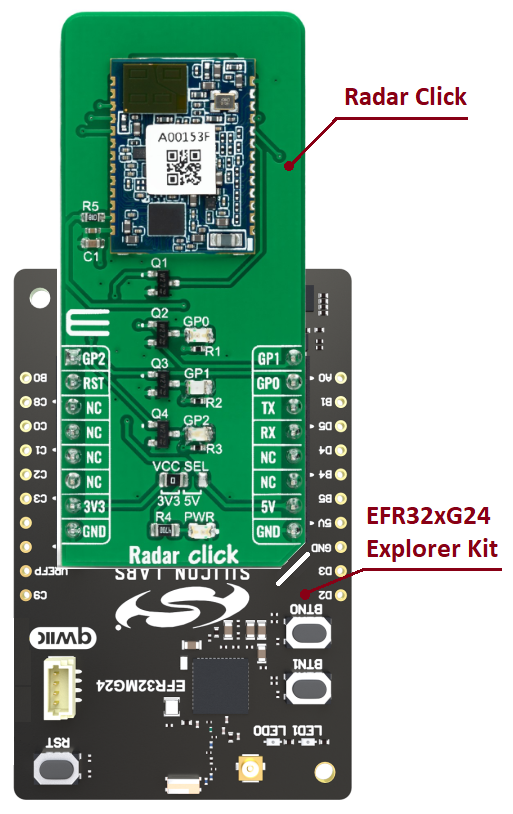

# MM5D91-00 - Radar Click (Mikroe) #

## Summary ##

This project shows the implementation of Radar-sensor driver using MM5D91-00 with Silicon Labs platform based on UART communication.

Radar Click as its foundation uses the MM5D91-00 presence detection sensor module with an integrated mmWave technology from Jorjin Technologies Inc. It is capable of counting the number of people who passed an entrance or entered a room. It simplifies the implementation of mmWave sensors in the band of 61.0 to 61.5 GHz range. The board includes an ARM Cortex-M4F-based processor system with 1Tx 3Rx antenna and an onboard regulator.
The device is beneficial for various presence sensing applications, ranging from offices and homes to commercial buildings and infrastructures.

## Table Of Contents ##

- [Required Hardware](#required-hardware)
- [Hardware Connection](#hardware-connection)
- [Setup](#setup)
  - [Create a project based on an example project](#create-a-project-based-on-an-example-project)
  - [Start with an empty example project](#start-with-an-empty-example-project)
- [How It Works](#how-it-works)
- [Report Bugs & Get Support](#report-bugs--get-support)

## Required Hardware ##

- 1x [Silicon Labs BLE Explorer Kit](https://www.silabs.com/development-tools/wireless/bluetooth) based on the EFR32 SoC, such as:
  - [BGM220-EK4314A](https://www.silabs.com/development-tools/wireless/bluetooth/bgm220-explorer-kit)
  - [BG22-EK4108A](https://www.silabs.com/development-tools/wireless/bluetooth/bg22-explorer-kit?tab=overview)
  - [xG24-EK2703A](https://www.silabs.com/development-tools/wireless/efr32xg24-explorer-kit?tab=overview)
  - [xG22-EK2710A](https://www.silabs.com/development-tools/wireless/efr32xg22e-explorer-kit?tab=overview)

  *or*

  1x [Silicon Labs Wi-Fi Development Kit](https://www.silabs.com/development-tools/wireless/wi-fi) based on SiWG917, such as:
  - [SIWX917-DK2605A](https://www.silabs.com/development-tools/wireless/wi-fi/siwx917-dk2605a-wifi-6-bluetooth-le-soc-dev-kit)
  - [SIWX917-RB4338A](https://www.silabs.com/development-tools/wireless/wi-fi/siwx917-rb4338a-wifi-6-bluetooth-le-soc-radio-board) + [Si-MB4002A](https://www.silabs.com/development-tools/wireless/wireless-pro-kit-mainboard?tab=overview)
  - [SiW917Y-EK2708A](https://www.silabs.com/development-tools/wireless/wi-fi/siw917y-ek2708a-explorer-kit?tab=overview)

- 1x [Radar Click board](https://www.mikroe.com/radar-click) based on MM5D91-00 sensor

## Hardware Connection ##

The Silicon Labs Explorer Kit boards feature a mikroBUS™ socket, allowing the Radar Click board to connect easily via the mikroBUS header. Ensure that the 45-degree corner of the Radar Click board aligns with the 45-degree white line on the Explorer Kit. The hardware connection is illustrated in the image below.

For the Silicon Labs boards that do not have a mikroBUS™ socket, consider using the Wire Jumpers.

The tables below provide an overview of the pin connections.

**Silicon Labs BLE Explorer Kit:**

| Description | BRD4314A | BRD4108A | BRD2703A | BRD2710A | ↔ | Radar Click |
| --- | --- | --- | --- | --- | --- | --- |
| UART Receive  | PB2 | PB2 | PD5 | PB2 | ↔ | TX  |
| UART Transmit | PB1 | PB1 | PD4 | PB1 | ↔ | RX  |
| RESET         | PC6 | PC6 | PC8 | PC6 | ↔ | RST |
| General Purpose 0 | PB3 | PB3 | PB1 | PB3 | ↔ | GP0 |
| General Purpose 1 | PB4 | PB4 | PA0 | PB4 | ↔ | GP1 |
| General Purpose 2 | PB0 | PB0 | PB0 | PB0 | ↔ | GP2 |

**Silicon Labs Wi-Fi Development Kit:**

| Description | BRD4338A + BRD4002A | BRD2605A | BRD2708A | ↔ | Radar Click |
| --- | --- | --- | --- | --- | --- |
| UART Receive  | GPIO_29 [P33] | GPIO_29 [EXP11] | ULP_GPIO_6 | ↔ | TX  |
| UART Transmit | GPIO_30 [P35] | GPIO_30 [EXP13] | ULP_GPIO_7 | ↔ | RX  |
| RESET         | GPIO_46 [P24] | GPIO_10 [EXP23] | GPIO_30    | ↔ | RST |
| General Purpose 0 | GPIO_47 [P26] | GPIO_11 [EXP22] | UULP_VBAT_GPIO_2 | ↔ | GP0 |
| General Purpose 1 | GPIO_48 [P28] | GPIO_12 [EXP25] | GPIO_12 | ↔ | GP1 |
| General Purpose 2 | GPIO_49 [P30] | GPIO_6 [EXP21]  | GPIO_29 | ↔ | GP2 |

## Setup ##

You can either create a project based on an example project or start with an empty example project.

> [!IMPORTANT]
>
> - Make sure that the [Third Party Hardware Drivers](https://github.com/SiliconLabsSoftware/third_party_hw_drivers_extension) extension is installed as part of the SiSDK. If not, follow [this documentation](https://github.com/SiliconLabsSoftware/third_party_hw_drivers_extension/blob/master/README.md#how-to-add-to-simplicity-studio-ide).
> - **Third Party Hardware Drivers** extension must be enabled for the project to install the required components from this extension.

> [!TIP]
> To show all components in the **Third Party Hardware Drivers** extension, the **Evaluation** quality must be enabled in the Software Component view.

### Create a project based on an example project ###

1. From the Launcher Home, add your device to My Products, click on it, and click on the **EXAMPLE PROJECTS & DEMOS** tab. Find the example project filtering by *radar*.

2. Click **Create** button on the **Third Party Hardware Drivers - MM5D91-00 - Radar Click (Mikroe)** example. Example project creation dialog pops up -> click Create and Finish and Project should be generated.

   

3. Build and flash this example to the board.

### Start with an empty example project ###

1. Create an "Empty C Project" for your board using Simplicity Studio v5. Use the default project settings.

2. Copy the file `app/example/mikroe_radar_mm5d91_00/app.c` into the project root folder (overwriting the existing file).

3. Open the .slcp file. Select the **SOFTWARE COMPONENTS** tab and install the following components:

   - **If the EFR32xG24 Explorer Kit is used:**
     - [Services] → [IO Stream] → [IO Stream: EUSART] → default instance name: vcom
     - [Services] → [IO Stream] → [IO Stream: USART] → default instance name: mikroe
     - [Application] → [Utility] → [Log]
     - [Third Party Hardware Drivers] → [Sensors] → [MM5D91-00 - Radar Click (Mikroe)] → use default configuration

   - **If the Wi-Fi Development Kit is used:**
     - [WiSeConnect 3 SDK] → [Device] → [Si91x] → [MCU] → [Service] → [Sleep Timer for Si91x]
     - [Third Party Hardware Drivers] → [Sensors] → [MM5D91-00 - Radar Click (Mikroe)] → use default configuration
     - [WiSeConnect 3 SDK] → [Device] → [Si91x] → [MCU] → [Peripheral] → [USART] → disable "USART0 DMA". Select the corresponding pins according to the table provided in [Hardware Connection](#hardware-connection)

4. Enable printf float support

   - Open Properties of the project.
   - Select C/C++ Build > Settings > Tool Settings > GNU ARM C Linker > General > Check "Printf float".

5. Build and flash this example to the board.

## How It Works ##

The application waits for the detection event and then displays on the USB UART the distance of detected object, accuracy, elapsed time since last reset, and the module's internal temperature.
You can launch Console that's integrated into Simplicity Studio or use a third-party terminal tool like PuTTY to receive the data from the Serial port. A screenshot of the console output is shown in the figure below.

## Report Bugs & Get Support ##

To report bugs in the Application Examples projects, please create a new "Issue" in the "Issues" section of [third_party_hw_drivers_extension](https://github.com/SiliconLabsSoftware/third_party_hw_drivers_extension) repo. Please reference the board, project, and source files associated with the bug, and reference line numbers. If you are proposing a fix, also include information on the proposed fix. Since these examples are provided as-is, there is no guarantee that these examples will be updated to fix these issues.

Questions and comments related to these examples should be made by creating a new "Issue" in the "Issues" section of [third_party_hw_drivers_extension](https://github.com/SiliconLabsSoftware/third_party_hw_drivers_extension) repo.