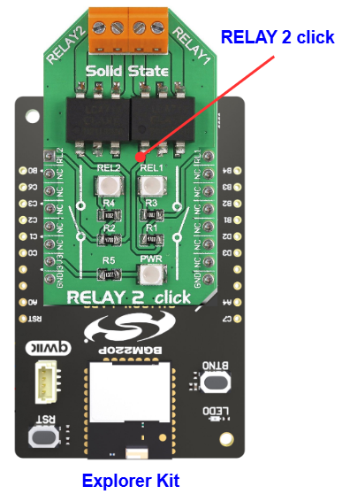

# LCA717 - Relay 2 Click (Mikroe) #

## Summary ##

This project shows the implementation of a two single-pole solid state relays (SSR) IC that is integrated on the Relay 2 Click board.

Relay 2 click is a dual relay click board™, equipped with two single-pole solid state relays (SSR), built with the patented OptoMOS® technology. These SSR devices allow reasonably high current, up to 2A and voltage up to 30V (peak-to-peak). It can be used as an MCU controlled switch for the instrumentation and sensor circuitry power control, various I/O subsystems, control of various embedded electronic applications, and similar cases where reliable and clean power supply control is required.

## Table Of Contents ##

- [Required Hardware](#required-hardware)
- [Hardware Connection](#hardware-connection)
- [Setup](#setup)
  - [Create a project based on an example project](#create-a-project-based-on-an-example-project)
  - [Start with an empty example project](#start-with-an-empty-example-project)
- [How It Works](#how-it-works)
- [Report Bugs & Get Support](#report-bugs--get-support)

## Required Hardware ##

- 1x [Silicon Labs BLE Explorer Kit](https://www.silabs.com/development-tools/wireless/bluetooth) based on the EFR32 SoC, such as:
  - [BGM220-EK4314A](https://www.silabs.com/development-tools/wireless/bluetooth/bgm220-explorer-kit)
  - [BG22-EK4108A](https://www.silabs.com/development-tools/wireless/bluetooth/bg22-explorer-kit?tab=overview)
  - [xG24-EK2703A](https://www.silabs.com/development-tools/wireless/efr32xg24-explorer-kit?tab=overview)
  - [xG22-EK2710A](https://www.silabs.com/development-tools/wireless/efr32xg22e-explorer-kit?tab=overview)

  *or*

  1x [Silicon Labs Wi-Fi Development Kit](https://www.silabs.com/development-tools/wireless/wi-fi) based on SiWG917, such as:
  - [SIWX917-DK2605A](https://www.silabs.com/development-tools/wireless/wi-fi/siwx917-dk2605a-wifi-6-bluetooth-le-soc-dev-kit)
  - [SIWX917-RB4338A](https://www.silabs.com/development-tools/wireless/wi-fi/siwx917-rb4338a-wifi-6-bluetooth-le-soc-radio-board) + [Si-MB4002A](https://www.silabs.com/development-tools/wireless/wireless-pro-kit-mainboard?tab=overview)
  - [SiW917Y-EK2708A](https://www.silabs.com/development-tools/wireless/wi-fi/siw917y-ek2708a-explorer-kit?tab=overview)

- 1x [Relay 2 Click board](https://www.mikroe.com/relay-2-click)

## Hardware Connection ##

The Silicon Labs Explorer Kit boards feature a mikroBUS™ socket, allowing the Relay 2 Click board to connect easily via the mikroBUS header. Ensure that the 45-degree corner of the Relay 2 Click board aligns with the 45-degree white line on the Explorer Kit. The hardware connection is illustrated in the image below.

For the Silicon Labs boards that do not have a mikroBUS™ socket, consider using the Wire Jumpers.

The tables below provide an overview of the pin connections.

**Silicon Labs BLE Development Kit:**

| Description | BRD4314A | BRD4108A | BRD2703A | BRD2710A | ↔ | Relay 2 Click |
| --- | --- | --- | --- | --- | --- | --- |
| Relay 1 | PB4 | PB4 | PA0 | PB4 | ↔ | RL1 |
| Relay 2 | PB0 | PB0 | PB0 | PB0 | ↔ | RL2 |

**Silicon Labs Wi-Fi Development Kit:**

| Description | BRD4338A + BRD4002A | BRD2605A | BRD2708A | ↔ | Relay 2 Click |
| --- | --- | --- | --- | --- | --- |
| Relay 1 | GPIO_46 [P24] | GPIO_10 [P23] | GPIO_12 [PWM] | ↔ | RL1 |
| Relay 2 | GPIO_47 [P26] | GPIO_11 [P22] | GPIO_29 [AN]  | ↔ | RL2 |

## Setup ##

You can either create a project based on an example project or start with an empty example project.

> [!IMPORTANT]
>
> - Make sure that the [Third Party Hardware Drivers](https://github.com/SiliconLabsSoftware/third_party_hw_drivers_extension) extension is installed as part of the SiSDK. If not, follow [this documentation](https://github.com/SiliconLabsSoftware/third_party_hw_drivers_extension/blob/master/README.md#how-to-add-to-simplicity-studio-ide).
> - **Third Party Hardware Drivers** extension must be enabled for the project to install the required components from this extension.

> [!TIP]
> To show all components in the **Third Party Hardware Drivers** extension, the **Evaluation** quality must be enabled in the Software Component view.

### Create a project based on an example project ###

1. From the Launcher Home, add your device to My Products, click on it, and click on the **EXAMPLE PROJECTS & DEMOS** tab. Find the example project filtering by **"relay"**.

2. Click **Create** button on the **Third Party Hardware Drivers - LCA717 - Relay 2 Click (Mikroe)** example. Example project creation dialog pops up -> click Create and Finish and Project should be generated.

   

3. Build and flash this example to the board.

### Start with an empty example project ###

1. Create an "Empty C Project" for your board using Simplicity Studio v5. Use the default project settings.

2. Copy the file `app/example/mikroe_relay2_lca717/app.c` into the project root folder (overwriting the existing file).

3. Open the .slcp file. Select the **SOFTWARE COMPONENTS** tab and install the following components:

   - **If the BLE Explorer Kit is used:**
     - [Services] → [Timers] → [Sleep Timer]
     - [Third Party Hardware Drivers] → [Miscellaneous] → [LCA717 - Relay 2 Click (Mikroe)] → use default configuration.

   - **If the Wi-Fi Development Kit is used:**
     - [WiSeConnect 3 SDK] → [Device] → [Si91x] → [MCU] → [Service] → [Sleep Timer for Si91x]
     - [Third Party Hardware Drivers] → [Miscellaneous] → [LCA717 - Relay 2 Click (Mikroe)] → use default configuration.

4. Build and flash this example to the board.

## How It Works ##

The input stage of the device is comprised of a highly efficient GaAIAs infrared LED, used to drive the photovoltaic elements of the SSR. The output stage has two N-type MOSFETs, which allow both DC and AC to be switched to the output stage.

## Report Bugs & Get Support ##

To report bugs in the Application Examples projects, please create a new "Issue" in the "Issues" section of [platform_hardware_drivers_sdk_extensions](https://github.com/SiliconLabs/platform_hardware_drivers_sdk_extensions) repo. Please reference the board, project, and source files associated with the bug, and reference line numbers. If you are proposing a fix, also include information on the proposed fix. Since these examples are provided as-is, there is no guarantee that these examples will be updated to fix these issues.

Questions and comments related to these examples should be made by creating a new "Issue" in the "Issues" section of [platform_hardware_drivers_sdk_extensions](https://github.com/SiliconLabs/platform_hardware_drivers_sdk_extensions) repo.
