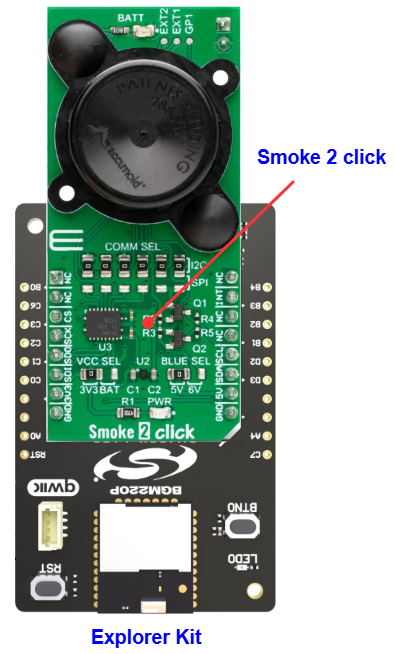

# ADPD188BI - Smoke 2 Click (Mikroe) #

## Summary ##

This project shows the driver implementation of the Smoke 2 Click module, which implements the ADPD188BI IC with the Silicon Labs Platform.

Smoke 2 Click is based on the ADPD188BI, a complete photometric system for smoke detection using optical dual-wavelength technology from Analog Devices. The module combines the dual photodetector with two separate LEDs and a mixed-signal photometric front-end ASIC, and prevents light from going directly from the LED to the photodiode without first entering the smoke detection chamber. The dual-wavelength combination in a scattering measurement, a 470nm blue LED and an 850nm IR LED, allows particle size discrimination between different types of smoke, dust, or steam. The core circuitry stimulates the LEDs and measures the corresponding optical return signals. This integrated solution enables low power and reduces false smoke alarms in harsh environments due to dust, steam, and other nuisance sources.

## Table Of Contents ##

- [Required Hardware](#required-hardware)
- [Hardware Connection](#hardware-connection)
- [Setup](#setup)
  - [Create a project based on an example project](#create-a-project-based-on-an-example-project)
  - [Start with an empty example project](#start-with-an-empty-example-project)
- [How It Works](#how-it-works)
- [Report Bugs & Get Support](#report-bugs--get-support)

## Required Hardware ##

- 1x [Silicon Labs BLE Explorer Kit](https://www.silabs.com/development-tools/wireless/bluetooth) based on the EFR32 SoC, such as:
  - [BGM220-EK4314A](https://www.silabs.com/development-tools/wireless/bluetooth/bgm220-explorer-kit)
  - [BG22-EK4108A](https://www.silabs.com/development-tools/wireless/bluetooth/bg22-explorer-kit?tab=overview)
  - [xG24-EK2703A](https://www.silabs.com/development-tools/wireless/efr32xg24-explorer-kit?tab=overview)
  - [xG22-EK2710A](https://www.silabs.com/development-tools/wireless/efr32xg22e-explorer-kit?tab=overview)

  *or*

  1x [Silicon Labs Wi-Fi Development Kit](https://www.silabs.com/development-tools/wireless/wi-fi) based on SiWG917, such as:
  - [SIWX917-DK2605A](https://www.silabs.com/development-tools/wireless/wi-fi/siwx917-dk2605a-wifi-6-bluetooth-le-soc-dev-kit)
  - [SIWX917-RB4338A](https://www.silabs.com/development-tools/wireless/wi-fi/siwx917-rb4338a-wifi-6-bluetooth-le-soc-radio-board) + [Si-MB4002A](https://www.silabs.com/development-tools/wireless/wireless-pro-kit-mainboard?tab=overview)
  - [SiW917Y-EK2708A](https://www.silabs.com/development-tools/wireless/wi-fi/siw917y-ek2708a-explorer-kit?tab=overview)

- 1x [Smoke 2 Click](https://www.mikroe.com/smoke-2-click)

## Hardware Connection ##

The Silicon Labs Explorer Kit boards feature a mikroBUS™ socket, allowing the Smoke 2 Click board to connect easily via the mikroBUS header. Ensure that the 45-degree corner of the Smoke 2 Click board aligns with the 45-degree white line on the Explorer Kit. The hardware connection is illustrated in the image below.

For the Silicon Labs boards that do not have a mikroBUS™ socket, consider using the Wire Jumpers.

The tables below provide an overview of the pin connections.

**Silicon Labs BLE Development Kit:**

| Description | BRD4314A | BRD4108A | BRD2703A | BRD2710A | ↔ | Smoke 2 Click |
| --- | --- | --- | --- | --- | --- | --- |
| I2C_SDA | PD3 | PD3 | PB5 | PD3 | ↔ | SDA |
| I2C_SCL | PD2 | PD2 | PB4 | PD2 | ↔ | SCL |
| Interrupt OUT | PB3 | PB3 | PB1 | PB3 | ↔ | INT |

**Silicon Labs Wi-Fi Development Kit:**

| Description | BRD4338A + BRD4002A | BRD2605A | BRD2708A | ↔ | Smoke 2 Click |
| --- | --- | --- | --- | --- | --- |
| I2C_SDA | ULP_GPIO_6 [EXP_16] | ULP_GPIO_6 [P16] | GPIO_6 | ↔ | SDA |
| I2C_SCL | ULP_GPIO_7 [EXP_15] | ULP_GPIO_7 [P15] | GPIO_7 | ↔ | SCL |
| Interrupt OUT | GPIO_48 [P28] | GPIO_12 [P25] | UULP_VBAT_GPIO_2 | ↔ | INT |

## Setup ##

You can either create a project based on an example project or start with an empty example project.

> [!IMPORTANT]
>
> - Make sure that the [Third Party Hardware Drivers](https://github.com/SiliconLabsSoftware/third_party_hw_drivers_extension) extension is installed as part of the SiSDK. If not, follow [this documentation](https://github.com/SiliconLabsSoftware/third_party_hw_drivers_extension/blob/master/README.md#how-to-add-to-simplicity-studio-ide).
> - **Third Party Hardware Drivers** extension must be enabled for the project to install the required components from this extension.

> [!TIP]
> To show all components in the **Third Party Hardware Drivers** extension, the **Evaluation** quality must be enabled in the Software Component view.

### Create a project based on an example project ###

1. From the Launcher Home, add your board to My Products, click on it, and click on the **EXAMPLE PROJECTS & DEMOS** tab. Find the example project filtering by **"smoke"**.

2. Click on the **Create** button on the **Third Party Hardware Drivers - Smoke 2 Click (Mikroe) - I2C** example. Example project creation dialog pops up -> click Create and Finish and Project should be generated.

   

3. Build and flash this example to the board.

### Start with an empty example project ###

1. Create an "Empty C Project" for your board using Simplicity Studio v5. Use the default project settings.

2. Copy the file `app/example/mikroe_smoke2_adpd188bi/app.c` into the project root folder (overwriting the existing file).

3. Open the .slcp file. Select the **SOFTWARE COMPONENTS** tab and install the following components:

   - **If the BLE Explorer Kit is used:**
     - [Services] → [Timers] → [Sleep Timer]
     - [Services] → [IO Stream] → [IO Stream: EUSART] → default instance name: vcom
     - [Application] → [Utility] → [Log]
     - [Platform] → [Driver] → [I2C] → [I2CSPM] → default instance name: **mikroe**
     - [Third Party Hardware Drivers] → [Sensors] → [ADPD188BI - Smoke 2 Click (Mikroe) - I2C]

   - **If the Wi-Fi Development Kit is used:**
     - [WiSeConnect 3 SDK] → [Device] → [Si91x] → [MCU] → [Service] → [Sleep Timer for Si91x]
     - [WiSeConnect 3 SDK] → [Device] → [Si91x] → [MCU] → [Peripheral] → [I2C] → [i2c2] → Select the corresponding pins according to the table provided in [Hardware Connection](#hardware-connection)
     - [Third Party Hardware Drivers] → [Sensors] → [ADPD188BI - Smoke 2 Click (Mikroe) - I2C]

4. Build and flash this example to the board.

## How It Works ##

Driver Layer Diagram is shown in the image below:

After you flashed the code to the Explorer Kit and powered the connected boards, the application starts running automatically. Use Putty/Tera Term (or another program) to read the values of the serial output. Note that the EFR32xG24 Explorer Kit board uses the default baud rate of 115200.

In the below image, you can see an example of how the output is displayed. There are two modes of operation in this example. If the user uses "EXAMPLE_MODE_SMOKE" then after the driver initializes the smoke2 click sensor, it will start calibration process. The programe will continuously compare the current sensor value with the threshold value to provide smoke detection status.

If the user uses "EXAMPLE_MODE_PROXIMITY" then after the driver initializes the smoke2 click sensor, it will continuously get the raw value from channel A, channel B, and FIFO and display it to the log. These raw values ​​will be small when no smoke is detected, and will increase significantly when higher concentrations of smoke are detected.

The user can choose the mode of operation via "EXAMPLE_MODE" macro at the begining of the "app.c".

## Report Bugs & Get Support ##

To report bugs in the Application Examples projects, please create a new "Issue" in the "Issues" section of [third_party_hw_drivers_extension](https://github.com/SiliconLabsSoftware/third_party_hw_drivers_extension) repo. Please reference the board, project, and source files associated with the bug, and reference line numbers. If you are proposing a fix, also include information on the proposed fix. Since these examples are provided as-is, there is no guarantee that these examples will be updated to fix these issues.

Questions and comments related to these examples should be made by creating a new "Issue" in the "Issues" section of [third_party_hw_drivers_extension](https://github.com/SiliconLabsSoftware/third_party_hw_drivers_extension) repo.
