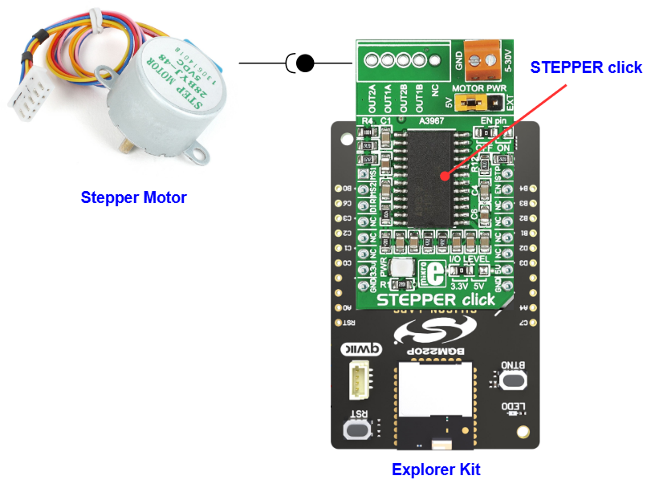

# A3967 - Stepper Click (Mikroe) #

## Summary ##

This project shows the driver implementation of the Stepper Click module, which implements the A3967 IC with the Silicon Labs Platform.

Stepper click is a complete solution for driving bipolar stepper motors with full/half and micro-steps. It features the A3967 IC from Allegro Microsystems with proprietary Satlington™ sink drivers on its outputs, which ensure high efficiency and reliable operation of the internal H-Bridges. This IC has the integrated translation section, used to simplify the control: using simple step control inputs from the host MCU, the stepper motor can be driven in both directions, with the predetermined step sizes. In addition, the output current is regulated allowing for noiseless operation of the stepper motor, with no resonance and ringing typically observed at unregulated stepper driver designs.

## Table Of Contents ##

- [Required Hardware](#required-hardware)
- [Hardware Connection](#hardware-connection)
- [Setup](#setup)
  - [Create a project based on an example project](#create-a-project-based-on-an-example-project)
  - [Start with an empty example project](#start-with-an-empty-example-project)
- [How It Works](#how-it-works)
- [Report Bugs & Get Support](#report-bugs--get-support)

## Required Hardware ##

- 1x [Silicon Labs BLE Explorer Kit](https://www.silabs.com/development-tools/wireless/bluetooth) based on the EFR32 SoC, such as:
  - [BGM220-EK4314A](https://www.silabs.com/development-tools/wireless/bluetooth/bgm220-explorer-kit)
  - [BG22-EK4108A](https://www.silabs.com/development-tools/wireless/bluetooth/bg22-explorer-kit?tab=overview)
  - [xG24-EK2703A](https://www.silabs.com/development-tools/wireless/efr32xg24-explorer-kit?tab=overview)
  - [xG22-EK2710A](https://www.silabs.com/development-tools/wireless/efr32xg22e-explorer-kit?tab=overview)

  *or*

  1x [Silicon Labs Wi-Fi Development Kit](https://www.silabs.com/development-tools/wireless/wi-fi) based on SiWG917, such as:
  - [SIWX917-DK2605A](https://www.silabs.com/development-tools/wireless/wi-fi/siwx917-dk2605a-wifi-6-bluetooth-le-soc-dev-kit)
  - [SIWX917-RB4338A](https://www.silabs.com/development-tools/wireless/wi-fi/siwx917-rb4338a-wifi-6-bluetooth-le-soc-radio-board) + [Si-MB4002A](https://www.silabs.com/development-tools/wireless/wireless-pro-kit-mainboard?tab=overview)
  - [SiW917Y-EK2708A](https://www.silabs.com/development-tools/wireless/wi-fi/siw917y-ek2708a-explorer-kit?tab=overview)

- 1x [Stepper Click](https://www.mikroe.com/stepper-click)
- 1x [Step Motor 5v](https://www.mikroe.com/step-motor-5v)

## Hardware Connection ##

The Silicon Labs Explorer Kit boards feature a mikroBUS™ socket, allowing the Stepper Click board to connect easily via the mikroBUS header. Ensure that the 45-degree corner of the Stepper Click board aligns with the 45-degree white line on the Explorer Kit. The hardware connection is illustrated in the image below.

For the Silicon Labs boards that do not have a mikroBUS™ socket, consider using the Wire Jumpers.

The tables below provide an overview of the pin connections.

**Silicon Labs BLE Explorer Kit:**

| Description | BRD4314A | BRD4108A | BRD2703A | BRD2710A | ↔ | Stepper Click |
| --- | --- | --- | --- | --- | --- | --- |
| Step size bit 1 | PB0 | PB0 | PB0 | PB0 | ↔ | MS1 |
| Step size bit 2 | PC6 | PC6 | PC8 | PC6 | ↔ | MS2 |
| Direction       | PC3 | PC3 | PC0 | PC3 | ↔ | DIR |
| Step trigger    | PB4 | PB4 | PA0 | PB4 | ↔ | STP |

**Silicon Labs Wi-Fi Development Kit:**

| Description | BRD4338A + BRD4002A | BRD2605A | BRD2708A | ↔ | Stepper Click |
| --- | --- | --- | --- | --- | --- |
| Step size bit 1 | GPIO_48 [P28] | GPIO_12 [P25] | GPIO_29 [AN] | ↔ | MS1 |
| Step size bit 2 | GPIO_49 [P30] | GPIO_6 [P21]  | GPIO_30 [RST] | ↔ | MS2 |
| Direction       | GPIO_47 [P26] | GPIO_11 [P22] | GPIO_28 [CS] | ↔ | DIR |
| Step trigger    | GPIO_46 [P24] | GPIO_10 [P23] | GPIO_12 [PWM] | ↔ | STP |

## Setup ##

You can either create a project based on an example project or start with an empty example project.

> [!IMPORTANT]
>
> - Make sure that the [Third Party Hardware Drivers](https://github.com/SiliconLabsSoftware/third_party_hw_drivers_extension) extension is installed as part of the SiSDK. If not, follow [this documentation](https://github.com/SiliconLabsSoftware/third_party_hw_drivers_extension/blob/master/README.md#how-to-add-to-simplicity-studio-ide).
> - **Third Party Hardware Drivers** extension must be enabled for the project to install the required components from this extension.

> [!TIP]
> To show all components in the **Third Party Hardware Drivers** extension, the **Evaluation** quality must be enabled in the Software Component view.

### Create a project based on an example project ###

1. From the Launcher Home, add your device to My Products, click on it, and click on the **EXAMPLE PROJECTS & DEMOS** tab. Find the example project filtering by "stepper".

2. Click **Create** button on the **Third Party Hardware Drivers - A3967 - Stepper Click (Mikroe)** example. Example project creation dialog pops up -> click Create and Finish and Project should be generated.

    

3. Build and flash this example to the board.

### Start with an empty example project ###

1. Create an "Empty C Project" for the your board using Simplicity Studio v5. Use the default project settings.

2. Copy the file `app/example/mikroe_stepper_a3967/app.c` into the project root folder (overwriting existing file).

3. Open the .slcp file. Select the **SOFTWARE COMPONENTS** tab and install the following components:

   - **If the BLE Explorer Kit is used:**
     - [Services] → [IO Stream] → [IO Stream: USART] → default instance name: vcom
     - [Application] → [Utility] → [Log]
     - [Third-Party Hardware Drivers] → [Motor Control] → [A3967 - Stepper Click (Mikroe)]

   - **If the Wi-Fi Development Kit is used:**
     - [Third-Party Hardware Drivers] → [Motor Control] → [A3967 - Stepper Click (Mikroe)]

4. Build and flash this example to the board.

## How It Works ##

According to the data sheet, when the 28BYJ-48 motor is operated in full-step mode, each step corresponds to a rotation of 5.625°. This means there are 64 steps per revolution (360°/5.625° = 64).

In addition, the motor features a 1/64 reduction gear set. This means that there are in fact 4096 steps (64*64 steps per revolution).

After the main program is executed, the stepper motor will start to run like the GIF below:

You also can check the output of PWM and it looks like the picture below:

## Report Bugs & Get Support ##

To report bugs in the Application Examples projects, please create a new "Issue" in the "Issues" section of [third_party_hw_drivers_extension](https://github.com/SiliconLabsSoftware/third_party_hw_drivers_extension) repo. Please reference the board, project, and source files associated with the bug, and reference line numbers. If you are proposing a fix, also include information on the proposed fix. Since these examples are provided as-is, there is no guarantee that these examples will be updated to fix these issues.

Questions and comments related to these examples should be made by creating a new "Issue" in the "Issues" section of [third_party_hw_drivers_extension](https://github.com/SiliconLabsSoftware/third_party_hw_drivers_extension) repo.
