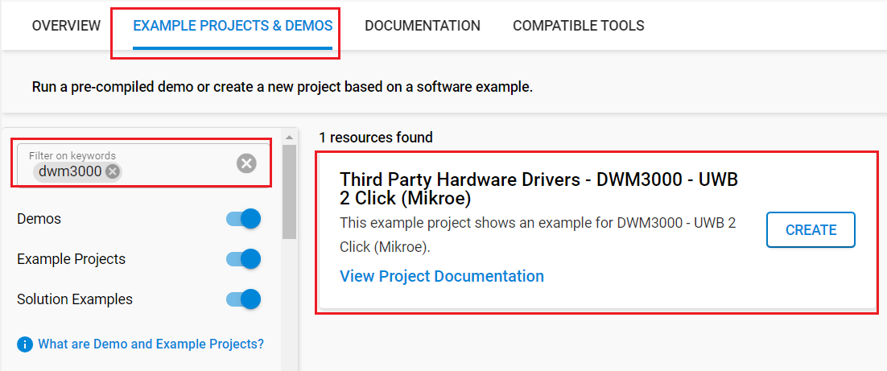

# DWM3000 - UWB 2 Click (Mikroe) #

## Summary ##

This example project showcases the driver integration of the Mikroe DWM3000 - UWB 2 Click board™.

UWB 2 Click board™ is an Ultra-Wideband transceiver. It features the DWM3000, an IEEE 802.15-z UWB transceiver module from Qorvo. This module fully aligns with FiRaTM PHY, MAC, and certification development. It uses an integrated UWB antenna to establish wireless communication in UWB channels 5 (6.5GHz) and 9 (8GHz). This Click board™ is optimized for developing precision real-time positioning system (RTLS) applications using two-way ranging diagrams or Time Difference of Arrival (TDoA). It can also be applied in many other fields such as agriculture, automation & building controls, factory automation, healthcare, safety & security and warehousing & logistics.

## Table Of Contents ##

- [Required Hardware](#required-hardware)
- [Hardware Connection](#hardware-connection)
- [Setup](#setup)
  - [Create a project based on an example project](#create-a-project-based-on-an-example-project)
  - [Start with an empty example project](#start-with-an-empty-example-project)
- [How It Works](#how-it-works)
- [Report Bugs & Get Support](#report-bugs--get-support)

## Required Hardware ##

- 2x [Silicon Labs BLE Explorer Kit](https://www.silabs.com/development-tools/wireless/bluetooth) based on the EFR32 SoC, such as:
  - [BGM220-EK4314A](https://www.silabs.com/development-tools/wireless/bluetooth/bgm220-explorer-kit)
  - [BG22-EK4108A](https://www.silabs.com/development-tools/wireless/bluetooth/bg22-explorer-kit?tab=overview)
  - [xG24-EK2703A](https://www.silabs.com/development-tools/wireless/efr32xg24-explorer-kit?tab=overview)
  - [xG22-EK2710A](https://www.silabs.com/development-tools/wireless/efr32xg22e-explorer-kit?tab=overview)

  *or*

  2x [Silicon Labs Wi-Fi Development Kit](https://www.silabs.com/development-tools/wireless/wi-fi) based on SiWG917, such as:
  - [SIWX917-DK2605A](https://www.silabs.com/development-tools/wireless/wi-fi/siwx917-dk2605a-wifi-6-bluetooth-le-soc-dev-kit)
  - [SIWX917-RB4338A](https://www.silabs.com/development-tools/wireless/wi-fi/siwx917-rb4338a-wifi-6-bluetooth-le-soc-radio-board) + [Si-MB4002A](https://www.silabs.com/development-tools/wireless/wireless-pro-kit-mainboard?tab=overview)
  - [SiW917Y-EK2708A](https://www.silabs.com/development-tools/wireless/wi-fi/siw917y-ek2708a-explorer-kit?tab=overview)

- 2x [UWB 2 Click board](https://www.mikroe.com/uwb-2-click)

## Hardware Connection ##

The Silicon Labs Explorer Kit boards feature a mikroBUS™ socket, allowing the UWB 2 Click board to connect easily via the mikroBUS header. Ensure that the 45-degree corner of the UWB 2 Click board aligns with the 45-degree white line on the Explorer Kit. The hardware connection is illustrated in the image below.


For the Silicon Labs boards that do not have a mikroBUS™ socket, consider using the Wire Jumpers.

The tables below provide an overview of the pin connections.

**Silicon Labs BLE Explorer Kit:**

| Description | BRD4314A | BRD4108A | BRD2703A | BRD2710A | ↔ | UWB 2 Click Board |
| --- | --- | --- | --- | --- | --- | --- |
| SPI CS PIN  | PC3 | PC3 | PC0 | PC3 | ↔ | CS  |
| SPI CLK PIN | PC2 | PC2 | PC1 | PC2 | ↔ | SCK |
| SPI RX PIN  | PC1 | PC1 | PC2 | PC1 | ↔ | SDO |
| SPI TX PIN  | PC0 | PC0 | PC3 | PC0 | ↔ | SDI |
| Reset       | PC6 | PC6 | PC8 | PC6 | ↔ | RST |
| Interrupt   | PB3 | PB3 | PB1 | PB3 | ↔ | INT |

**Silicon Labs Wi-Fi Development Kit:**

| Description | BRD4338A + BRD4002A | BRD2605A | BRD2708A | ↔ | UWB 2 Click Board |
| --- | --- | --- | --- | --- | --- |
| RTE_GSPI_MASTER_CLK_PIN  | GPIO_25 [P25] | GPIO_25 [P3] | GPIO_25 | ↔ | SCK |
| RTE_GSPI_MASTER_MISO_PIN | GPIO_26 [P27] | GPIO_26 [P5] | GPIO_26 | ↔ | SDO |
| RTE_GSPI_MASTER_MOSI_PIN | GPIO_27 [P29] | GPIO_27 [P7] | GPIO_27 | ↔ | SDI |
| RTE_GSPI_MASTER_CS0_PIN  | GPIO_28 [P31] | GPIO_28 [P9] | GPIO_28 | ↔ | CS  |
| Reset        | GPIO_46 [P24] | GPIO_10 [P23] | GPIO_30 | ↔ | RST |
| Interrupt    | GPIO_47 [P26] | GPIO_11 [P22] | UULP_VBAT_GPIO_2 | ↔ | INT |

## Setup ##

You can either create a project based on an example project or start with an empty example project.

> [!IMPORTANT]
>
> - Make sure that the [Third Party Hardware Drivers](https://github.com/SiliconLabsSoftware/third_party_hw_drivers_extension) extension is installed as part of the SiSDK. If not, follow [this documentation](https://github.com/SiliconLabsSoftware/third_party_hw_drivers_extension/blob/master/README.md#how-to-add-to-simplicity-studio-ide).
> - **Third Party Hardware Drivers** extension must be enabled for the project to install the required components from this extension.

> [!TIP]
> To show all components in the **Third Party Hardware Drivers** extension, the **Evaluation** quality must be enabled in the Software Component view.

### Create a project based on an example project ###

1. From the Launcher Home, add your board to My Products, click on it, and click on the **EXAMPLE PROJECTS & DEMOS** tab. Find the example project filtering by "dwm300".

2. Click **Create** button on the project **Third Party Hardware Drivers - DWM3000 - UWB 2 Click (Mikroe)**. Example project creation dialog pops up -> click Create and Finish and Project should be generated.

    

3. Build and flash this example to the board.

### Start with an empty example project ###

1. Create an "Empty C Project" for your board using Simplicity Studio v5. Use the default project settings.

2. Copy all of the files in the `app/example/mikroe_uwb2_dwm3000/app_files` folder into the project root folder (overwriting the existing file).

3. Open the .slcp file. Select the **SOFTWARE COMPONENTS** tab and install the following components:

   - **If the BLE Explorer Kit is used**:
     - [Services] → [IO Stream] → [IO Stream: EUSART] → default instance name: vcom
     - [Services] → [Timers] → [Sleep Timer]
     - [Application] → [Utility] → [Log]
     - [Third Party Hardware Drivers] → [Wireless Connectivity] → [DWM3000 - UWB 2 Click (Mikroe)] → use default configuration

   - **If the Wi-Fi Development Kit is used**:
     - [WiSeConnect 3 SDK] → [Device] → [Si91x] → [MCU] → [Service] → [Sleep Timer for Si91x]
     - [Third Party Hardware Drivers] → [Wireless Connectivity] → [DWM3000 - UWB 2 Click (Mikroe)] → use default configuration

4. Editing the Linker File:

   - From the project root folder, open **"autogen/linkerfile.ld"** (if using EFR32xG24 Explorer Kit) or **"autogen/linkerfile_SoC.ld"** (if using Wi-Fi Development Kit) file and copy the following section to the autogenerated linker:

     ```C
         .dw_drivers ALIGN(4):
         {
             __dw_drivers_start = . ;
             KEEP(*(.dw_drivers*))
             __dw_drivers_end = . ;
         } > FLASH
     ```

   - The final linker file after editing is shown in the image below:
     

5. Using Optimization level -O2 (Optimize more) if the Wi-Fi Development Kit is used:

   - Open Properties of the project.
   - Select C/C++ Build → Settings → Tool Settings → GNU ARM C Compiler → Optimization → Optimization level → Selecting Optimize (-O2).

6. Build and flash this example to the board.

## How It Works #

After you flash the code to the your board and power the connected boards, the application starts running automatically. Use Putty/Tera Term (or another program) to read the values of the serial output. Note that your board uses the default baud rate of 115200.

First, the user must have two boards to run this demo example, one for the Transmitter, and one for Receiver. The user can decide whether to use the device in Transmitter (Tx) or Receiver (Rx) mode by macro "DEMO_APP_TRANSMITTER" in the "app.c" file.

- In Tx mode, the main program initializes the driver, reads some information and checks communication with the dwm3000 device. After that, it transmits a packet message periodically. There is a periodic timer in the code, which determines the transmitting intervals; the default transmitting intervals rate is 2000 ms. If you need more frequent transmitting, it is possible to change the value of the macro "TRANSMITTING_INTERVAL_MSEC" in the "app.c" file. The screenshot of the console is shown in the image below:

  

- In Rx mode, the main program initializes the driver, reads some information and checks communication with the dwm3000 device. After that, the device enters receiver mode, and it prints each received packet. The screenshot of the console is shown in the image below:

  

## Report Bugs & Get Support ##

To report bugs in the Application Examples projects, please create a new "Issue" in the "Issues" section of [third_party_hw_drivers_extension](https://github.com/SiliconLabsSoftware/third_party_hw_drivers_extension) repo. Please reference the board, project, and source files associated with the bug, and reference line numbers. If you are proposing a fix, also include information on the proposed fix. Since these examples are provided as-is, there is no guarantee that these examples will be updated to fix these issues.

Questions and comments related to these examples should be made by creating a new "Issue" in the "Issues" section of [third_party_hw_drivers_extension](https://github.com/SiliconLabsSoftware/third_party_hw_drivers_extension) repo.
