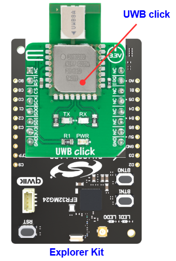
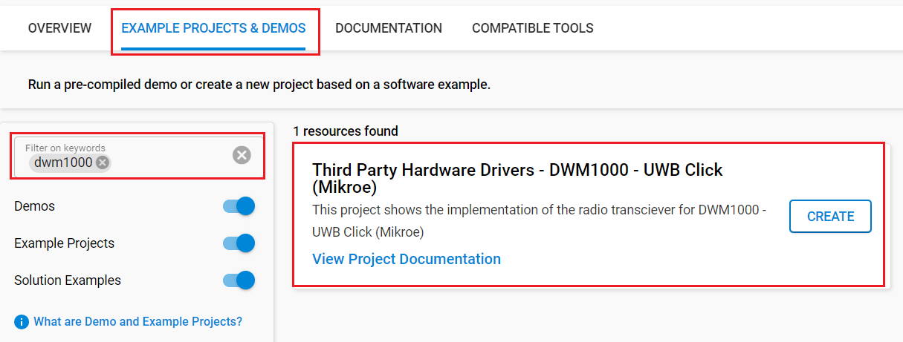
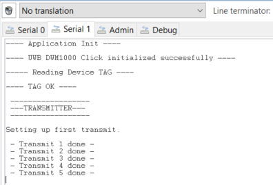
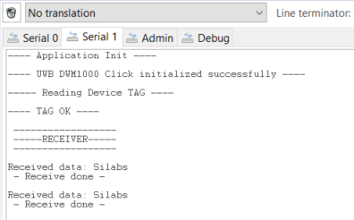

# DWM1000 - UWB Click (Mikroe) #

## Summary ##

This example project showcases the driver integration of the Mikroe DWM1000 - UWB Click board.

UWB Click is an Ultra-Wideband transceiver Click board™ that can be used in 2-way ranging or TDOA location systems to locate assets to a precision of 10 cm and supports data rates of up to 6.8 Mbps. This Click board™ features the DWM1000 module based on Qorvo's DW1000 Ultra-Wideband (UWB) transceiver from Qorvo.

It features a frequency range from 3.5GHz to 6.5GHz, a very precise location of tagged objects, up to 6.8Mbps data rates, low power consumption, and more while the communication with the MCU is accomplished through a standard SPI serial interface. This Click board™ is optimized for applications in real-time location systems and wireless sensor networks across a variety of markets including agriculture, building control and automation, factory automation, healthcare, safety & security, warehousing & logistics, and a range of others.

## Table Of Contents ##

- [Required Hardware](#required-hardware)
- [Hardware Connection](#hardware-connection)
- [Setup](#setup)
  - [Create a project based on an example project](#create-a-project-based-on-an-example-project)
  - [Start with an empty example project](#start-with-an-empty-example-project)
- [How It Works](#how-it-works)
- [Report Bugs & Get Support](#report-bugs--get-support)

## Required Hardware ##

- 2x [Silicon Labs BLE Explorer Kit](https://www.silabs.com/development-tools/wireless/bluetooth) based on the EFR32 SoC, such as:
  - [BGM220-EK4314A](https://www.silabs.com/development-tools/wireless/bluetooth/bgm220-explorer-kit)
  - [BG22-EK4108A](https://www.silabs.com/development-tools/wireless/bluetooth/bg22-explorer-kit?tab=overview)
  - [xG24-EK2703A](https://www.silabs.com/development-tools/wireless/efr32xg24-explorer-kit?tab=overview)
  - [xG22-EK2710A](https://www.silabs.com/development-tools/wireless/efr32xg22e-explorer-kit?tab=overview)

  *or*

  2x [Silicon Labs Wi-Fi Development Kit](https://www.silabs.com/development-tools/wireless/wi-fi) based on SiWG917, such as:
  - [SIWX917-DK2605A](https://www.silabs.com/development-tools/wireless/wi-fi/siwx917-dk2605a-wifi-6-bluetooth-le-soc-dev-kit)
  - [SIWX917-RB4338A](https://www.silabs.com/development-tools/wireless/wi-fi/siwx917-rb4338a-wifi-6-bluetooth-le-soc-radio-board) + [Si-MB4002A](https://www.silabs.com/development-tools/wireless/wireless-pro-kit-mainboard?tab=overview)
  - [SiW917Y-EK2708A](https://www.silabs.com/development-tools/wireless/wi-fi/siw917y-ek2708a-explorer-kit?tab=overview)

- 2 x [UWB Click](https://www.mikroe.com/uwb-click), one is for TX and one is for RX

## Hardware Connection ##

The Silicon Labs Explorer Kit boards feature a mikroBUS™ socket, allowing the UWB Click board to connect easily via the mikroBUS header. Ensure that the 45-degree corner of the UWB Click board aligns with the 45-degree white line on the Explorer Kit. The hardware connection is illustrated in the image below.

For the Silicon Labs boards that do not have a mikroBUS™ socket, consider using the Wire Jumpers.

The tables below provide an overview of the pin connections.

**Silicon Labs BLE Explorer Kit:**

| Description | BRD4314A | BRD4108A | BRD2703A | BRD2710A | ↔ | UWB Click Board |
| --- | --- | --- | --- | --- | --- | --- |
| SPI CS PIN  | PC3 | PC3 | PC0 | PC3 | ↔ | CS  |
| SPI CLK PIN | PC2 | PC2 | PC1 | PC2 | ↔ | SCK |
| SPI RX PIN  | PC1 | PC1 | PC2 | PC1 | ↔ | SDO |
| SPI TX PIN  | PC0 | PC0 | PC3 | PC0 | ↔ | SDI |
| Reset       | PC6 | PC6 | PC8 | PC6 | ↔ | RST |
| Interrupt   | PB3 | PB3 | PB1 | PB3 | ↔ | INT |

**Silicon Labs Wi-Fi Development Kit:**

| Description | BRD4338A + BRD4002A | BRD2605A | BRD2708A | ↔ | UWB Click Board |
| --- | --- | --- | --- | --- | --- |
| RTE_GSPI_MASTER_CLK_PIN  | GPIO_25 [P25] | GPIO_25 [P3] | GPIO_25 | ↔ | SCK |
| RTE_GSPI_MASTER_MISO_PIN | GPIO_26 [P27] | GPIO_26 [P5] | GPIO_26 | ↔ | SDO |
| RTE_GSPI_MASTER_MOSI_PIN | GPIO_27 [P29] | GPIO_27 [P7] | GPIO_27 | ↔ | SDI |
| CS           | GPIO_28 [P31] | GPIO_28 [P9] | GPIO_28 | ↔ | CS |
| Reset        | GPIO_46 [P24] | GPIO_10 [P23] | GPIO_30 | ↔ | RST |
| Interrupt    | GPIO_47 [P26] | GPIO_11 [P22] | UULP_VBAT_GPIO_2 | ↔ | INT |

### Driver Layer Diagram ###

The driver of the DWM1000 - UWB Click board builds upon more than one level of software. On the first layer, there are the SPIDRV and GPIO drivers from Silabs, which focus on interfacing with the motherboard. On top of that, there are multiple layers of drivers, which either work as an interfacing layer between the Click board and the motherboard or control the DWM1000 UWB module. Here you can see the high-level overview of the software layers:

## Setup ##

You can either create a project based on an example project or start with an empty example project.

> [!IMPORTANT]
>
> - Make sure that the [Third Party Hardware Drivers](https://github.com/SiliconLabsSoftware/third_party_hw_drivers_extension) extension is installed as part of the SiSDK. If not, follow [this documentation](https://github.com/SiliconLabsSoftware/third_party_hw_drivers_extension/blob/master/README.md#how-to-add-to-simplicity-studio-ide).
> - **Third Party Hardware Drivers** extension must be enabled for the project to install the required components from this extension.

> [!TIP]
> To show all components in the **Third Party Hardware Drivers** extension, the **Evaluation** quality must be enabled in the Software Component view.

### Create a project based on an example project ###

1. From the Launcher Home, add your board to My Products, click on it, and click on the **EXAMPLE PROJECTS & DEMOS** tab. Find the example project filtering by "dwm1000".

2. Click **Create** button on the example **Third Party Hardware Drivers - DWM1000 - UWB Click (Mikroe)**. Example project creation dialog pops up -> click Create and Finish and Project should be generated.

   

3. Build and flash this example to the board.

### Start with an empty example project ###

1. Create an "Empty C Project" for the your board using Simplicity Studio v5. Use the default project settings.

2. Copy the file `app/example/mikroe_uwb_dwm1000/app.c` into the project root folder (overwriting the existing file).

3. Open the .slcp file. Select the **SOFTWARE COMPONENTS** tab and install the following components:

   - **If the BLE Explorer Kit is used**
     - [Services] → [Timers] → [Sleep Timer]
     - [Services] → [IO Stream] → [IO Stream: EUSART] → default instance name: vcom
     - [Application] → [Utility] → [Log]
     - [Application] → [Utility] → [Assert]
     - [Third Party Hardware Drivers] → [Wireless Connectivity] → [DWM1000 - UWB Click (Mikroe)] → use default configuration
     - [Platform] → [Driver] → [SPI] → [SPIDRV] → [mikroe] → change the configuration for [SPI master chip select (CS) control scheme] to "CS controlled by the application"

   - **If the Wi-Fi Development Kit is used**:
     - [WiSeConnect 3 SDK] → [Device] → [Si91x] → [MCU] → [Service] → [Sleep Timer for Si91x]
     - [Application] → [Utility] → [Assert]
     - [Third Party Hardware Drivers] → [Wireless Connectivity] → [DWM1000 - UWB Click (Mikroe)] → use default configuration
     - [WiSeConnect 3 SDK] → [Device] → [Si91x] → [MCU] → [Peripheral] → [GSPI] → Configure a different pin as CS0 to replace GPIO 28 (e.g. GPIO 49), since GPIO 28 is already managed by the [DWM1000 - UWB Click (Mikroe)] component

4. Build and flash this example to the board.

## How It Works ##

This is an example that demonstrates the use of the DWM1000 - UWB Click board. User must have two boards to run this demo example, one for the Transmitter, and one for Receiver. The user can decide whether to use the device in Transmitter (Tx) or Receiver (Rx) mode by macro "DEMO_APP_TRANSMITTER" in the `app.c` file

In Tx mode, the device transmits a packet upon startup. After that, it transmits a packet message periodically. There is a periodic timer in the code, which determines the transmitting intervals; the default transmitting intervals rate is 2000 ms. If you need more frequent transmitting, it is possible to change the value of the macro "TRANSMITTING_INTERVAL_MSEC" in the `app.c` file. The screenshot of the console can be seen below:

In Rx mode, the device enters receiver mode upon startup, and it prints each received packet after every IRQ event. The screenshot of the console can be seen below:

## Report Bugs & Get Support ##

To report bugs in the Application Examples projects, please create a new "Issue" in the "Issues" section of [third_party_hw_drivers_extension](https://github.com/SiliconLabsSoftware/third_party_hw_drivers_extension) repo. Please reference the board, project, and source files associated with the bug, and reference line numbers. If you are proposing a fix, also include information on the proposed fix. Since these examples are provided as-is, there is no guarantee that these examples will be updated to fix these issues.

Questions and comments related to these examples should be made by creating a new "Issue" in the "Issues" section of [third_party_hw_drivers_extension](https://github.com/SiliconLabsSoftware/third_party_hw_drivers_extension) repo.
