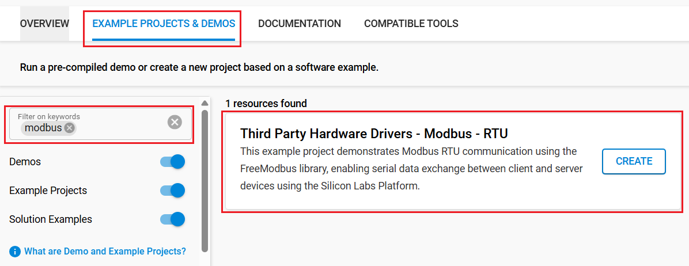
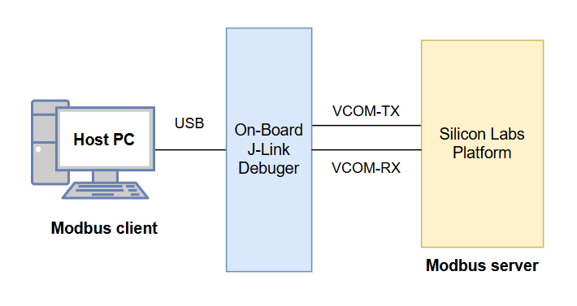

# Modbus - RTU #

## Overview ##

This example project demonstrates Modbus RTU communication for serial data exchange between client and server devices using the Silicon Labs platform.

This project is based on [FreeModbus](https://github.com/cwalter-at/freemodbus) which is a Modbus ASCII/RTU and Modbus TCP implementation for embedded systems. The library includes support for RTU and ASCII transmission modes, as defined in the Modbus over Serial Line Specification v1.0.

Visit <https://www.modbus.org> to find information for implementing the MODBUS protocol.

## Table Of Contents ##

- [Required Hardware](#required-hardware)
- [Hardware Connection](#hardware-connection)
- [Setup](#setup)
  - [Based on an example project](#create-a-project-based-on-an-example-project)
  - [Start with an empty example project](#start-with-an-empty-example-project)
- [How It Works](#how-it-works)
- [Report Bugs & Get Support](#report-bugs--get-support)

## Required Hardware ##

- 1x [Silicon Labs BLE Development Kit](https://www.silabs.com/development-tools/wireless/bluetooth) based on the EFR32 SoC, such as:
  - [BGM220-EK4314A](https://www.silabs.com/development-tools/wireless/bluetooth/bgm220-explorer-kit)
  - [BG22-EK4108A](https://www.silabs.com/development-tools/wireless/bluetooth/bg22-explorer-kit?tab=overview)
  - [xG24-EK2703A](https://www.silabs.com/development-tools/wireless/efr32xg24-explorer-kit?tab=overview)
  - [xG22-EK2710A](https://www.silabs.com/development-tools/wireless/efr32xg22e-explorer-kit?tab=overview)
  - [XG24-DK2601B](https://www.silabs.com/development-tools/wireless/efr32xg24-dev-kit)
  - [SparkFun Thing Plus Matter - MGM240P](https://www.sparkfun.com/sparkfun-thing-plus-matter-mgm240p.html)

  *or*

  1x [Silicon Labs Wi-Fi Development Kit](https://www.silabs.com/development-tools/wireless/wi-fi) based on SiWG917, such as:
  - [SIWX917-DK2605A](https://www.silabs.com/development-tools/wireless/wi-fi/siwx917-dk2605a-wifi-6-bluetooth-le-soc-dev-kit)
  - [SIWX917-RB4338A](https://www.silabs.com/development-tools/wireless/wi-fi/siwx917-rb4338a-wifi-6-bluetooth-le-soc-radio-board) + [Si-MB4002A](https://www.silabs.com/development-tools/wireless/wireless-pro-kit-mainboard?tab=overview)
  - [SiW917Y-EK2708A](https://www.silabs.com/development-tools/wireless/wi-fi/siw917y-ek2708a-explorer-kit?tab=overview)

## Hardware Connection ##

- Connect the Bluetooth Development Kit to the PC using a compatible cable (for example, a micro USB cable for the BGM220 Bluetooth Module Explorer Kit).

## Setup ##

You can either create a project from an existing example or start with an empty project.

> [!IMPORTANT]
>
> - Make sure that the [Third Party Hardware Drivers](https://github.com/SiliconLabsSoftware/third_party_hw_drivers_extension) extension is installed as part of the SiSDK. If not, follow [this documentation](https://github.com/SiliconLabsSoftware/third_party_hw_drivers_extension/blob/master/README.md#how-to-add-to-simplicity-studio-ide).
> - **Third Party Hardware Drivers** extension must be enabled for the project to install the required components from this extension.

> [!TIP]
> To show all components in the **Third Party Hardware Drivers** extension, the **Evaluation** quality must be enabled in the Software Component view.

### Create a project based on an example project ###

1. From the Launcher Home, add your board to My Products, click on it, and click on the **EXAMPLE PROJECTS & DEMOS** tab. Find the example project filtering by *modbus*.

   

2. Click **Create** button on the **Third Party Hardware Drivers - Modbus - RTU** example. When the project creation dialog appears, click **Create and Finish** - then, the project will be generated.

3. Build and flash this example to the board.

### Start with an empty example project ###

1. Create an "Empty C Project" for the "BGM220 Explorer Kit Board" using Simplicity Studio v5. Use the default project settings.

2. Copy the file `app/example/modbus_rtu/app.c` into the project root folder, overwriting the existing file.

3. Open the .slcp file. Select the **SOFTWARE COMPONENTS** tab and install the following components:

   - **If the BLE Explorer Kit is used:**
     - [Third Party Hardware Drivers] → [Services] → [Modbus] → use the default configuration

   - **If the Wi-Fi Development Kit is used:**
     - [Third Party Hardware Drivers] → [Services] → [Modbus (ULP UART)] → use the default configuration

4. Build and flash this example to the board.

## How It Works ##

Modbus communication is transmitted over serial lines between devices.
The simplest setup involves a single serial cable connecting the serial ports of two devices, a client and a server.
In this project, a virtual COM port is used to enable serial data exchange between the client and server devices, as illustrated in the image below.



On the host PC, a Python script located at `app/example/modbus_rtu/simple_async_client.py` is used to demonstrate how a Modbus RTU client communicates with a server. You need to modify the script to adapt it to your situation.

> [!TIP]
> `simple_async_client.py` is based on the Pymodbus library. Using the command: `pip install pymodbus[serial]` to install Pymodbus with the pyserial dependency.

The console output is shown as below.

```bash
> python simple_async_client.py
get client
connect to server
2025-10-03 14:33:21,679 DEBUG base:56 Connecting to COM33:0.
2025-10-03 14:33:21,680 DEBUG transport:242 Connecting comm
2025-10-03 14:33:21,697 DEBUG transport:277 Connected to comm
get and verify data
2025-10-03 14:33:21,805 DEBUG transport:375 send: 0xa 0x1 0x3 0xe8 0x0 0x1 0x7c 0xc1
2025-10-03 14:33:21,816 DEBUG transport:329 recv: 0xa 0x1 0x1 0x0 0x53 0xac extra data:
2025-10-03 14:33:21,816 DEBUG base:72 Processing: 0xa 0x1 0x1 0x0 0x53 0xac
2025-10-03 14:33:21,817 DEBUG decoders:79 decoded PDU function_code(1 sub -1) -> ReadCoilsResponse(dev_id=0, transaction_id=0, address=0, count=0, bits=[False, False, False, False, False, False, False, False], registers=[], status=1, retries=0)
2025-10-03 14:33:21,819 DEBUG transport:375 send: 0xa 0x4 0x7 0xd0 0x0 0x2 0x70 0x3d
2025-10-03 14:33:21,831 DEBUG transport:329 recv: 0xa 0x4 0x4 0x64 0x0 0x0 0x0 0x5e 0x74 extra data:
2025-10-03 14:33:21,832 DEBUG base:72 Processing: 0xa 0x4 0x4 0x64 0x0 0x0 0x0 0x5e 0x74
2025-10-03 14:33:21,832 DEBUG decoders:79 decoded PDU function_code(4 sub -1) -> ReadInputRegistersResponse(dev_id=0, transaction_id=0, address=0, count=0, bits=[], registers=[25600, 0], status=1, retries=0)
Got int32: 1677721600
close connection
```

## Report Bugs & Get Support ##

To report bugs in the Application Examples projects, please create a new "Issue" in the "Issues" section of [third_party_hw_drivers_extension](https://github.com/SiliconLabsSoftware/third_party_hw_drivers_extension) repo. Please include references to the board, project, and source files associated with the bug, along with relevant line numbers. If you are proposing a fix, also include information on the proposed fix. Since these examples are provided as-is, there is no guarantee that these examples will be updated to fix these issues.

Questions and comments related to these examples should be made by creating a new "Issue" in the "Issues" section of [third_party_hw_drivers_extension](https://github.com/SiliconLabsSoftware/third_party_hw_drivers_extension) repo.
