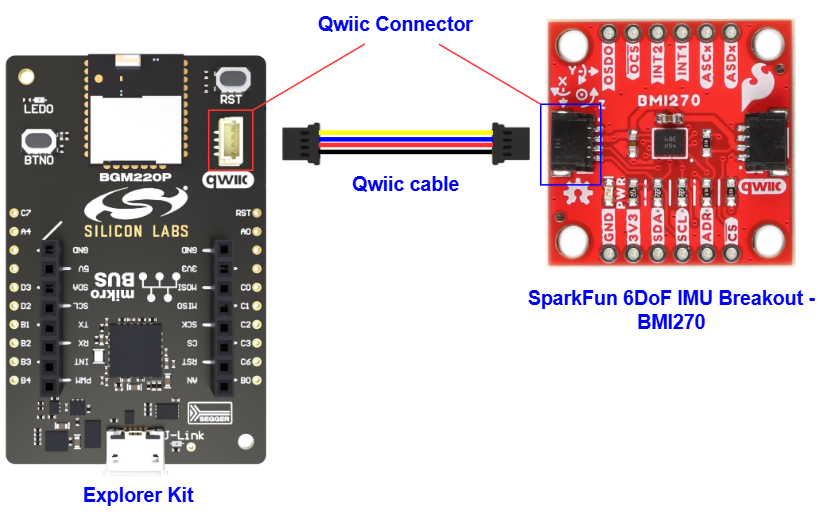
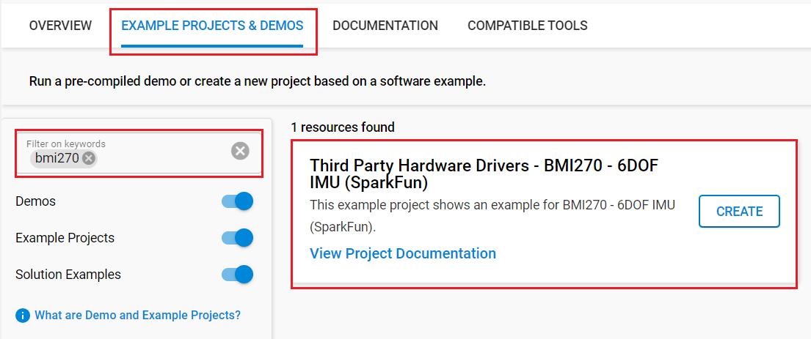

# BMI270 - 6DoF IMU Breakout (SparkFun) #

## Summary ##

This example project showcases the driver integration of the SparkFun BMI270 - 6DoF IMU Breakout.

The SparkFun BMI270 6DoF IMU Breakout is a Qwiic-enabled breakout board based on the ultra-low power BMI270 from Bosch. This chip is a highly integrated, low-power IMU optimized for wearables providing precise acceleration, angular rate measurement, and intelligent on-chip motion-triggered interrupt features. Not only does the BMI270 comprise a fast and sensitive accelerometer and gyro pair, but it also contains several intelligent, on-chip motion-triggered interrupt features.

## Table Of Contents ##

- [Required Hardware](#required-hardware)
- [Hardware Connection](#hardware-connection)
- [Setup](#setup)
  - [Create a project based on an example project](#create-a-project-based-on-an-example-project)
  - [Start with an empty example project](#start-with-an-empty-example-project)
- [How It Works](#how-it-works)
- [Report Bugs & Get Support](#report-bugs--get-support)

## Required Hardware ##

- 1x [Silicon Labs BLE Development Kit](https://www.silabs.com/development-tools/wireless/bluetooth) based on the EFR32 SoC, such as:
  - [BGM220-EK4314A](https://www.silabs.com/development-tools/wireless/bluetooth/bgm220-explorer-kit)
  - [BG22-EK4108A](https://www.silabs.com/development-tools/wireless/bluetooth/bg22-explorer-kit?tab=overview)
  - [xG24-EK2703A](https://www.silabs.com/development-tools/wireless/efr32xg24-explorer-kit?tab=overview)
  - [xG22-EK2710A](https://www.silabs.com/development-tools/wireless/efr32xg22e-explorer-kit?tab=overview)
  - [XG24-DK2601B](https://www.silabs.com/development-tools/wireless/efr32xg24-dev-kit)
  - [SparkFun Thing Plus Matter - MGM240P](https://www.sparkfun.com/sparkfun-thing-plus-matter-mgm240p.html)

  *or*

  1x [Silicon Labs Wi-Fi Development Kit](https://www.silabs.com/development-tools/wireless/wi-fi) based on SiWG917, such as:
  - [SIWX917-DK2605A](https://www.silabs.com/development-tools/wireless/wi-fi/siwx917-dk2605a-wifi-6-bluetooth-le-soc-dev-kit)
  - [SIWX917-RB4338A](https://www.silabs.com/development-tools/wireless/wi-fi/siwx917-rb4338a-wifi-6-bluetooth-le-soc-radio-board) + [Si-MB4002A](https://www.silabs.com/development-tools/wireless/wireless-pro-kit-mainboard?tab=overview)
  - [SiW917Y-EK2708A](https://www.silabs.com/development-tools/wireless/wi-fi/siw917y-ek2708a-explorer-kit?tab=overview)

- 1x [SparkFun 6DoF IMU Breakout - BMI270 (Qwiic)](https://www.sparkfun.com/products/22397)

## Hardware Connection ##

For the Silicon Labs boards that feature a Qwiic connector, a [Qwiic Cable](https://www.sparkfun.com/flexible-qwiic-cable-100mm.html) is used to connect to the SparkFun 6DoF IMU Breakout board, as illustrated in the figure below.

For the Silicon Labs boards that do not have a Qwiic connector, consider using the [Qwiic Breadboard Cable](https://www.sparkfun.com/products/14425).

The tables below provide an overview of the pin connections.

**Silicon Labs BLE Development Kit:**

| Description | BRD4108A | BRD4314A | BRD2601B | BRD2703A | BRD2704A | BRD2710A | ↔ | SparkFun 6DoF IMU Breakout |
| --- | --- | --- | --- | --- | --- | --- | --- |  --- |
| I2C_SDA | PD3 | PD3 | PC5 | PC5 | PB4 | PD3 | ↔ | SDA |
| I2C_SCL | PD2 | PD2 | PC4 | PC4 | PB3 | PD2 | ↔ | SCL |

**Silicon Labs Wi-Fi Development Kit:**

| Description | BRD4338A + BRD4002A | BRD2605A | BRD2708A | ↔ | SparkFun 6DoF IMU Breakout |
| --- | --- | --- | --- | --- | --- |
| I2C_SDA | ULP_GPIO_6 [EXP_16] | ULP_GPIO_6 | GPIO_6 | ↔ | SDA |
| I2C_SCL | ULP_GPIO_7 [EXP_15] | ULP_GPIO_7 | GPIO_7 | ↔ | SCL |

## Setup ##

You can either create a project based on an example project or start with an empty example project.

> [!IMPORTANT]
>
> - Make sure that the [Third Party Hardware Drivers](https://github.com/SiliconLabsSoftware/third_party_hw_drivers_extension) extension is installed as part of the SiSDK. If not, follow [this documentation](https://github.com/SiliconLabsSoftware/third_party_hw_drivers_extension/blob/master/README.md#how-to-add-to-simplicity-studio-ide).
> - **Third Party Hardware Drivers** extension must be enabled for the project to install the required components from this extension.

> [!TIP]
> To show all components in the **Third Party Hardware Drivers** extension, the **Evaluation** quality must be enabled in the Software Component view.

### Create a project based on an example project ###

1. From the Launcher Home, add your board to My Products, click on it, and click on the **EXAMPLE PROJECTS & DEMOS** tab. Find the example project filtering by "bmi270".

2. Click **Create** button on the **Third Party Hardware Drivers - BMI270 - 6DOF IMU (SparkFun)** example. Example project creation dialog pops up -> click Create and Finish and Project should be generated.

   

3. Build and flash this example to the board.

### Start with an empty example project ###

1. Create an "Empty C Project" for your board using Simplicity Studio v5. Use the default project settings.

2. Copy the file `app/example/silabs_6dof_imu_bmi270/app.c` into the project root folder (overwriting the existing file).

3. Open the .slcp file. Select the **SOFTWARE COMPONENTS** tab and install the following components:

   - **If the BLE Development Kit is used:**
     - [Services] → [IO Stream] → [IO Stream: EUSART] → default instance name: vcom
     - [Application] → [Utility] → [Log]
     - [Application] → [Utility] → [Assert]
     - [Platform] → [Driver] → [I2C] → [I2CSPM] → default instance name: qwiic
     - [Third Party Hardware Drivers] → [Sensor] → [BMI270 - 6DOF IMU Breakout (Sparkfun)] → use default configuration

   - **If the Wi-Fi Development Kit is used**
     - [Application] → [Utility] → [Assert]
     - [WiSeConnect 3 SDK] → [Device] → [Si91x] → [MCU] → [Peripheral] → [I2C] → [i2c2] → Select the corresponding pins according to the table provided in [Hardware Connection](#hardware-connection)
     - [Third Party Hardware Drivers] → [Sensor] → [BMI270 - 6DOF IMU Breakout (Sparkfun)] → use default configuration

4. Enable **Printf float**

   - Open Properties of the project.
   - Select C/C++ Build → Settings → Tool Settings → GNU ARM C Linker → General → Check **Printf float**.

5. Build and flash this example to the board.

## How It Works #

After you flash the code and power the connected boards, the application starts running automatically. Use Putty/Tera Term (or another program) to read the values of the serial output. Note that the Kit uses the default baud rate of 115200.

First, the main program initializes the driver, configs some parameters and checks communication with the bmi270 device. After that, it read the accelerometer, gyroscope and temperature data periodically. There is a periodic timer in the code, which determines the sampling intervals; the default sampling interval rate is 500 ms. If you need more frequent sampling, it is possible to change the value of the macro "READING_INTERVAL_MSEC" in the "app.c" file. The screenshot of the console is shown in the image below:

## Report Bugs & Get Support ##

To report bugs in the Application Examples projects, please create a new "Issue" in the "Issues" section of [third_party_hw_drivers_extension](https://github.com/SiliconLabsSoftware/third_party_hw_drivers_extension) repo. Please reference the board, project, and source files associated with the bug, and reference line numbers. If you are proposing a fix, also include information on the proposed fix. Since these examples are provided as-is, there is no guarantee that these examples will be updated to fix these issues.

Questions and comments related to these examples should be made by creating a new "Issue" in the "Issues" section of [third_party_hw_drivers_extension](https://github.com/SiliconLabsSoftware/third_party_hw_drivers_extension) repo.
