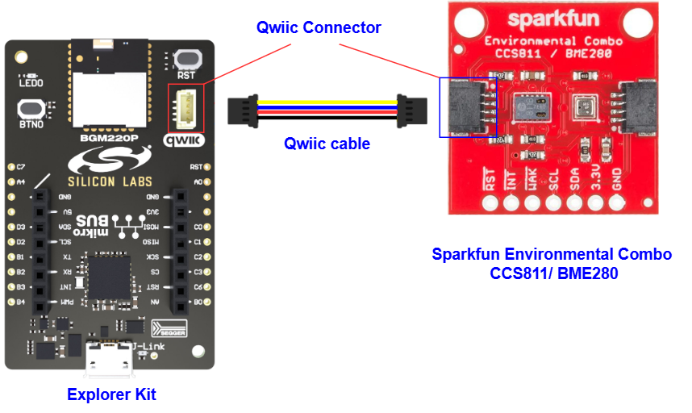
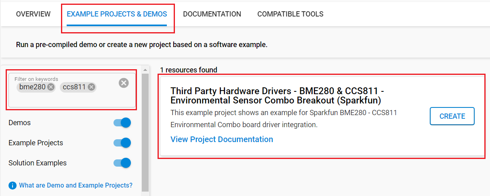
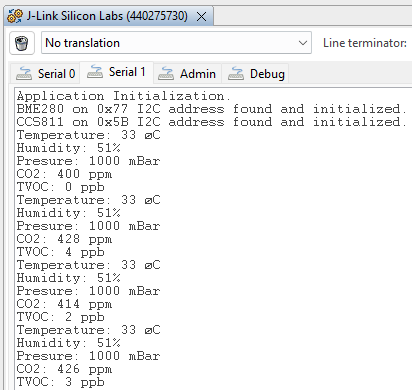

# BME280 & CCS811 - Environmental Sensor Combo Breakout #

## Summary ##

This example project shows an example for environmental parameter collection with Sparkfun BME280 - CCS811 Environmental Sensor Combo Breakout Board driver integration with the Silicon Labs Platform.

The CCS811/BME280 (Qwiic) Environmental Combo Breakout works together to take care of all of your atmospheric quality sensing needs with the CCS811 and BME280 ICs. The CCS811 is an exceedingly popular sensor, providing readings for equivalent CO2 (or eCO2) in the parts per million (PPM) and total volatile organic compounds in the parts per billion (PPB). The BME280 provides humidity, temperature, and barometric pressure. It is easy to interface with them via I2C.

## Table Of Contents ##

- [Required Hardware](#required-hardware)
- [Hardware Connection](#hardware-connection)
- [Setup](#setup)
  - [Create a project based on an example project](#create-a-project-based-on-an-example-project)
  - [Start with an empty example project](#start-with-an-empty-example-project)
- [How It Works](#how-it-works)
- [Report Bugs & Get Support](#report-bugs--get-support)

## Required Hardware ##

- 1x [Silicon Labs BLE Development Kit](https://www.silabs.com/development-tools/wireless/bluetooth) based on the EFR32 SoC, such as:
  - [BGM220-EK4314A](https://www.silabs.com/development-tools/wireless/bluetooth/bgm220-explorer-kit)
  - [BG22-EK4108A](https://www.silabs.com/development-tools/wireless/bluetooth/bg22-explorer-kit?tab=overview)
  - [xG24-EK2703A](https://www.silabs.com/development-tools/wireless/efr32xg24-explorer-kit?tab=overview)
  - [xG22-EK2710A](https://www.silabs.com/development-tools/wireless/efr32xg22e-explorer-kit?tab=overview)
  - [XG24-DK2601B](https://www.silabs.com/development-tools/wireless/efr32xg24-dev-kit)
  - [SparkFun Thing Plus Matter - MGM240P](https://www.sparkfun.com/sparkfun-thing-plus-matter-mgm240p.html)

  *or*

  1x [Silicon Labs Wi-Fi Development Kit](https://www.silabs.com/development-tools/wireless/wi-fi) based on SiWG917, such as:
  - [SIWX917-DK2605A](https://www.silabs.com/development-tools/wireless/wi-fi/siwx917-dk2605a-wifi-6-bluetooth-le-soc-dev-kit)
  - [SIWX917-RB4338A](https://www.silabs.com/development-tools/wireless/wi-fi/siwx917-rb4338a-wifi-6-bluetooth-le-soc-radio-board) + [Si-MB4002A](https://www.silabs.com/development-tools/wireless/wireless-pro-kit-mainboard?tab=overview)
  - [SiW917Y-EK2708A](https://www.silabs.com/development-tools/wireless/wi-fi/siw917y-ek2708a-explorer-kit?tab=overview)

- 1x Sparkfun Environmental Combo Breakout CCS811/BME280

  *or*

  1x [SparkFun Atmospheric Sensor Breakout - BME280 (Qwiic)](https://www.sparkfun.com/products/15440) + 1x SparkFun Air Quality Breakout - CCS811 (Qwiic)

## Hardware Connection ##

For the Silicon Labs boards that feature a Qwiic connector, a [Qwiic Cable](https://www.sparkfun.com/flexible-qwiic-cable-100mm.html) is used to connect to the SparkFun Environmental Sensor Combo Breakout board, as illustrated in the figure below.

For the Silicon Labs boards that do not have a Qwiic connector, consider using the [Qwiic Breadboard Cable](https://www.sparkfun.com/products/14425).

The tables below provide an overview of the pin connections.

**Silicon Labs BLE Development Kit:**

| Description | BRD4108A | BRD4314A | BRD2601B | BRD2703A | BRD2704A | BRD2710A | ↔ | SparkFun Environmental Sensor Combo Breakout |
| --- | --- | --- | --- | --- | --- | --- | --- |  --- |
| I2C_SDA | PD3 | PD3 | PC5 | PC5 | PB4 | PD3 | ↔ | SDA |
| I2C_SCL | PD2 | PD2 | PC4 | PC4 | PB3 | PD2 | ↔ | SCL |

**Silicon Labs Wi-Fi Development Kit:**

| Description | BRD4338A + BRD4002A | BRD2605A | BRD2708A | ↔ | SparkFun Environmental Sensor Combo Breakout |
| --- | --- | --- | --- | --- | --- |
| I2C_SDA | ULP_GPIO_6 [EXP_16] | ULP_GPIO_6 | GPIO_6 | ↔ | SDA |
| I2C_SCL | ULP_GPIO_7 [EXP_15] | ULP_GPIO_7 | GPIO_7 | ↔ | SCL |

> [!TIP]
> If you want to conserve power, you should connect **WAK** pin on the Environmental Combo Breakout board to your board to change the sensor's active and sleep states.

## Setup ##

You can either create a project based on an example project or start with an empty example project.

> [!IMPORTANT]
>
> - Make sure that the [Third Party Hardware Drivers](https://github.com/SiliconLabsSoftware/third_party_hw_drivers_extension) extension is installed as part of the SiSDK. If not, follow [this documentation](https://github.com/SiliconLabsSoftware/third_party_hw_drivers_extension/blob/master/README.md#how-to-add-to-simplicity-studio-ide).
> - **Third Party Hardware Drivers** extension must be enabled for the project to install the required components from this extension.

> [!TIP]
> To show all components in the **Third Party Hardware Drivers** extension, the **Evaluation** quality must be enabled in the Software Component view.

### Create a project based on an example project ###

1. From the Launcher Home, add your device to My Products, click on it, and click on the **EXAMPLE PROJECTS & DEMOS** tab. Find the example project filtering by *bme280, ccs811*.

2. Click Create button on the project **Third Party Hardware Drivers - BME280 & CCS811 - Environmental Sensor Combo Breakout (Sparkfun)** example. Example project creation dialog pops up -> click Create and Finish and Project should be generated.

   

3. Build and flash this example to the board.

### Start with an empty example project ###

1. Create an "Empty C Project" for the your board using Simplicity Studio v5. Use the default project settings.

2. Copy the file [app.c](https://github.com/SiliconLabsSoftware/third_party_hw_drivers_extension/tree/master/app/example/sparkfun_environmental_bme280_ccs811) (overwriting the existing file), into the project root folder.

3. Open the .slcp file. Select the **SOFTWARE COMPONENTS** tab and install the following components:

   - **If the BLE Development Kit is used:**
     - [Services] → [IO Stream] → [IO Stream: USART] → default instance name: vcom
     - [Application] → [Utility] → [Log]
     - [Platform] → [Driver] → [I2C] → [I2CSPM] → default instance name: qwiic
     - [Services] → [Timers] → [Sleep Timer]
     - [Third Party Hardware Drivers] → [Sensors] → [BME28 - Atmospheric Sensor (Sparkfun)]
     - [Third Party Hardware Drivers] → [Sensors] → [CCS811 - Air Quality Sensor (Sparkfun)]

   - **If the Wi-Fi Development Kit is used:**
     - [WiSeConnect 3 SDK] → [Device] → [Si91x] → [MCU] → [Service] → [Sleep Timer for Si91x]
     - [WiSeConnect 3 SDK] → [Device] → [Si91x] → [MCU] → [Peripheral] → [I2C] → [i2c2] → [i2c2] → Select the corresponding pins according to the table provided in [Hardware Connection](#hardware-connection)
     - [Third Party Hardware Drivers] → [Sensors] → [BME28 - Atmospheric Sensor (Sparkfun)]
     - [Third Party Hardware Drivers] → [Sensors] → [CCS811 - Air Quality Sensor (Sparkfun)]

4. Build and flash this example to the board.

## How It Works ##

The driver is using an I2C channel to initialize and read out both sensors. If just one sensor is needed, you can delete the header of the other sensor and source file.

The driver uses a simple timer for timings. Also, a higher-level kit driver I2CSPM (I2C simple poll-based master mode driver) is used for initializing the I2C peripheral as master mode and performing the I2C transfer.

This example is used to measure environmental parameters: temperature, humidity, pressure, CO2, and TVOC.

You can launch Console that's integrated into Simplicity Studio or use a third-party terminal tool like Tera Term to receive the data from the USB. A screenshot of the console output is shown in the figure below.

## Report Bugs & Get Support ##

To report bugs in the Application Examples projects, please create a new "Issue" in the "Issues" section of [third_party_hw_drivers_extension](https://github.com/SiliconLabsSoftware/third_party_hw_drivers_extension) repo. Please reference the board, project, and source files associated with the bug, and reference line numbers. If you are proposing a fix, also include information on the proposed fix. Since these examples are provided as-is, there is no guarantee that these examples will be updated to fix these issues.

Questions and comments related to these examples should be made by creating a new "Issue" in the "Issues" section of [third_party_hw_drivers_extension](https://github.com/SiliconLabsSoftware/third_party_hw_drivers_extension) repo.
