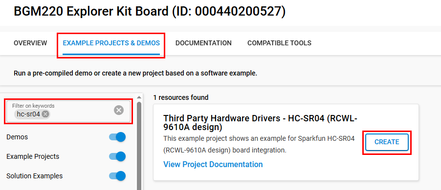
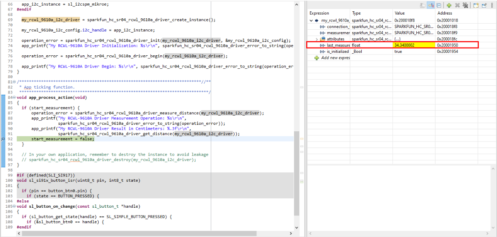

# HC-SR04 (RCWL-9610A) - Ultrasonic Distance Sensor (SparkFun) #

## Summary ##

The HC-SR04 (RCWL-9610A design) is an ultrasonic distance sensor that provides non-contact measurement capabilities from 2 cm to 400 cm with ranging accuracy of approximately 3 mm. The sensor operates by transmitting an ultrasonic pulse and measuring the time required for the echo to return. The module features four pins: VCC, Trigger, Echo, and Ground. It operates at 5V and uses a 40 kHz ultrasonic transducer for both transmission and reception.

The sensor operates on a simple principle: when triggered with a 10µs pulse on the Trigger pin, it sends out eight 40 kHz ultrasonic bursts. The Echo pin then outputs a HIGH pulse with a duration proportional to the distance measured. The distance can be calculated using the formula: Distance = (Echo pulse width × Speed of Sound) / 2.

## Table Of Contents ##

- [Required Hardware](#required-hardware)
- [Hardware Connection](#hardware-connection)
- [Setup](#setup)
  - [Create a project based on an example project](#create-a-project-based-on-an-example-project)
  - [Start with an empty example project](#start-with-an-empty-example-project)
- [How It Works](#how-it-works)
- [Report Bugs & Get Support](#report-bugs--get-support)

## Required Hardware ##

- 1x [Silicon Labs BLE Development Kit](https://www.silabs.com/development-tools/wireless/bluetooth) based on the EFR32 SoC, such as:
  - [BGM220-EK4314A](https://www.silabs.com/development-tools/wireless/bluetooth/bgm220-explorer-kit)
  - [BG22-EK4108A](https://www.silabs.com/development-tools/wireless/bluetooth/bg22-explorer-kit?tab=overview)
  - [xG24-EK2703A](https://www.silabs.com/development-tools/wireless/efr32xg24-explorer-kit?tab=overview)
  - [xG22-EK2710A](https://www.silabs.com/development-tools/wireless/efr32xg22e-explorer-kit?tab=overview)

  *or*

  1x [Silicon Labs Wi-Fi Development Kit](https://www.silabs.com/development-tools/wireless/wi-fi) based on SiWG917, such as:
  - [SIWX917-DK2605A](https://www.silabs.com/development-tools/wireless/wi-fi/siwx917-dk2605a-wifi-6-bluetooth-le-soc-dev-kit)
  - [SIWX917-RB4338A](https://www.silabs.com/development-tools/wireless/wi-fi/siwx917-rb4338a-wifi-6-bluetooth-le-soc-radio-board) + [Si-MB4002A](https://www.silabs.com/development-tools/wireless/wireless-pro-kit-mainboard?tab=overview)
  - [SiW917Y-EK2708A](https://www.silabs.com/development-tools/wireless/wi-fi/siw917y-ek2708a-explorer-kit?tab=overview)

- 1x [HC-SR04 (RCWL-9610A design) Ultrasonic Distance Sensor](https://www.sparkfun.com/ultrasonic-distance-sensor-3-3v-hc-sr04-180-red.html)

## Hardware Connection ##

The HC-SR04 (RCWL-9610A design) requires four connections: VCC (5V power supply), GND (ground), Rx/SCL, and Tx/SDA. Connect the Tx/SDA pin from the RCWL-9610A board to the Rx/SDA pin on the Silicon Labs board, and the Rx/SCL pin from the RCWL-9610A board to the Tx/SCL pin on the Silicon Labs board. Ensure that the sensor receives a stable 5V power supply for optimal operation.

The tables below provide an overview of the pin connections.

**Silicon Labs EFR32 Development Kit:**

| Description | BRD4108A | BRD4314A | BRD2601B | BRD2703A | BRD2704A | BRD2710A | ↔ | SparkFun HC-SR04 (RCWL-9610A) |
| --- | --- | --- | --- | --- | --- | --- | --- |  --- |
| I2C_SDA | PD3 | PD3 | PC5 | PC5 | PB4 | PD3 | ↔ | SDA |
| I2C_SCL | PD2 | PD2 | PC4 | PC4 | PB3 | PD2 | ↔ | SCL |

| Description | BRD4314A | BRD4108A | BRD2703A | BRD2710A | ↔ | SparkFun HC-SR04 (RCWL-9610A) |
| --- | --- | --- | --- | --- | --- | --- |
| UART Receive  | PB2 | PB2 | PD5 | PB2 | ↔ | TX  |
| UART Transmit | PB1 | PB1 | PD4 | PB1 | ↔ | RX  |

**Silicon Labs Wi-Fi Development Kit:**

| Description | BRD4338A + BRD4002A | BRD2605A | BRD2708A | ↔ | SparkFun HC-SR04 (RCWL-9610A) |
| --- | --- | --- | --- | --- | --- |
| I2C_SDA | ULP_GPIO_6 [EXP_16] | ULP_GPIO_6 | GPIO_6 | ↔ | SDA |
| I2C_SCL | ULP_GPIO_7 [EXP_15] | ULP_GPIO_7 | GPIO_7 | ↔ | SCL |

| Description | BRD4338A + BRD4002A | BRD2605A | BRD2708A | ↔ | SparkFun HC-SR04 (RCWL-9610A) |
| --- | --- | --- | --- | --- | --- |
| UART Receive  | GPIO_29 [P33] | GPIO_29 [EXP11] | ULP_GPIO_6 | ↔ | TX  |
| UART Transmit | GPIO_30 [P35] | GPIO_30 [EXP13] | ULP_GPIO_7 | ↔ | RX  |

> [!TIP]
> Always refer to the device's reference manual to get the correct pin layout.

## Setup ##

You can either create a project based on an example project or start with an empty example project.

> [!IMPORTANT]
>
> - Make sure that the [Third Party Hardware Drivers](https://github.com/SiliconLabsSoftware/third_party_hw_drivers_extension) extension is installed as part of the SiSDK. If not, follow [this documentation](https://github.com/SiliconLabsSoftware/third_party_hw_drivers_extension/blob/master/README.md#how-to-add-to-simplicity-studio-ide).
> - **Third Party Hardware Drivers** extension must be enabled for the project to install the required components from this extension.

> [!TIP]
> To show all components in the **Third Party Hardware Drivers** extension, the **Evaluation** quality must be enabled in the Software Component view.

### Create a project based on an example project ###

1. From the Launcher Home, add your device to My Products, click on it, and click on the **EXAMPLE PROJECTS & DEMOS** tab. Find the example project filtering by "HC-SR04".

2. Click **Create** button on the **Third Party Hardware Drivers - HC-SR04 (RCWL-9610A design)** example. Example project creation dialog pops up -> click Create and Finish and Project should be generated.

   

3. Build and flash this example to the board.

### Start with an empty example project ###

1. Create an "Empty C Project" for your board using Simplicity Studio v5. Use the default project settings.

2. Copy the file `app/example/sparkfun_hc_sr04_rcwl_9610a/app.c` into the project root folder (overwriting existing file).

3. Open the .slcp file. Select the **SOFTWARE COMPONENTS** tab and install the following components:

   - **If the EFR32 Development Kit is used**:
     - [Application] → [Utility] → [Log]
     - [Services] → [IO Stream] → [IO Stream: EUSART] → default instance name: **vcom**
     - [Services] → [IO Stream] → [IO Stream: USART] → default instance name: **mikroe**
     - [Platform] → [Driver] → [I2C] → [I2CSPM] → default instance name: **mikroe**
     - [Platform] → [Driver]→ [Button] → [Simple Button] → default instance name: **btn0**
     - [Services] → [Timers] → [Sleep Timer]
     - [Third Party Hardware Drivers] → [Sensors] → [HC-SR04 (RCWL-9610A design)(SparkFun)]

   - **If the Wi-Fi Development Kit is used:**
     - [WiSeConnect 3 SDK] → [Device] → [Si91x] → [MCU] → [Service] → [Sleep Timer for Si91x]
     - [WiSeConnect 3 SDK] → [Device] → [Si91x] → [MCU] → [Hardware] → [Button] → [btn0]
     - [WiSeConnect 3 SDK] → [Device] → [Si91x] → [MCU] → [Peripheral] → [I2C] → [i2c2] → Select the corresponding pins according to the table provided in [Hardware Connection](#hardware-connection)
     - [WiSeConnect 3 SDK] → [Device] → [Si91x] → [MCU] → [Peripheral] → [USART] → disable "USART0 DMA". Select the corresponding pins according to the table provided in [Hardware Connection](#hardware-connection)
     - [Third Party Hardware Drivers] → [Sensors] → [HC-SR04 (RCWL-9610A design)]

4. Enable **Printf float**

   - Open Properties of the project.
   - Select C/C++ Build → Settings → Tool Settings → GNU ARM C Linker → General → Check **Printf float**.

5. Build and flash the project to your device.

## How It Works ##

The HC-SR04 (RCWL-9610A design) ultrasonic sensor can be controlled using UART or I2C interfaces, simplifying integration with development boards. Instead of direct GPIO manipulation, commands are sent over UART or I2C to initiate measurements. The sensor processes these commands, performs the ultrasonic distance measurement internally, and returns the measured distance data via the selected communication interface.

This project demonstrates how to configure and communicate with the HC-SR04 (RCWL-9610A design) using UART or I2C. The application sends measurement requests and receives distance results, which are then displayed on the serial console. This approach abstracts the timing and pulse-width measurement, making sensor operation more reliable and easier to implement.

> [!TIP]
> Refer to the official [HC-SR04 (RCWL-9610A design)](https://cdn.sparkfun.com/datasheets/Sensors/Proximity/HCSR04.pdf) datasheet for detailed specifications and operating characteristics.

### Testing ###

Press **Button 0** on the Silicon Labs development kit to initiate a distance measurement. The application will send a measurement request to the HC-SR04 (RCWL-9610A design) sensor, and the measured distance (in centimeters) will be displayed on the serial console.

## Report Bugs & Get Support ##

To report bugs in the Application Examples projects, please create a new "Issue" in the "Issues" section of [third_party_hw_drivers_extension](https://github.com/SiliconLabsSoftware/third_party_hw_drivers_extension) repo. Please reference the board, project, and source files associated with the bug, and reference line numbers. If you are proposing a fix, also include information on the proposed fix. Since these examples are provided as-is, there is no guarantee that these examples will be updated to fix these issues.

Questions and comments related to these examples should be made by creating a new "Issue" in the "Issues" section of [third_party_hw_drivers_extension](https://github.com/SiliconLabsSoftware/third_party_hw_drivers_extension) repo.