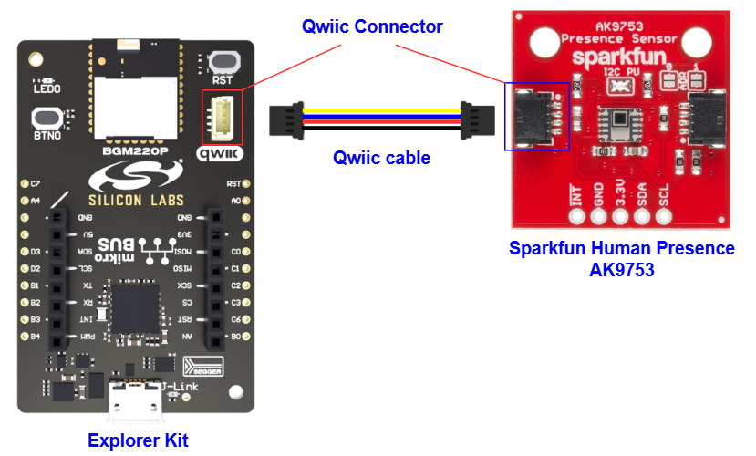
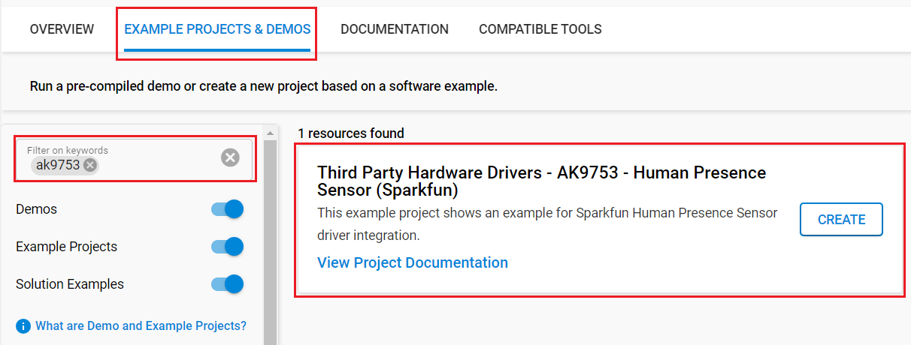

# AK9753 - Human Presence Sensor (Sparkfun) #

[](https://siliconlabs-massmarket.github.io/repository-catalog/#applications-list?filter=Access%20Control)
[](https://siliconlabs-massmarket.github.io/repository-catalog/#applications-list?filter=Commercial%20Lighting)
[](https://siliconlabs-massmarket.github.io/repository-catalog/#applications-list?filter=Connected%20Outdoor)
[](https://siliconlabs-massmarket.github.io/repository-catalog/#applications-list?filter=Factory%20Automation)
[](https://siliconlabs-massmarket.github.io/repository-catalog/#applications-list?filter=LED%20Lighting)
[](https://siliconlabs-massmarket.github.io/repository-catalog/#applications-list?filter=Process%20Automation)
[](https://siliconlabs-massmarket.github.io/repository-catalog/#applications-list?filter=Security%20Cameras)
[](https://siliconlabs-massmarket.github.io/repository-catalog/#applications-list?filter=Smart%20Buildings)
[](https://siliconlabs-massmarket.github.io/repository-catalog/#applications-list?filter=Smart%20Hospitals)
[](https://siliconlabs-massmarket.github.io/repository-catalog/#applications-list?filter=Smart%20HVAC)
[](https://siliconlabs-massmarket.github.io/repository-catalog/#applications-list?filter=Street%20Lighting)

## Summary ##

This example project shows an example for Sparkfun Human Presence Sensor Breakout (AK9753) driver integration.

The AK9753 is a low-power and compact infrared-ray (IR) sensor module. It is composed of four quantum IR sensors and an integrated circuit (IC) for characteristic compensation. The four IR sensors' offset and gain variations are calibrated at shipment. An integral analog-to-digital converter provides
16-bit data outputs. The AK9753 is suitable for several-foot human detectors by using the external lens.

The goal is to provide a hardware driver that supports the basic IR measurement readout, along with configuration for the various embedded functionality and interrupt generation.

## Table Of Contents ##

- [Required Hardware](#required-hardware)
- [Hardware Connection](#hardware-connection)
- [Setup](#setup)
  - [Create a project based on an example project](#create-a-project-based-on-an-example-project)
  - [Start with an empty example project](#start-with-an-empty-example-project)
- [How It Works](#how-it-works)
- [Report Bugs & Get Support](#report-bugs--get-support)

## Required Hardware ##

- 1x [Silicon Labs BLE Development Kit](https://www.silabs.com/development-tools/wireless/bluetooth) based on the EFR32 SoC, such as:
  - [BGM220-EK4314A](https://www.silabs.com/development-tools/wireless/bluetooth/bgm220-explorer-kit)
  - [BG22-EK4108A](https://www.silabs.com/development-tools/wireless/bluetooth/bg22-explorer-kit?tab=overview)
  - [xG24-EK2703A](https://www.silabs.com/development-tools/wireless/efr32xg24-explorer-kit?tab=overview)
  - [xG22-EK2710A](https://www.silabs.com/development-tools/wireless/efr32xg22e-explorer-kit?tab=overview)
  - [XG24-DK2601B](https://www.silabs.com/development-tools/wireless/efr32xg24-dev-kit)
  - [SparkFun Thing Plus Matter - MGM240P](https://www.sparkfun.com/sparkfun-thing-plus-matter-mgm240p.html)

  *or*

  1x [Silicon Labs Wi-Fi Development Kit](https://www.silabs.com/development-tools/wireless/wi-fi) based on SiWG917, such as:
  - [SIWX917-DK2605A](https://www.silabs.com/development-tools/wireless/wi-fi/siwx917-dk2605a-wifi-6-bluetooth-le-soc-dev-kit)
  - [SIWX917-RB4338A](https://www.silabs.com/development-tools/wireless/wi-fi/siwx917-rb4338a-wifi-6-bluetooth-le-soc-radio-board) + [Si-MB4002A](https://www.silabs.com/development-tools/wireless/wireless-pro-kit-mainboard?tab=overview)
  - [SiW917Y-EK2708A](https://www.silabs.com/development-tools/wireless/wi-fi/siw917y-ek2708a-explorer-kit?tab=overview)

- 1x [SparkFun Human Presence Sensor Breakout - AK9753 (Qwiic)](https://www.sparkfun.com/products/14349)

## Hardware Connection ##

For the Silicon Labs boards that feature a Qwiic connector, a [Qwiic Cable](https://www.sparkfun.com/flexible-qwiic-cable-100mm.html) is used to connect to the SparkFun Human Presence Sensor Breakout board, as illustrated in the figure below.



For the Silicon Labs boards that do not have a Qwiic connector, consider using the [Qwiic Breadboard Cable](https://www.sparkfun.com/products/14425).

The tables below provide an overview of the pin connections.

**Silicon Labs BLE Development Kit:**

| Description | BRD4108A | BRD4314A | BRD2601B | BRD2703A | BRD2704A | BRD2710A | ↔ | SparkFun Human Presence Sensor Breakout |
| --- | --- | --- | --- | --- | --- | --- | --- |  --- |
| I2C_SDA | PD3 | PD3 | PC5 | PC5 | PB4 | PD3 | ↔ | SDA |
| I2C_SCL | PD2 | PD2 | PC4 | PC4 | PB3 | PD2 | ↔ | SCL |

**Silicon Labs Wi-Fi Development Kit:**

| Description | BRD4338A + BRD4002A | BRD2605A | BRD2708A | ↔ | SparkFun Human Presence Sensor Breakout |
| --- | --- | --- | --- | --- | --- |
| I2C_SDA | ULP_GPIO_6 [EXP_16] | ULP_GPIO_6 | GPIO_6 | ↔ | SDA |
| I2C_SCL | ULP_GPIO_7 [EXP_15] | ULP_GPIO_7 | GPIO_7 | ↔ | SCL |

> [!NOTE]
> Normal Mode / Switch Mode selection is controlled by the CAD1 pin and CAD0 pin. When CAD1 pin and CAD0 pin are set as CAD1 pin= CAD0 pin= “H”, the digital output can be used through the I2C interface. When CAD1 pin and CAD0 pin are set as CAD1 pin= CAD0 pin= “H”, Switch Mode is selected. When Switch Mode is selected, SCL pin and SDA pin should be tied to “H”. (Do not access the AK9753 through the I2C interface in Switch Mode.)

| CAD1      | CAD0 | I2C output | Slave address |Mode        |
| --------- | ---- | ---------- | ------------- | ---------- |
| L         | L    | Enable     | 64H           | Normal Mode|
| L         | H    | Enable     | 65H           | Normal Mode|
| H         | L    | Enable     | 66H           | Normal Mode|
| H         | H    | Disable    | Prohibited    | Switch Mode|

> [!TIP]
> If multiple boards are connected to the I2C bus, the equivalent resistance goes down, increasing your pull-up strength. If multiple boards are connected on the same bus, make sure only one board has the pull-up resistors connected.


## Setup ##

You can either create a project based on an example project or start with an empty example project.

> [!IMPORTANT]
>
> - Make sure that the [Third Party Hardware Drivers](https://github.com/SiliconLabsSoftware/third_party_hw_drivers_extension) extension is installed as part of the SiSDK. If not, follow [this documentation](https://github.com/SiliconLabsSoftware/third_party_hw_drivers_extension/blob/master/README.md#how-to-add-to-simplicity-studio-ide).
> - **Third Party Hardware Drivers** extension must be enabled for the project to install the required components from this extension.

> [!TIP]
> To show all components in the **Third Party Hardware Drivers** extension, the **Evaluation** quality must be enabled in the Software Component view.

### Create a project based on an example project ###

1. From the Launcher Home, add your board to My Products, click on it, and click on the **EXAMPLE PROJECTS & DEMOS** tab. Find the example project filtering by "ak9753".

2. Click **Create** button on the **Third Party Hardware Drivers - MQ3 - Alcohol Click (Mikroe)** example. Example project creation dialog pops up -> click Create and Finish and Project should be generated.

   

3. Build and flash this example to the board.

### Start with an empty example project ###

1. Create an "Empty C Project" for your board using Simplicity Studio v5. Use the default project settings.

2. Copy the file `app/example/sparkfun_human_presence_ak9753/app.c` into the project root folder (overwriting the existing file).

3. Open the .slcp file. Select the **SOFTWARE COMPONENTS** tab and install the following components:

   - **If the BLE Development Kit is used:**
     - [Services] → [IO Stream] → [IO Stream: USART] → default instance name: vcom
     - [Application] → [Utility] → [Log]
     - [Platform] → [Driver] → [I2C] → [I2CSPM] → default instance name: qwiic
     - [Third Party Hardware Drivers] → [Sensors] → [AK9753 - Human Presence Sensor (Sparkfun) - I2C] → use default configuration

   - **If the Wi-Fi Development Kit is used:**
     - [WiSeConnect 3 SDK] → [Device] → [Si91x] → [MCU] → [Peripheral] → [I2C] → [i2c2]
     - [Third Party Hardware Drivers] → [Sensors] → [AK9753 - Human Presence Sensor (Sparkfun) - I2C] → use default configuration

4. Enable **Printf float**

   - Open Properties of the project.
   - Select C/C++ Build → Settings → Tool Settings → GNU ARM C Linker → General → Check **Printf float**.
     

5. Build and flash the project to your device.

## How It Works ##

### Normal Mode ###

 There are eight Modes in Normal Mode.(CAD0 pin= “L” or CAD1 pin= “L”)

1. Power down Mode

2. Stand-by Mode

3. Single shot Mode

4. Continuous Mode 0

5. Continuous Mode 1

6. Continuous Mode 2

7. Continuous Mode 3

8. EEPROM access Mode

   

### Switch Mode ###

 There are two Modes in Switch Mode. (CAD0 pin= CAD1 pin= “H”)

1. Power down Mode
2. Measurement Mode

   

Some functionality of AK9753 includes the following:

- Power Down: If present, set the PDN pin to logic low to power down the AK9753

  ```c
  sl_status_t sparkfun_ak9753_power_down(void);
  ```

- Power Up: If present, set the PDN pin to logic high to power up the AK9753

  ```c
  sl_status_t sparkfun_ak9753_power_up(void);
  ```

- Set Mode: Set the AK9753 mode of operation.

  ```c
  sl_status_t sparkfun_ak9753_set_mode(uint8_t mode);
  ```

- Threshold: Set the threshold level for differential output IR2-IR4. Performs the appropriate bit-shift for register settings. 16-bit (pre-shift) value is also stored in the local configuration.

  ```c
  sl_status_t sparkfun_ak9753_set_threshold_ir24(bool height, uint16_t thresholdValue);
  ```

- Threshold in EEPROM:  Set the threshold level for differential output IR2-IR4 stored in sensor EEPROM. Performs the appropriate bit-shift for register settings.

  ```c
  sl_status_t sparkfun_ak9753_set_eeprom_threshold_ir24(bool height, uint16_t thresholdValue);
  ```

- Hysteresis threshold: Set the hysteresis of threshold level for differential output IR2-IR4.  Masks only the lower 5 bits. Value is also stored in local configuration.

  ```c
  sl_status_t sparkfun_ak9753_set_hysteresis_ir24(uint8_t hysteresisValue);
  ```

- Hysteresis threshold in EEPROM: Set the hysteresis of a threshold level for differential output IR2-IR4 stored in sensor EEPROM.

  ```c
  sl_status_t sparkfun_ak9753_set_eeprom_hysteresis_ir24(uint8_t hysteresisValue);
  ```

### API Overview ###

`sparkfun_ak9753.c`: implements APIs for application.

- Initialization and configuration API: specific register read/write to get and set settings for AK9753.

- Read Sensor Data/Status: specific register read to get acceleration data and status.

- Low-level functions: initialize I2C communication, read/write a memory block via I2C, given memory address, and read/write a register via I2C, given register address.

### Testing ###

This simple test application demonstrates the main of the available features of the human presence AK9753 sensor, after initialization, the human presence AK9753 sensor measures the value and return on the serial communication interface.

Please follow the below steps to test the example:

- Open a terminal program on your PC, such as the Console that is integrated into Simplicity Studio or a third-party tool terminal like Tera Term to receive the logs from the virtual COM port.

   

## Report Bugs & Get Support ##

To report bugs in the Application Examples projects, please create a new "Issue" in the "Issues" section of [third_party_hw_drivers_extension](https://github.com/SiliconLabsSoftware/third_party_hw_drivers_extension) repo. Please reference the board, project, and source files associated with the bug, and reference line numbers. If you are proposing a fix, also include information on the proposed fix. Since these examples are provided as-is, there is no guarantee that these examples will be updated to fix these issues.

Questions and comments related to these examples should be made by creating a new "Issue" in the "Issues" section of [third_party_hw_drivers_extension](https://github.com/SiliconLabsSoftware/third_party_hw_drivers_extension) repo.
