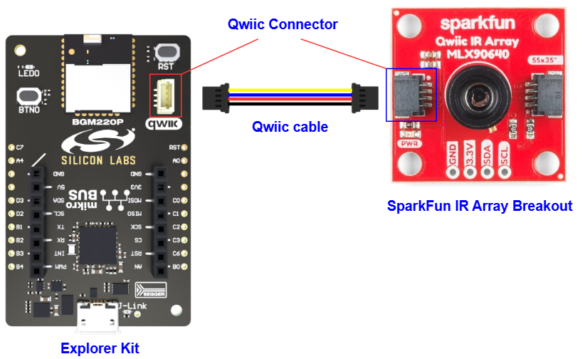
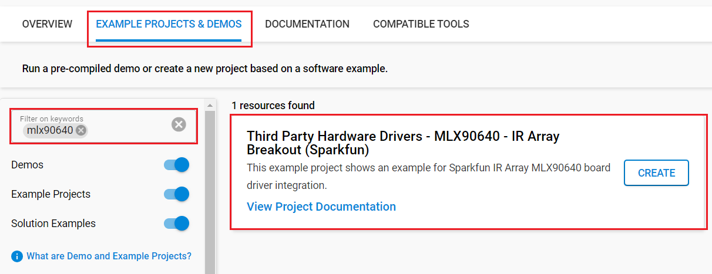

# MLX90640 - IR Array Breakout (Sparkfun) #

## Summary ##

This project aims to implement the hardware driver interacting with the [SparkFun IR Array Breakout - 55 Degree FOV, MLX90640 (Qwiic)](https://www.sparkfun.com/products/14844) via APIs of Silicon Labs Platform.

The MLX90640 is equipped with a 32x24 array of thermopile sensors creating, in essence, a low resolution thermal imaging camera. With this breakout, users can detect surface temperatures from many feet away with an accuracy of ±1.5°C (best case). To make it even easier to get the infrared image, all communication is enacted exclusively via I2C, utilizing our handy Qwiic system.

It can be used for high precision non-contact temperature
measurements, thermal leaks in homes, industrial temperature control of moving parts, movement detection, human presence, and other similar applications.

## Table Of Contents ##

- [Required Hardware](#required-hardware)
- [Hardware Connection](#hardware-connection)
- [Setup](#setup)
  - [Create a project based on an example project](#create-a-project-based-on-an-example-project)
  - [Start with an empty example project](#start-with-an-empty-example-project)
- [How It Works](#how-it-works)
- [Generating image with Python](#generating-image-with-python)
- [Report Bugs & Get Support](#report-bugs--get-support)

## Required Hardware ##

- 1x [Silicon Labs BLE Development Kit](https://www.silabs.com/development-tools/wireless/bluetooth) based on the EFR32 SoC, such as:
  - [BGM220-EK4314A](https://www.silabs.com/development-tools/wireless/bluetooth/bgm220-explorer-kit)
  - [BG22-EK4108A](https://www.silabs.com/development-tools/wireless/bluetooth/bg22-explorer-kit?tab=overview)
  - [xG24-EK2703A](https://www.silabs.com/development-tools/wireless/efr32xg24-explorer-kit?tab=overview)
  - [xG22-EK2710A](https://www.silabs.com/development-tools/wireless/efr32xg22e-explorer-kit?tab=overview)
  - [XG24-DK2601B](https://www.silabs.com/development-tools/wireless/efr32xg24-dev-kit)
  - [SparkFun Thing Plus Matter - MGM240P](https://www.sparkfun.com/sparkfun-thing-plus-matter-mgm240p.html)

  *or*

  1x [Silicon Labs Wi-Fi Development Kit](https://www.silabs.com/development-tools/wireless/wi-fi) based on SiWG917, such as:
  - [SIWX917-DK2605A](https://www.silabs.com/development-tools/wireless/wi-fi/siwx917-dk2605a-wifi-6-bluetooth-le-soc-dev-kit)
  - [SIWX917-RB4338A](https://www.silabs.com/development-tools/wireless/wi-fi/siwx917-rb4338a-wifi-6-bluetooth-le-soc-radio-board) + [Si-MB4002A](https://www.silabs.com/development-tools/wireless/wireless-pro-kit-mainboard?tab=overview)
  - [SiW917Y-EK2708A](https://www.silabs.com/development-tools/wireless/wi-fi/siw917y-ek2708a-explorer-kit?tab=overview)

- 1x [SparkFun IR Array Breakout - 55 Degree FOV, MLX90640 (Qwiic)](https://www.sparkfun.com/products/14844)

## Hardware Connection ##

For the Silicon Labs boards that feature a Qwiic connector, a [Qwiic Cable](https://www.sparkfun.com/flexible-qwiic-cable-100mm.html) is used to connect to the SparkFun IR Array Breakout board, as illustrated in the figure below.

For the Silicon Labs boards that do not have a Qwiic connector, consider using the [Qwiic Breadboard Cable](https://www.sparkfun.com/products/14425).

The tables below provide an overview of the pin connections.

**Silicon Labs BLE Development Kit:**

| Description | BRD4108A | BRD4314A | BRD2601B | BRD2703A | BRD2704A | BRD2710A | ↔ | SparkFun IR Array Breakout |
| --- | --- | --- | --- | --- | --- | --- | --- |  --- |
| I2C_SDA | PD3 | PD3 | PC5 | PC5 | PB4 | PD3 | ↔ | SDA |
| I2C_SCL | PD2 | PD2 | PC4 | PC4 | PB3 | PD2 | ↔ | SCL |

**Silicon Labs Wi-Fi Development Kit:**

| Description | BRD4338A + BRD4002A | BRD2605A | BRD2708A | ↔ | SparkFun IR Array Breakout |
| --- | --- | --- | --- | --- | --- |
| I2C_SDA | ULP_GPIO_6 [EXP_16] | ULP_GPIO_6 | GPIO_6 | ↔ | SDA |
| I2C_SCL | ULP_GPIO_7 [EXP_15] | ULP_GPIO_7 | GPIO_7 | ↔ | SCL |

## Setup ##

You can either create a project based on an example project or start with an empty example project.

> [!IMPORTANT]
>
> - Make sure that the [Third Party Hardware Drivers](https://github.com/SiliconLabsSoftware/third_party_hw_drivers_extension) extension is installed as part of the SiSDK. If not, follow [this documentation](https://github.com/SiliconLabsSoftware/third_party_hw_drivers_extension/blob/master/README.md#how-to-add-to-simplicity-studio-ide).
> - **Third Party Hardware Drivers** extension must be enabled for the project to install the required components from this extension.

> [!TIP]
> To show all components in the **Third Party Hardware Drivers** extension, the **Evaluation** quality must be enabled in the Software Component view.

### Create a project based on an example project ###

1. From the Launcher Home, add your device to My Products, click on it, and click on the **EXAMPLE PROJECTS & DEMOS** tab. Find the example project filtering by *mlx90640*.

2. Click **Create** button on the **Third Party Hardware Drivers - MLX90640 - IR Array Breakout (Sparkfun)** example. Example project creation dialog pops up -> click Create and Finish and Project should be generated.

   

3. Build and flash this example to the board.

### Start with an empty example project ###

1. Create an "Empty C Project" for the your board using Simplicity Studio v5. Use the default project settings.

2. Copy the file `app/example/sparkfun_ir_array_mlx90640/app.c` into the project root folder (overwriting the existing file).

3. Open the .slcp file. Select the **SOFTWARE COMPONENTS** tab and install the following components:

   - **If the BLE Development Kit is used:**
     - [Application] → [Utility] → [Assert]
     - [Services] → [Timers] → [Sleep Timer]
     - [Services] → [IO Stream] → [IO Stream: USART] → default instance name: vcom
     - [Application] → [Utility] → [Log]
     - [Platform] → [Driver] → [I2C] → [I2CSPM] → default instance name: qwiic
     - [Third Party Hardware Drivers] → [Sensors] → [MLX90640 - IR Array Breakout (Sparkfun)]

   - **If the Wi-Fi Development Kit is used:**
     - [Application] → [Utility] → [Assert]
     - [WiSeConnect 3 SDK] → [Device] → [Si91x] → [MCU] → [Service] → [Sleep Timer for Si91x]
     - [WiSeConnect 3 SDK] → [Device] → [Si91x] → [MCU] → [Peripheral] → [I2C] → [i2c2] → Select the corresponding pins according to the table provided in [Hardware Connection](#hardware-connection)
     - [Third Party Hardware Drivers] → [Sensors] → [MLX90640 - IR Array Breakout (Sparkfun)]

4. Enable **Printf float**

   - Open Properties of the project.
   - Select C/C++ Build → Settings → Tool Settings → GNU ARM C Linker → General → Check **Printf float**.
     

5. Build and flash the project to your device.

> [!NOTE]
> The driver stores the contents of the EEPROM, so the HEAP and STACK sizes need to be increased. Edit the config/sl_memory_config.h file and increase SL_STACK_SIZE to 10240 and SL_HEAP_SIZE to 6411

## How It Works ##

### API Overview ###

[sparkfun_mlx90640.c](https://github.com/SiliconLabsSoftware/third_party_hw_drivers_extension/tree/master/driver/public/silabs/ir_array_mlx90640/src/sparkfun_mlx90640.c) - This is the top-level API implementation. The user application should only use the APIs listed below.

- `sparkfun_mlx90640_init`: Initialize mlx90640 driver

- `sparkfun_mlx90640_get_image_array`: Provides an array of temperatures for all 768 pixel.

### Sensor operation principle ###

The MLX90640 sensor is factory calibrated with calibration constants stored in the EEPROM memory. The ambient and object temperature can be calculated based on these calibration constants and the measurement data.

The MLX90640 is factory calibrated in the ambient temperature range from -20 to 85˚C and from -20 to 200˚C for
the object temperature range. The measured value is the average temperature of all objects in the Field Of View
of the sensor (55 degrees).

The thermopile sensing element voltage signal is amplified and digitized. After digital filtering, the raw measurement result is stored in the RAM memory. Furthermore, the mlx90640 contains a sensor element to measure the temperature of the sensor itself. The raw information of this sensor is also stored in RAM after processing. The result of each measurement conversion is accessible via I2C. From the measurement data and the calibration data, the external unit can calculate both the sensor temperature and the object temperature.

### Testing ###

Initializing the driver and getting a temperature array from the sensor happens in the following way:

Application only needs to call **sparkfun_mlx90640_init** once at startup, then with **sparkfun_mlx90640_get_image_array()** function it's possible to request an array of temperatures for all 768 pixels.
For more features or possibilities please refer to the API function descriptions found in [sparkfun_mlx90640.h](https://github.com/SiliconLabsSoftware/third_party_hw_drivers_extension/tree/master/driver/public/silabs/ir_array_mlx90640/inc/sparkfun_mlx90640.h).

## Generating image with Python ##

There is a Python script `image/image_generator.py` that parses the array of temperatures provided by the driver and generates an image based on the data. By listening on the COM port, it's possible to generate a low-refresh-rate live video out of the images. For this the following python packages are needed:

- numpy
- seaborn
- matplotlib
- pyserial

Simply replace the "COM19" in the script with the actual COM port your device is connected to.
Then run the script, and the live image will be visible in a new window.

## Report Bugs & Get Support ##

To report bugs in the Application Examples projects, please create a new "Issue" in the "Issues" section of [third_party_hw_drivers_extension](https://github.com/SiliconLabsSoftware/third_party_hw_drivers_extension) repo. Please reference the board, project, and source files associated with the bug, and reference line numbers. If you are proposing a fix, also include information on the proposed fix. Since these examples are provided as-is, there is no guarantee that these examples will be updated to fix these issues.

Questions and comments related to these examples should be made by creating a new "Issue" in the "Issues" section of [third_party_hw_drivers_extension](https://github.com/SiliconLabsSoftware/third_party_hw_drivers_extension) repo.
