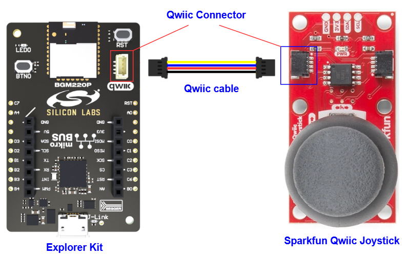
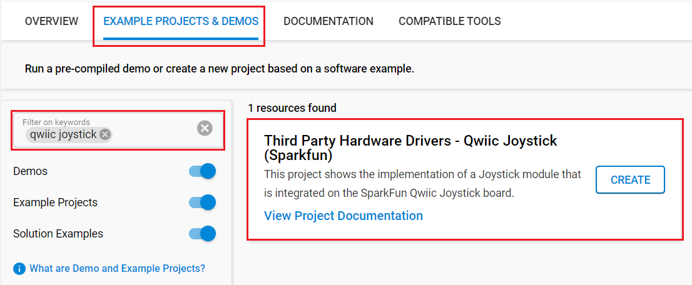

# Qwiic Joystick (Sparkfun) #

## Summary ##

This project shows the implementation of a Joystick module that is integrated into the SparkFun Qwiic Joystick board.

The SparkFun Qwiic Joystick board combines the convenience of the Qwiic connection system and an analog Joystick that is similar to the analog Joysticks on PS2 (PlayStation 2) controllers. Directional movements are simply measured with two 10 kΩ potentiometers, connected with a gimbal mechanism that separates the horizontal and vertical movements. This Joystick also has a select button that is actuated when the Joystick is pressed down. With the pre-installed firmware, the ATtiny85 acts as an intermediary (microcontroller) for the analog and digital inputs from the Joystick. This allows the Qwiic Joystick to report its position over I2C.

For more information about the SparkFun Qwiic Joystick, see the [specification page](https://learn.sparkfun.com/tutorials/qwiic-joystick-hookup-guide).

## Table Of Contents ##

- [Required Hardware](#required-hardware)
- [Hardware Connection](#hardware-connection)
- [Setup](#setup)
  - [Create a project based on an example project](#create-a-project-based-on-an-example-project)
  - [Start with an empty example project](#start-with-an-empty-example-project)
- [How It Works](#how-it-works)
- [Report Bugs & Get Support](#report-bugs--get-support)

## Required Hardware ##

- 1x [Silicon Labs BLE Development Kit](https://www.silabs.com/development-tools/wireless/bluetooth) based on the EFR32 SoC, such as:
  - [BGM220-EK4314A](https://www.silabs.com/development-tools/wireless/bluetooth/bgm220-explorer-kit)
  - [BG22-EK4108A](https://www.silabs.com/development-tools/wireless/bluetooth/bg22-explorer-kit?tab=overview)
  - [xG24-EK2703A](https://www.silabs.com/development-tools/wireless/efr32xg24-explorer-kit?tab=overview)
  - [xG22-EK2710A](https://www.silabs.com/development-tools/wireless/efr32xg22e-explorer-kit?tab=overview)
  - [XG24-DK2601B](https://www.silabs.com/development-tools/wireless/efr32xg24-dev-kit)
  - [SparkFun Thing Plus Matter - MGM240P](https://www.sparkfun.com/sparkfun-thing-plus-matter-mgm240p.html)

  *or*

  1x [Silicon Labs Wi-Fi Development Kit](https://www.silabs.com/development-tools/wireless/wi-fi) based on SiWG917, such as:
  - [SIWX917-DK2605A](https://www.silabs.com/development-tools/wireless/wi-fi/siwx917-dk2605a-wifi-6-bluetooth-le-soc-dev-kit)
  - [SIWX917-RB4338A](https://www.silabs.com/development-tools/wireless/wi-fi/siwx917-rb4338a-wifi-6-bluetooth-le-soc-radio-board) + [Si-MB4002A](https://www.silabs.com/development-tools/wireless/wireless-pro-kit-mainboard?tab=overview)
  - [SiW917Y-EK2708A](https://www.silabs.com/development-tools/wireless/wi-fi/siw917y-ek2708a-explorer-kit?tab=overview)

- 1x [SparkFun Qwiic Joystick Board](https://www.sparkfun.com/products/15168)

## Hardware Connection ##

For the Silicon Labs boards that feature a Qwiic connector, a [Qwiic Cable](https://www.sparkfun.com/flexible-qwiic-cable-100mm.html) is used to connect to the SparkFun Qwiic Joystick board, as illustrated in the figure below.

For the Silicon Labs boards that do not have a Qwiic connector, consider using the [Qwiic Breadboard Cable](https://www.sparkfun.com/products/14425).

The tables below provide an overview of the pin connections.

**Silicon Labs BLE Development Kit:**

| Description | BRD4108A | BRD4314A | BRD2601B | BRD2703A | BRD2704A | BRD2710A | ↔ | SparkFun Qwiic Joystick |
| --- | --- | --- | --- | --- | --- | --- | --- |  --- |
| I2C_SDA | PD3 | PD3 | PC5 | PC5 | PB4 | PD3 | ↔ | SDA |
| I2C_SCL | PD2 | PD2 | PC4 | PC4 | PB3 | PD2 | ↔ | SCL |

**Silicon Labs Wi-Fi Development Kit:**

| Description | BRD4338A + BRD4002A | BRD2605A | BRD2708A | ↔ | SparkFun Qwiic Joystick |
| --- | --- | --- | --- | --- | --- |
| I2C_SDA | ULP_GPIO_6 [EXP_16] | ULP_GPIO_6 | GPIO_6 | ↔ | SDA |
| I2C_SCL | ULP_GPIO_7 [EXP_15] | ULP_GPIO_7 | GPIO_7 | ↔ | SCL |

## Setup ##

You can either create a project based on an example project or start with an empty example project.

> [!IMPORTANT]
>
> - Make sure that the [Third Party Hardware Drivers](https://github.com/SiliconLabsSoftware/third_party_hw_drivers_extension) extension is installed as part of the SiSDK. If not, follow [this documentation](https://github.com/SiliconLabsSoftware/third_party_hw_drivers_extension/blob/master/README.md#how-to-add-to-simplicity-studio-ide).
> - **Third Party Hardware Drivers** extension must be enabled for the project to install the required components from this extension.

> [!TIP]
> To show all components in the **Third Party Hardware Drivers** extension, the **Evaluation** quality must be enabled in the Software Component view.

### Create a project based on an example project ###

1. From the Launcher Home, add your board to My Products, click on it, and click on the **EXAMPLE PROJECTS & DEMOS** tab. Find the example project filtering by "joystick".

2. Click Create button on the project **Third Party Hardware Drivers - Qwiic Joystick (SparkFun)** example. Example project creation dialog pops up -> click Create and Finish and Project should be generated.

    

3. Build and flash this example to the board.

### Start with an empty example project ###

1. Create an "Empty C Project" for your board using Simplicity Studio v5. Use the default project settings.

2. Copy the file `app/example/sparkfun_qwiic_joystick/app.c` into the project root folder (overwriting the existing file).

3. Open the .slcp file. Select the **SOFTWARE COMPONENTS** tab and install the following components:

   - **If the BLE Development Kit is used:**
     - [Services] → [IO Stream] → [IO Stream: USART] → default instance name: vcom
     - [Application] → [Utility] → [Log]
     - [Platform] → [Driver] → [I2C] → [I2CSPM] → default instance name: qwiic
     - [Third Party Hardware Drivers] → [Human Machine Interface] → [Qwiic Joystick (Sparkfun)]

   - **If the Wi-Fi Development Kit is used:**
     - [WiSeConnect 3 SDK] → [Device] → [Si91x] → [MCU] → [Peripheral] → [I2C] → [i2c2] → Select the corresponding pins according to the table provided in [Hardware Connection](#hardware-connection)
     - [Third Party Hardware Drivers] → [Human Machine Interface] → [Qwiic Joystick (Sparkfun)]

4. Build and flash the project to your device.

## How It Works ##

### API Overview ###

- *sparkfun_joystick_init()*: Initialize the Joystick module. This function should be called before the main loop.

- *sparkfun_joystick_get_firmware_version(): Read the Firmware Version from the Joystick. Helpful for tech support.

- *sparkfun_joystick_set_address()*: Set new I2C address for Joystick.

- *sparkfun_joystick_get_address()*: Get current I2C address used of Joystick.

- *sparkfun_joystick_scan_address()*: Scan I2C address of all Joystick that connected on the I2C bus.

- *sparkfun_joystick_select_device()*: Select device on the I2C bus based on its I2C address.

- *sparkfun_joystick_read_horizontal_position(): Read the Current Horizontal Position from the Joystick.

- *sparkfun_joystick_read_vertical_position(): Read the Current Vertical Position from the Joystick.

- *sparkfun_joystick_read_button_position(): Read the Current Button Position from the Joystick.

- *sparkfun_joystick_check_button(): Reads the Status of the Button.

- *sparkfun_joystick_present()*: Check whether a Joystick is present on the I2C bus or not.

- *sparkfun_joystick_send_command()*: Send a command and read the result over the I2C bus.

### Testing ###

This example demonstrates some of the available features of the Joystick module. Follow the below steps to test the example:

1. On your PC open a terminal program, such as the Console that is integrated with Simplicity Studio or a third-party tool terminal like Tera Term to receive the logs from the virtual COM port.

2. Try to move the Joystick in some direction and check the logs on the terminal.

   

## Report Bugs & Get Support ##

To report bugs in the Application Examples projects, please create a new "Issue" in the "Issues" section of [third_party_hw_drivers_extension](https://github.com/SiliconLabsSoftware/third_party_hw_drivers_extension) repo. Please reference the board, project, and source files associated with the bug, and reference line numbers. If you are proposing a fix, also include information on the proposed fix. Since these examples are provided as-is, there is no guarantee that these examples will be updated to fix these issues.

Questions and comments related to these examples should be made by creating a new "Issue" in the "Issues" section of [third_party_hw_drivers_extension](https://github.com/SiliconLabsSoftware/third_party_hw_drivers_extension) repo.
