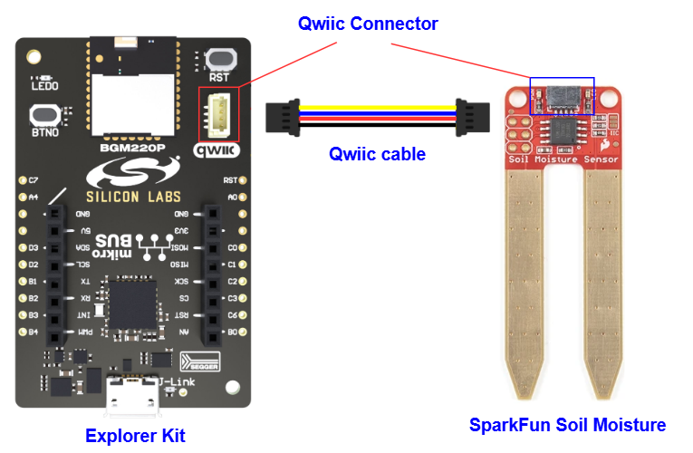

# Qwiic Soil Moisture Sensor (Sparkfun) #

[](https://siliconlabs-massmarket.github.io/repository-catalog/#applications-list?filter=Connected%20Outdoor)
[](https://siliconlabs-massmarket.github.io/repository-catalog/#applications-list?filter=Process%20Automation)
[](https://siliconlabs-massmarket.github.io/repository-catalog/#applications-list?filter=Sensors)
[](https://siliconlabs-massmarket.github.io/repository-catalog/#applications-list?filter=Smart%20Agriculture)

## Summary ##

This project aims to implement a hardware driver interacting with the [Sparkfun soil moisture sensor](https://www.sparkfun.com/products/17731) using Silicon Labs platform.

Sparkfun soil moisture is a simple breakout for measuring the moisture in soil and similar materials. The soil moisture sensor is pretty straightforward to use. The two large, exposed pads function as probes for the sensor, together acting as a variable resistor. The more water that is in the soil means the better the conductivity between the pads will be, resulting in a lower resistance and a higher SIG out. This version of the Soil Moisture Sensor includes a Qwiic connector, making it even easier to use this sensor.

This soil moisture sensor be used in agricultural infrastructure, but also beneficial for household applications, like gardening tools or weather stations.

## Table Of Contents ##

- [Required Hardware](#required-hardware)
- [Hardware Connection](#hardware-connection)
- [Setup](#setup)
  - [Create a project based on an example project](#create-a-project-based-on-an-example-project)
  - [Start with an empty example project](#start-with-an-empty-example-project)
- [How It Works](#how-it-works)
  - [API Overview](#api-overview)
  - [Testing](#testing)
- [Report Bugs & Get Support](#report-bugs--get-support)

## Required Hardware ##

- 1x [Silicon Labs BLE Development Kit](https://www.silabs.com/development-tools/wireless/bluetooth) based on the EFR32 SoC, such as:
  - [BGM220-EK4314A](https://www.silabs.com/development-tools/wireless/bluetooth/bgm220-explorer-kit)
  - [BG22-EK4108A](https://www.silabs.com/development-tools/wireless/bluetooth/bg22-explorer-kit?tab=overview)
  - [xG24-EK2703A](https://www.silabs.com/development-tools/wireless/efr32xg24-explorer-kit?tab=overview)
  - [xG22-EK2710A](https://www.silabs.com/development-tools/wireless/efr32xg22e-explorer-kit?tab=overview)
  - [XG24-DK2601B](https://www.silabs.com/development-tools/wireless/efr32xg24-dev-kit)
  - [SparkFun Thing Plus Matter - MGM240P](https://www.sparkfun.com/sparkfun-thing-plus-matter-mgm240p.html)

  *or*

  1x [Silicon Labs Wi-Fi Development Kit](https://www.silabs.com/development-tools/wireless/wi-fi) based on SiWG917, such as:
  - [SIWX917-DK2605A](https://www.silabs.com/development-tools/wireless/wi-fi/siwx917-dk2605a-wifi-6-bluetooth-le-soc-dev-kit)
  - [SIWX917-RB4338A](https://www.silabs.com/development-tools/wireless/wi-fi/siwx917-rb4338a-wifi-6-bluetooth-le-soc-radio-board) + [Si-MB4002A](https://www.silabs.com/development-tools/wireless/wireless-pro-kit-mainboard?tab=overview)
  - [SiW917Y-EK2708A](https://www.silabs.com/development-tools/wireless/wi-fi/siw917y-ek2708a-explorer-kit?tab=overview)

- 1x [SparkFun Qwiic Soil Moisture Sensor](https://www.sparkfun.com/products/17731)

## Hardware Connection ##

For the Silicon Labs boards that feature a Qwiic connector, a [Qwiic Cable](https://www.sparkfun.com/flexible-qwiic-cable-100mm.html) is used to connect to the SparkFun Qwiic Soil Moisture board, as illustrated in the figure below.



For the Silicon Labs boards that do not have a Qwiic connector, consider using the [Qwiic Breadboard Cable](https://www.sparkfun.com/products/14425).

The tables below provide an overview of the pin connections.

**Silicon Labs BLE Development Kit:**

| Description | BRD4108A | BRD4314A | BRD2601B | BRD2703A | BRD2704A | BRD2710A | ↔ | SparkFun Qwiic Soil Moisture |
| --- | --- | --- | --- | --- | --- | --- | --- |  --- |
| I2C_SDA | PD3 | PD3 | PC5 | PC5 | PB4 | PD3 | ↔ | SDA |
| I2C_SCL | PD2 | PD2 | PC4 | PC4 | PB3 | PD2 | ↔ | SCL |

**Silicon Labs Wi-Fi Development Kit:**

| Description | BRD4338A + BRD4002A | BRD2605A | BRD2708A | ↔ | SparkFun Qwiic Soil Moisture |
| --- | --- | --- | --- | --- | --- |
| I2C_SDA | ULP_GPIO_6 [EXP_16] | ULP_GPIO_6 | GPIO_6 | ↔ | SDA |
| I2C_SCL | ULP_GPIO_7 [EXP_15] | ULP_GPIO_7 | GPIO_7 | ↔ | SCL |

## Setup ##

You can either create a project based on an example project or start with an empty example project.

> [!IMPORTANT]
>
> - Make sure that the [Third Party Hardware Drivers](https://github.com/SiliconLabsSoftware/third_party_hw_drivers_extension) extension is installed as part of the SiSDK. If not, follow [this documentation](https://github.com/SiliconLabsSoftware/third_party_hw_drivers_extension/blob/master/README.md#how-to-add-to-simplicity-studio-ide).
> - **Third Party Hardware Drivers** extension must be enabled for the project to install the required components from this extension.

> [!TIP]
> To show all components in the **Third Party Hardware Drivers** extension, the **Evaluation** quality must be enabled in the Software Component view.

### Create a project based on an example project ###

1. From the Launcher Home, add your board to My Products, click on it, and click on the **EXAMPLE PROJECTS & DEMOS** tab. Find the example project filtering by "soil".

2. Click **Create** button on the **Third Party Hardware Drivers - Qwiic Soil Moisture Sensor (Sparkfun) - I2C** example. Example project creation dialog pops up -> click Create and Finish and Project should be generated.

   

3. Build and flash this example to the board.

### Start with an empty example project ###

1. Create an "Empty C Project" for your board using Simplicity Studio v5. Use the default project settings.

2. Copy the file `app/example/sparkfun_soil_moisture/app.c` into the project root folder (overwriting the existing file).

3. Open the .slcp file. Select the **SOFTWARE COMPONENTS** tab and install the following components:

   - **If the BLE Development Kit is used:**
     - [Services] → [Timers] → [Sleep Timer]
     - [Services] → [IO Stream] → [IO Stream: USART] → default instance name: vcom
     - [Application] → [Utility] → [Log]
     - [Platform] → [Driver] → [I2C] → [I2CSPM] → default instance name: qwiic
     - [Third Party Hardware Drivers] → [Sensors] → [Qwiic Soil Moisture Sensor (Sparkfun) - I2C]

   - **If the Wi-Fi Development Kit is used:**
     - [WiSeConnect 3 SDK] → [Device] → [Si91x] → [MCU] → [Services] → [Sleep Timer for Si91x]
     - [WiSeConnect 3 SDK] → [Device] → [Si91x] → [MCU] → [Peripheral] → [I2C] → [i2c2] → Select the corresponding pins according to the table provided in [Hardware Connection](#hardware-connection)
     - [Third Party Hardware Drivers] → [Sensors] → [Qwiic Soil Moisture Sensor (Sparkfun) - I2C]

4. Build and flash the project to your device.

## Sensor Calibration ##

Sparkfun Soil Moisture sensor outputs the soil moisture value via 10-bit resolution ADC value so it needs to be calibrated before the sensor can output meaning values. The calibration procedure is quite simple.

- Place the sensor in the driest and wettest condition, read the moisture raw values using:

   ```c
   sl_status_t sparkfun_soil_moisture_get_moisture_raw(uint16_t *value)
   ```

- Store these value by using two functions below:

   ```c
   sl_status_t sparkfun_soil_moisture_set_dry_value(uint16_t dry_value)
   ```

   ```c
   sl_status_t sparkfun_soil_moisture_set_wet_value(uint16_t wet_value)
   ```

- The driest and wettest values will correspond to 0% and 100% moisture value.

## How It Works ##

### API Overview ###

The driver includes 2 files: [sparkfun_soil_moisture.c](https://github.com/SiliconLabsSoftware/third_party_hw_drivers_extension/tree/master/driver/public/silabs/soil_moisture/src/sparkfun_soil_moisture.c) and [sparkfun_soil_moisture.h](https://github.com/SiliconLabsSoftware/third_party_hw_drivers_extension/tree/master/driver/public/silabs/soil_moisture/inc/sparkfun_soil_moisture.h):

[sparkfun_soil_moisture.c](https://github.com/SiliconLabsSoftware/third_party_hw_drivers_extension/tree/master/driver/public/silabs/soil_moisture/src/sparkfun_soil_moisture.c) : The source file of the driver, it contains the implementation of all the public functions that will be used by users and the local functions that handle the I2C communication between the sensor and the microcontroller.

[sparkfun_soil_moisture.h](https://github.com/SiliconLabsSoftware/third_party_hw_drivers_extension/tree/master/driver/public/silabs/soil_moisture/inc/sparkfun_soil_moisture.h) : Containing public function prototypes of the driver.

### Testing ###

The below chart represents the workflow of a simple testing program. The left chart shows the initialization steps that are needed before reading data and the right chart shows the periodic measuring process.


Use Console Launcher on Simplicity Studio to monitor the serial output. The BGM220P uses by default a baudrate of 115200. You should expect a similar output to the one below.


## Report Bugs & Get Support ##

To report bugs in the Application Examples projects, please create a new "Issue" in the "Issues" section of [third_party_hw_drivers_extension](https://github.com/SiliconLabsSoftware/third_party_hw_drivers_extension) repo. Please reference the board, project, and source files associated with the bug, and reference line numbers. If you are proposing a fix, also include information on the proposed fix. Since these examples are provided as-is, there is no guarantee that these examples will be updated to fix these issues.

Questions and comments related to these examples should be made by creating a new "Issue" in the "Issues" section of [third_party_hw_drivers_extension](https://github.com/SiliconLabsSoftware/third_party_hw_drivers_extension) repo.
