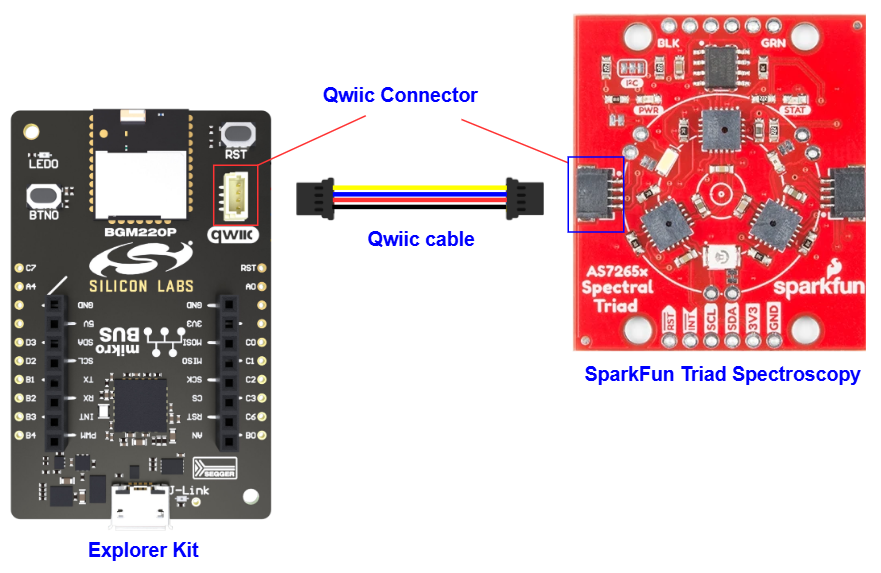
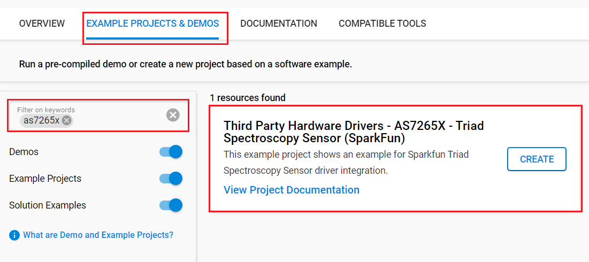

# AS7265x - Sparkfun Triad Spectroscopy Sensor #

## Summary ##

This project shows the implementation of the Triad Spectroscopy Sensor using a **Triad Spectroscopy Sensor-AS7265x** with Silicon Labs platform based on I2C communication.

The SparkFun Triad Spectroscopy Sensor is a powerful optical inspection sensor also known as a spectrophotometer. Three AS7265x spectral sensors are combined alongside visible, UV, and IR LEDs to illuminate and test various surfaces for light spectroscopy. The Triad is made up of three sensors; the AS72651, the AS72652, and the AS72653 and can detect light from 410nm (UV) to 940nm (IR).

For more information about the Triad Spectroscopy Sensor-AS7265x, see the [specification page](https://cdn.sparkfun.com/assets/c/2/9/0/a/AS7265x_Datasheet.pdf).

## Table Of Contents ##

- [Required Hardware](#required-hardware)
- [Hardware Connection](#hardware-connection)
- [Setup](#setup)
  - [Create a project based on an example project](#create-a-project-based-on-an-example-project)
  - [Start with an empty example project](#start-with-an-empty-example-project)
- [How It Works](#how-it-works)
  - [API Overview](#api-overview)
  - [Testing](#testing)
- [Report Bugs & Get Support](#report-bugs--get-support)

## Required Hardware ##

- 1x [Silicon Labs BLE Development Kit](https://www.silabs.com/development-tools/wireless/bluetooth) based on the EFR32 SoC, such as:
  - [BGM220-EK4314A](https://www.silabs.com/development-tools/wireless/bluetooth/bgm220-explorer-kit)
  - [BG22-EK4108A](https://www.silabs.com/development-tools/wireless/bluetooth/bg22-explorer-kit?tab=overview)
  - [xG24-EK2703A](https://www.silabs.com/development-tools/wireless/efr32xg24-explorer-kit?tab=overview)
  - [xG22-EK2710A](https://www.silabs.com/development-tools/wireless/efr32xg22e-explorer-kit?tab=overview)
  - [XG24-DK2601B](https://www.silabs.com/development-tools/wireless/efr32xg24-dev-kit)
  - [SparkFun Thing Plus Matter - MGM240P](https://www.sparkfun.com/sparkfun-thing-plus-matter-mgm240p.html)

  *or*

  1x [Silicon Labs Wi-Fi Development Kit](https://www.silabs.com/development-tools/wireless/wi-fi) based on SiWG917, such as:
  - [SIWX917-DK2605A](https://www.silabs.com/development-tools/wireless/wi-fi/siwx917-dk2605a-wifi-6-bluetooth-le-soc-dev-kit)
  - [SIWX917-RB4338A](https://www.silabs.com/development-tools/wireless/wi-fi/siwx917-rb4338a-wifi-6-bluetooth-le-soc-radio-board) + [Si-MB4002A](https://www.silabs.com/development-tools/wireless/wireless-pro-kit-mainboard?tab=overview)
  - [SiW917Y-EK2708A](https://www.silabs.com/development-tools/wireless/wi-fi/siw917y-ek2708a-explorer-kit?tab=overview)

- 1x [Triad Spectroscopy Sensor - AS7265x Board](https://www.sparkfun.com/products/15050)

## Hardware Connection ##

For the Silicon Labs boards that feature a Qwiic connector, a [Qwiic Cable](https://www.sparkfun.com/flexible-qwiic-cable-100mm.html) is used to connect to the SparkFun Triad Spectroscopy board, as illustrated in the figure below.

For the Silicon Labs boards that do not have a Qwiic connector, consider using the [Qwiic Breadboard Cable](https://www.sparkfun.com/products/14425).

The tables below provide an overview of the pin connections.

**Silicon Labs BLE Development Kit:**

| Description | BRD4108A | BRD4314A | BRD2601B | BRD2703A | BRD2704A | BRD2710A | ↔ | SparkFun Triad Spectroscopy |
| --- | --- | --- | --- | --- | --- | --- | --- |  --- |
| I2C_SDA | PD3 | PD3 | PC5 | PC5 | PB4 | PD3 | ↔ | SDA |
| I2C_SCL | PD2 | PD2 | PC4 | PC4 | PB3 | PD2 | ↔ | SCL |

**Silicon Labs Wi-Fi Development Kit:**

| Description | BRD4338A + BRD4002A | BRD2605A | BRD2708A | ↔ | SparkFun Triad Spectroscopy |
| --- | --- | --- | --- | --- | --- |
| I2C_SDA | ULP_GPIO_6 [EXP_16] | ULP_GPIO_6 | GPIO_6 | ↔ | SDA |
| I2C_SCL | ULP_GPIO_7 [EXP_15] | ULP_GPIO_7 | GPIO_7 | ↔ | SCL |

## Setup ##

You can either create a project based on an example project or start with an empty example project.

> [!IMPORTANT]
>
> - Make sure that the [Third Party Hardware Drivers](https://github.com/SiliconLabsSoftware/third_party_hw_drivers_extension) extension is installed as part of the SiSDK. If not, follow [this documentation](https://github.com/SiliconLabsSoftware/third_party_hw_drivers_extension/blob/master/README.md#how-to-add-to-simplicity-studio-ide).
> - **Third Party Hardware Drivers** extension must be enabled for the project to install the required components from this extension.

> [!TIP]
> To show all components in the **Third Party Hardware Drivers** extension, the **Evaluation** quality must be enabled in the Software Component view.

### Create a project based on an example project ###

1. From the Launcher Home, add your board to My Products, click on it, and click on the **EXAMPLE PROJECTS & DEMOS** tab. Find the example project filtering by "as7265x".

2. Click **Create** button on the **Third Party Hardware Drivers - AS7265X - Triad Spectroscopy Sensor (SparkFun)** example. Example project creation dialog pops up -> click Create and Finish and Project should be generated.

   

3. Build and flash this example to the board.

### Start with an empty example project ###

1. Create an "Empty C Project" for your board using Simplicity Studio v5. Use the default project settings.

2. Copy the file `app/example/sparkfun_spectroscopy_as7265x/app.c` into the project root folder (overwriting the existing file).

3. Open the .slcp file. Select the **SOFTWARE COMPONENTS** tab and install the following components:

   - **If the BLE Development Kit is used:**
     - [Services] → [IO Stream] → [IO Stream: USART] → default instance name: vcom
     - [Application] → [Utility] → [Log]
     - [Application] → [Utility] → [Assert]
     - [Platform] → [Driver] → [I2C] → [I2CSPM] → default instance name: qwiic
     - [Third Party Hardware Drivers] → [Sensors] → [AS7265x - Triad Spectroscopy Sensor (Sparkfun) - I2C]

   - **If the Wi-Fi Development Kit is used:**
     - [Application] → [Utility] → [Assert]
     - [WiSeConnect 3 SDK] → [Device] → [Si91x] → [MCU] → [Peripheral] → [I2C] → [i2c2] → Select the corresponding pins according to the table provided in [Hardware Connection](#hardware-connection)
     - [Third Party Hardware Drivers] → [Sensors] → [AS7265x - Triad Spectroscopy Sensor (Sparkfun) - I2C]

4. Enable **Printf float**

   - Open Properties of the project.
   - Select C/C++ Build → Settings → Tool Settings → GNU ARM C Linker → General → Check **Printf float**.

5. Build and flash the project to your device.

## How It Works ##

### API Overview ###

`sparkfun_as7265x.c`: implements APIs for application.

- Initialization and configuration API: specific register read/write to get and set settings for AS7265X.

- Read Sensor Data/Status: specific register read to get acceleration data and status.

- Low-level functions: initialize I2C communication, read/write a memory block via I2C, given memory address, and read/write a register via I2C, given register address.

### Testing ###

This simple test application demonstrates some of the available features of the A Triad Spectroscopy Sensor - AS7265x, after initialization, the Triad Spectroscopy Sensor - AS7265x measures the value and return on the serial communication interface.

You can choose which type of test you want by uncommenting the #define, follow the below steps to test the example:

1. Open a terminal program on your PC, such as the Console that is integrated into Simplicity Studio or a third-party tool terminal like Tera Term to receive the logs from the virtual COM port.

2. Depending on the test mode defined in the `app.c` file, the code application can operate in different modes.

- If you use **TEST_BASIC_READING** for testing, this example takes all 18 readings, 372nm to 966nm, over I2C and outputs them to the serial port.

   

- If you use **TEST_BASIC_READING_WITH_LED** for testing, this example takes all 18 readings and blinks the illumination LEDs as it goes, resets the device, and observes the log messages.

   

- If you use **TEST_READ_RAW_VALUE** for testing, this example shows how to output the raw sensor values.

   

- If you use **TEST_MAX_READ_RATE** for testing, this example shows how to set up the sensor for max, calibrated read rate.

   

## Report Bugs & Get Support ##

To report bugs in the Application Examples projects, please create a new "Issue" in the "Issues" section of [third_party_hw_drivers_extension](https://github.com/SiliconLabsSoftware/third_party_hw_drivers_extension) repo. Please reference the board, project, and source files associated with the bug, and reference line numbers. If you are proposing a fix, also include information on the proposed fix. Since these examples are provided as-is, there is no guarantee that these examples will be updated to fix these issues.

Questions and comments related to these examples should be made by creating a new "Issue" in the "Issues" section of [third_party_hw_drivers_extension](https://github.com/SiliconLabsSoftware/third_party_hw_drivers_extension) repo.
