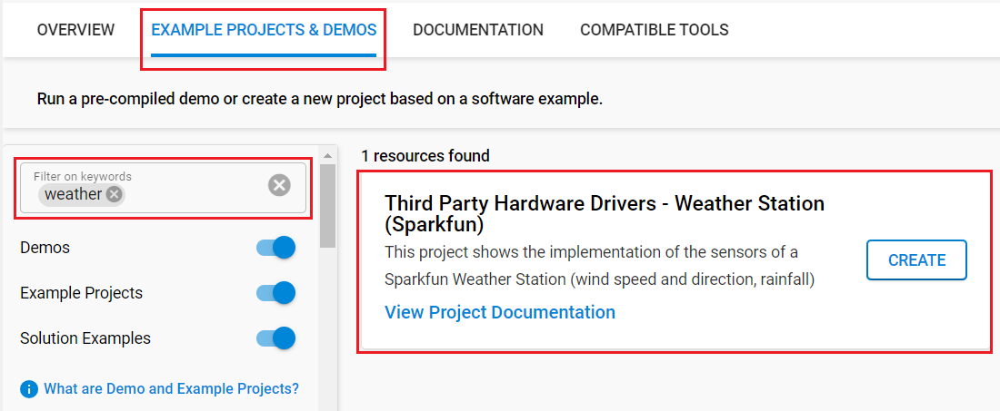

# Weather Station (Sparkfun) #

## Summary ##

This project showcases how to utilize the Sparkfun Weather Meter Kit and implement its sensors along with the Silabs Explorer Kit. Whether you are an agriculturalist, a professional meteorologist or a weather hobbyist, building your own weather station can be a really rewarding project.

The Weather Meter Kit from Sparkfun represents the three core components of weather measurement, which allow you to measure the wind speed, wind direction, and rainfall easily, over RJ-11 connections.

SparkFun Photon Weather Shield board is used to transmit data from the weather station to the Silabs Explorer Kit via the GPIO interface. Although the latter board is an add-on board, which could provide you with access to the barometric pressure, relative humidity and temperature data as well, this application example focuses only on the sensor data coming from Weather Meter Kit - the sensor data of the Photon Weather Shield board is not utilized.

For more information about the SparkFun Weather Meter Kit, see the [specification page](https://learn.sparkfun.com/tutorials/weather-meter-hookup-guide).

## Table Of Contents ##

- [Required Hardware](#required-hardware)
- [Hardware Connection](#hardware-connection)
- [Setup](#setup)
  - [Create a project based on an example project](#create-a-project-based-on-an-example-project)
  - [Start with an empty example project](#start-with-an-empty-example-project)
- [How It Works](#how-it-works)
  - [API Overview](#api-overview)
  - [Testing](#testing)
- [Report Bugs & Get Support](#report-bugs--get-support)

## Required Hardware ##

- 1x [XG24-EK2703A](https://www.silabs.com/development-tools/wireless/efr32xg24-explorer-kit) EFR32xG24 Explorer Kit

  *or*

  1x [Silicon Labs Wi-Fi Development Kit](https://www.silabs.com/development-tools/wireless/wi-fi) based on SiWG917, such as:
  - [SIWX917-DK2605A](https://www.silabs.com/development-tools/wireless/wi-fi/siwx917-dk2605a-wifi-6-bluetooth-le-soc-dev-kit)
  - [SIWX917-RB4338A](https://www.silabs.com/development-tools/wireless/wi-fi/siwx917-rb4338a-wifi-6-bluetooth-le-soc-radio-board) + [Si-MB4002A](https://www.silabs.com/development-tools/wireless/wireless-pro-kit-mainboard?tab=overview)
  - [SiW917Y-EK2708A](https://www.silabs.com/development-tools/wireless/wi-fi/siw917y-ek2708a-explorer-kit?tab=overview)

- 1x [SparkFun Weather Meter Kit](https://www.sparkfun.com/products/15901)
- 1x Sparkfun Photon Weather Shield

## Hardware Connection ##

Use RJ11 cables to connect the wind vane and rain gauge to the Photon Weather Shield board. Jumper wires can be used to connect the Silicon Labs Development Kit board to the Photon Weather Shield board, as shown below.

The table below provide an overview of the pin connections.

| Description | BRD2703A | BRD4338A + BRD4002A | BRD2605A | BRD2708A | ↔ | Sparkfun Photon Weather Shield |
| --- | --- | --- | --- | --- | --- | --- |
| win direction | PB0 | ULP_GPIO_1 [P16]  | ULP_GPIO_1 [P4] | GPIO_29 [AN]    | ↔ | A0 |
| win speed     | PB1 | GPIO_46 [P24]     | GPIO_11 [P22]   | GPIO_12 [PWM]   | ↔ | D3 |
| rain fall     | PA0 | GPIO_47 [P26]     | GPIO_10 [P23]   | ULP_GPIO_6 [RX] | ↔ | D2 |

> [!NOTE]
> The sensor output (D3, D2) must be connected with a external capacitor and a resistor as below:

## Setup ##

You can either create a project based on an example project or start with an empty example project.

> [!IMPORTANT]
>
> - Make sure that the [Third Party Hardware Drivers](https://github.com/SiliconLabsSoftware/third_party_hw_drivers_extension) extension is installed as part of the SiSDK. If not, follow [this documentation](https://github.com/SiliconLabsSoftware/third_party_hw_drivers_extension/blob/master/README.md#how-to-add-to-simplicity-studio-ide).
> - **Third Party Hardware Drivers** extension must be enabled for the project to install the required components from this extension.

> [!TIP]
> To show all components in the **Third Party Hardware Drivers** extension, the **Evaluation** quality must be enabled in the Software Component view.

### Create a project based on an example project ###

1. From the Launcher Home, add your board to My Products, click on it, and click on the **EXAMPLE PROJECTS & DEMOS** tab. Find the example project with filter "weather".

2. Click **Create** button on the **Third Party Hardware Drivers - Weather Station (SparkFun)** example. Example project creation dialog pops up -> click Create and Finish and Project should be generated.

3. Build and flash this example to the board.

### Start with an empty example project ###

1. Create an "Empty C Project" for your board using Simplicity Studio v5. Use the default project settings.

2. Copy the file `app/example/sparkfun_weatherstation/app.c` into the project root folder (overwriting the existing file).

3. Open the .slcp file. Select the **SOFTWARE COMPONENTS** tab and install the following components:

   - **If the BLE Development Kit is used:**
     - [Services] → [Timers] → [Sleep Timer]
     - [Services] → [IO Stream] → [IO Stream: EUSART] → default instance name: vcom
     - [Third Party] → [Tiny printf]
     - [Third Party Hardware Drivers] → [Sensors] → [Weather Meter Kit - Rainfall (Sparkfun)]
     - [Third Party Hardware Drivers] → [Sensors] → [Weather Meter Kit - Wind Direction (Sparkfun)]
     - [Third Party Hardware Drivers] → [Sensors] → [Weather Meter Kit - Wind Speed (Sparkfun)]

   - **If the Wi-Fi Development Kit is used:**
     - [WiSeConnect 3 SDK] → [Device] → [Si91x] → [MCU] → [Service] → [Sleep Timer for Si91x]
     - [Third Party Hardware Drivers] → [Sensors] → [Weather Meter Kit - Rainfall (Sparkfun)]
     - [Third Party Hardware Drivers] → [Sensors] → [Weather Meter Kit - Wind Direction (Sparkfun)]
     - [Third Party Hardware Drivers] → [Sensors] → [Weather Meter Kit - Wind Speed (Sparkfun)]

4. Build and flash the project to your device.

## How It Works ##

### API Overview ###

Rainfall (rain gauge)

- *sparkfun_weatherstation_rainfall_init()*: Initializes the rainfall detection

- *sparkfun_weatherstation_rainfall_reset_rainfall_count()*: Resets the rainfall event counter

- *sparkfun_weatherstation_rainfall_get_rainfall_count()*: Gets the current value of the rainfall event counter

- *sparkfun_weatherstation_rainfall_get_rainfall_amount()*: Gets the rainfall amount in mm

Wind Direction (wind vane)

- *sparkfun_weatherstation_winddirection_init()*: Initializes the wind direction detection

- *sparkfun_weatherstation_winddirection_read_direction()*: Reads the wind direction from the sensor

Wind Speed (anemometer)

- *sparkfun_weatherstation_windspeed_init()*: Initializes the wind speed detection

- *sparkfun_weatherstation_windspeed_get()*: Reads the wind speed calculated at the last measurement

### Testing ###

This example periodically reads the measured values from the sensors. Follow the below steps to test the example:

1. On your PC, open a terminal program, such as the Console, which is integrated in Simplicity Studio or use a third-party tool terminal, like Tera Term to receive the logs from the virtual COM port.

2. Observe the measured values of the sensors.

   

## Report Bugs & Get Support ##

To report bugs in the Application Examples projects, please create a new "Issue" in the "Issues" section of [third_party_hw_drivers_extension](https://github.com/SiliconLabsSoftware/third_party_hw_drivers_extension) repo. Please reference the board, project, and source files associated with the bug, and reference line numbers. If you are proposing a fix, also include information on the proposed fix. Since these examples are provided as-is, there is no guarantee that these examples will be updated to fix these issues.

Questions and comments related to these examples should be made by creating a new "Issue" in the "Issues" section of [third_party_hw_drivers_extension](https://github.com/SiliconLabsSoftware/third_party_hw_drivers_extension) repo.
